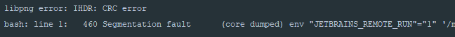

你见过彩虹吗？

来源：第七届山东省大学生网络安全技能大赛

[81cf84c2-0901-46d8-80c7-f0844e7e5253.zip](https://ctf.bugku.com/files/b5f4b306f5cb020e91308895cf5ad767/81cf84c2-0901-46d8-80c7-f0844e7e5253.zip)

存档：[81cf84c2-0901-46d8-80c7-f0844e7e5253.zip](./problems/81cf84c2-0901-46d8-80c7-f0844e7e5253.zip)

## 解决方案
解压得到7张不同颜色的png，Stegsolve看到低通道有问题：


再看一张：


懒得一个个翻了，写个小东西（先提示一下下面这玩意儿没法用，别复制了）：

``` cpp
#include <opencv2/opencv.hpp>

int main() {
    for (size_t i = 0; i < 7; ++i) {
        std::string filename("./" + std::to_string(i) + ".png");
        cv::Mat src, dst(400, 380, CV_8UC1);
        src = cv::imread(filename.c_str());
        for (int ir = 0; ir < 380; ++ir) {
            for (int ic = 0; ic < 400; ++ic) {
                dst.at<uchar>(ir, ic) = (src.at<cv::Vec3b>(ir, ic)[2] & 1) == 1 ? static_cast<uchar>(255) : static_cast<uchar>(0);
            }
        }
        filename = "./" + std::to_string(i) + ".decode.png";
        cv::imwrite(filename, dst);
    }

    return 0;
}

```

走起...

糟糕，好像翻车：



头部有问题，估计高度被改过，那就TweakPNG改回来先，再启动：


