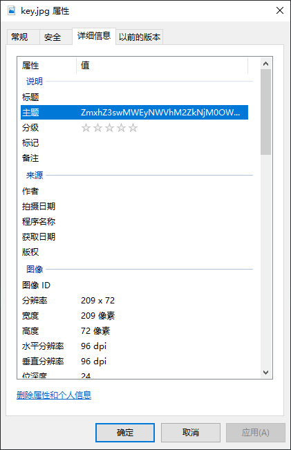

作者：NIPC

[1.txt](https://ctf.bugku.com/files/de3b517a9b83b2d35f1a8751e9b80c08/1.txt)

存档：[1.txt](./problems/1.txt)

## 解决方案
文档是很长的一段二进制，把长度质因数分解然后尝试画图没有结果，后来发现应该把它二进制写入,而不是让它按字符形式存档，于是有：
``` cpp
#include <fstream>

int main() {
    std::ifstream inputFileStream("./1.txt");
    std::ofstream outputFileStream("./1.bin");

    while (!inputFileStream.eof()) {
        char ch = 0;
        for (int i = 0; i < 8; ++i) {
            char bit;
            inputFileStream >> bit;
            ch = (ch << 1) + (bit - '0');
        }
        outputFileStream << ch;
    }

    return 0;
}

```

可以解压该文件，得到一个key.jpg。在文件属性中可以看到可疑的主题：



复制出来：

    ZmxhZ3swMWEyNWVhM2ZkNjM0OWM2ZTYzNWExZDAxOTZlNzVmYn0=
    
BASE64解开：

    flag{01a25ea3fd6349c6e635a1d0196e75fb}
