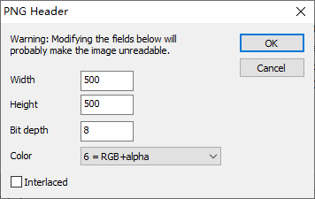
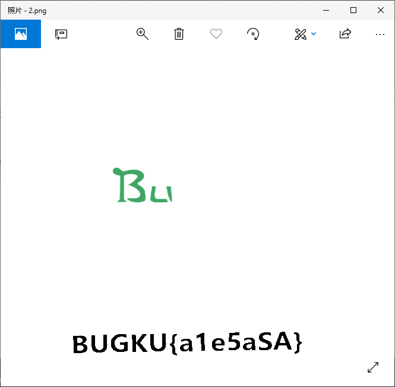
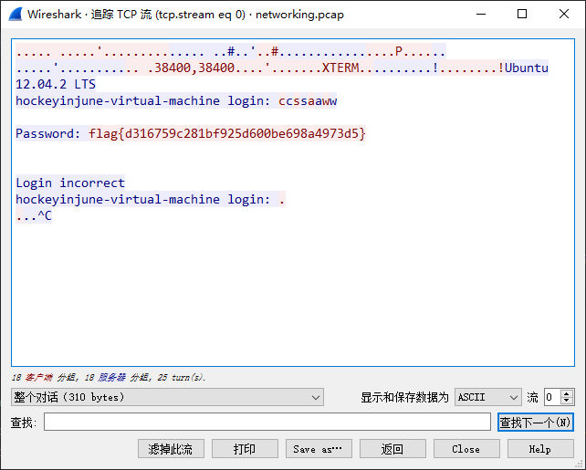
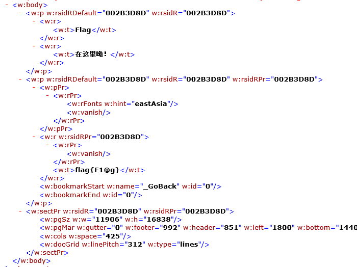
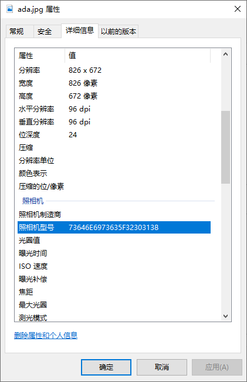

## 签到题
关注微信公众号：Bugku
即可获取flag

下面也有二维码

### 解决方案
    flag{BugKu-Sec-pwn!}
    
## 这是一张单纯的图片
[http://123.206.87.240:8002/misc/1.jpg](http://123.206.87.240:8002/misc/1.jpg)

存档：[1.jpg](./problems/1.jpg)

FLAG在哪里？？

### 解决方案
看看文件末尾：

    hexdump -C ./1.jpg


有一串HTML编码：
``` html
&#107;&#101;&#121;&#123;&#121;&#111;&#117;&#32;&#97;&#114;&#101;&#32;&#114;&#105;&#103;&#104;&#116;&#125;
```
解码就得到：
    
    key{you are right}    

## 隐写
[2.rar](https://ctf.bugku.com/files/f8da9b5979e89e91d083c7accdea4427/2.rar)

存档：[2.rar](./problems/2.rar)

### 解决方案
解压后发现一个2.png，启动StegSolve后每个图层看不出有什么异常，于是试试TweakPNG。打开图片时发现：


果然有问题，于是改下高度：



保存后就可以看到flag：



## telnet
[http://123.206.87.240:8002/misc/telnet/1.zip](http://123.206.87.240:8002/misc/telnet/1.zip)

key格式flag{xxxxxxxxxxxxxxxxxxxxxxxxxxx}

存档：[1.zip](./problems/1.zip)

### 解决方案
打开压缩包，内含一个networking.pcap，直接Wireshark打开然后追踪TCP流：



## 眼见非实(ISCCCTF)
[zip](https://ctf.bugku.com/files/919ee4ea1658c3e3ef8b59b67f298470/zip)

存档：[zip](./problems/zip)

### 解决方案
解压后得到一个打不开的文档，估计被损坏了，直接用7-Zip把文档作为压缩包打开，直击/word/document.xml：



应该不用我再说一遍了...

## 啊哒
有趣的表情包

来源：第七届山东省大学生网络安全技能大赛

[1cdf3a75-21ed-4b91-8d49-1b348d44dcf.zip](https://ctf.bugku.com/files/37b57dc545752a92fa6b2d571b88667a/1cdf3a75-21ed-4b91-8d49-1b348d44dcf.zip)

存档：[1cdf3a75-21ed-4b91-8d49-1b348d44dcf.zip](./problems/1cdf3a75-21ed-4b91-8d49-1b348d44dcf.zip)

### 解决方案
解压后得到一个ada.jpg，binwalk发现内含其它文件，然后foremost尝试将其分离，得到一个加密了的压缩包。其实zip可以尝试爆破的，但我们还是来找一下密码：



奇怪的相机型号：

    73646E6973635F32303138
    
把它16进制转字符：

    sdnisc_2018
    
拿去解压刚刚的zip：

    flag{3XiF_iNf0rM@ti0n}
