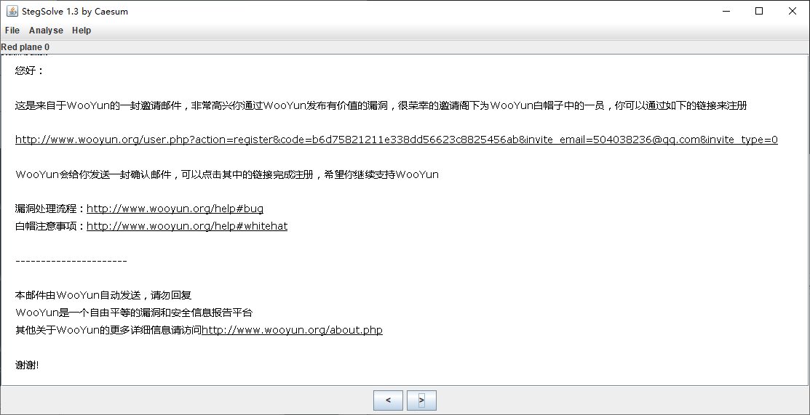

来源：XJNU

[misc50.zip](https://ctf.bugku.com/files/69fed30501c47ddd56250587d359e7d9/misc50.zip)

存档：[misc50.zip](./problems/misc50.zip)

## 解决方案
StegSolve打开后看到低通到左上方有异常：

试试Analyse->Data Extract，调整一下顺序：

