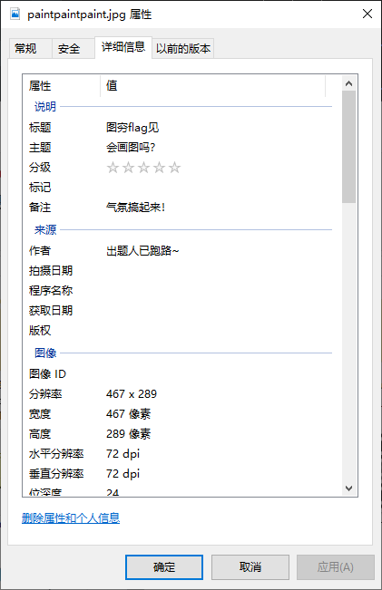
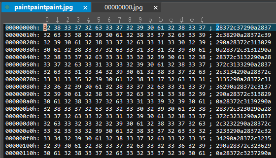

作者：NIPC

[paintpaintpaint.jpg](https://ctf.bugku.com/files/f6697e1f904a0c30b56f72fcf0023434/paintpaintpaint.jpg)

存档：[paintpaintpaint.jpg](./problems/paintpaintpaint.jpg)

## 解决方案
下载到一个jpg，有个Hint：



大小偏大，foremost出来的jpg只有21K，但是原文件有634K，估计后面有数据，于是用UltraEdit切掉前面，很有规律：



尝试着将其转为ASCII，发现是一堆坐标，估计可以画出一个二维码，于是代码走起：

``` cpp
#include <fstream>
#include <sstream>
#include <opencv2/opencv.hpp>

int main() {
    std::ifstream inputFileStream("./paintpaintpaint.jpg");
    std::stringstream ss;

    while (!inputFileStream.eof()) {
        char ch1, ch2;
        inputFileStream >> ch1 >> ch2;
        ch1 = ('a' <= ch1 && ch1 <= 'f') ? (ch1 - 'a') : (ch1 - '0');
        ch2 = ('a' <= ch2 && ch2 <= 'f') ? (ch2 - 'a') : (ch2 - '0');
        char ch = (ch1 << 4) + ch2;
        ss << (('0' <= ch && ch <= '9') ? ch : ' ');
    }

    cv::Mat img(300, 300, CV_8UC1, cv::Scalar(255));
    while (!ss.eof()) {
        int row, col;
        ss >> row >> col;
        img.at<uchar>(row, col) = 0;
    }
    cv::imwrite("output.png", img);

    return 0;
}

```

得到一个二维码：


扫一下：

    flag{40fc0a979f759c8892f4dc045e28b820}
