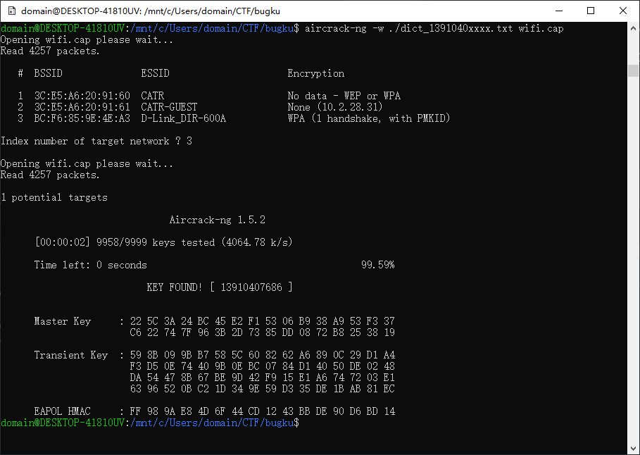

flag格式：flag{你破解的WiFi密码}

tips：密码为手机号，为了不为难你，大佬特地让我悄悄地把前七位告诉你

1391040**

Goodluck!!

作者@NewBee

[wifi.cap](https://ctf.bugku.com/files/77decd384a172b9a2294e6c6acfd48cc/wifi.cap)

存档：[wifi.cap](./problems/wifi.cap)

## 解决方案
先瞄一眼里面有啥：


根据Hint，准备一下字典：

``` cpp
#include <fstream>
#include <iomanip>

int main() {
    std::ofstream outputFileStream("./dict_1391040xxxx.txt");

    for (size_t i = 0; i < 10000; ++i) {
        outputFileStream << "1391040" << std::setw(4) << std::setfill('0') << i << std::endl;
    }

    return 0;
}

```

然后可以开始爆破了：

    aircrack-ng -w ./dict_1391040xxxx.txt ./wifi.cap
    
很快就得手了：


