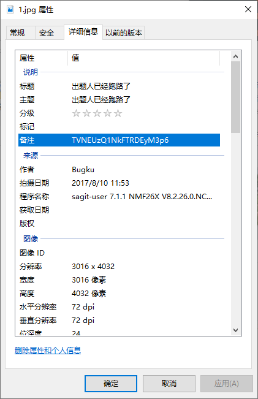

[https://share.weiyun.com/9287be0a629971ac53d97f39727eee18](https://share.weiyun.com/9287be0a629971ac53d97f39727eee18)

存档：[1.jpg.zip](./problems/1.jpg.zip)

## 解决方案
解压得到一个相对比较大的图片，foremost得到了一个rar，有密码。不过在图片属性上可以看到：

    TVNEUzQ1NkFTRDEyM3p6
    
BASE64解开一下：

    MSDS456ASD123zz
    
好像挺有规律...拿去解压得到了一个2.png，很熟悉的图片，还是改高度：

