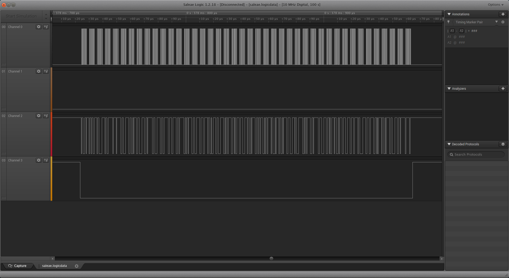

## 题目
你在一个写有“AoiSystem嵌入式”的U盘上，发现了这个文件。

[请下载附件(提取码：bpek)](https://pan.baidu.com/s/1tSfr3-4stkjsvoG6yduJGQ) [备用下载](https://share.weiyun.com/5vYShIl)

题目存档：[saleae.zip](./problems/saleae_b73227737dbbfb7c966cf2ce2f7aeb7f.zip)

## 解决方案
高中那会儿搞单片机的时候就听过saleae的大名，只是那会儿某宝上就已经有各种便宜货“saleae逻辑分析仪”，贴着人家的商标用着别人的软件...学生199USD一个基础款还是有点小贵...要是接下来还做嵌入式的话果断入一个支持一下好了。

跑题跑得有点远...这题提示得很明显了，并且解压后也是一个`.logicdata`文件，所以用saleae的软件打开它，先关注这里：

放大仔细看看规律：

看起来像是每个周期有8个高电平脉冲，先看看前两个周期的取值：

    0110 0110
    0110 1100
    0110 0001
    0110 0111
    0111 1011
    0011 0001
    0011 0010
    0011 0000
    0011 0111
    0011 0001
    0011 0011
    0011 1001
    0011 0111
    0010 1101
    0011 0001
    0011 1001
    0110 0100
    0011 0001
    0010 1101
    0011 0100
    0011 1000
    0110 0101
    0011 0110
    0010 1101
    0110 0010
    0110 0101
    0011 1000
    0110 0011
    0010 1101
    0011 0111
    0011 1000
    0011 0100
    0110 0010
    0011 1000
    0011 1001
    0110 0001
    0011 1001
    0011 0101
    0110 0101
    0011 0000
    0011 0111
    0111 1101
    
    flag{12071397-19d1-48e6-be8c-784b89a95e07}

