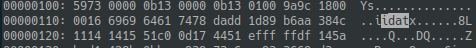
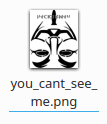

下载到一个tryme.zip和一个you_cant_see_me.png，压缩包内含flag.txt但是被加密了；png打不开，还嘲讽我（？），先看一下十六进制：

    vim -b you_cant_see_me.png
    :%!xxd

然后发现文件头有问题；而且竟然没有IDAT，估计是被破坏了，不过竟然能搜到一个小写的idat，确认过眼神，是应该改的地方。改回来保存看看：

    :%!xxd -r
    :wq

已经可以预览图片了：

打开：

行吧旋转一下：

懒得写个镜像了，直接拿手机前摄拍了一张就可以看到正的了：

    h4CK3RM4n

题目hint表示应该先哈希一下再try一下：

    2c919f82ee2ed6985d5c5e275d67e4f8

解压flag.txt成功get到flag：

    pctf{y0u_s33_m33_n0w!}
