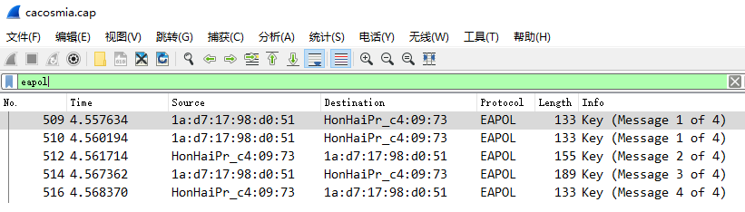
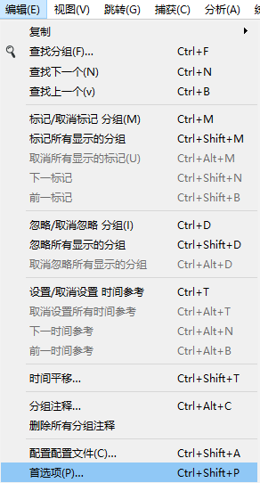
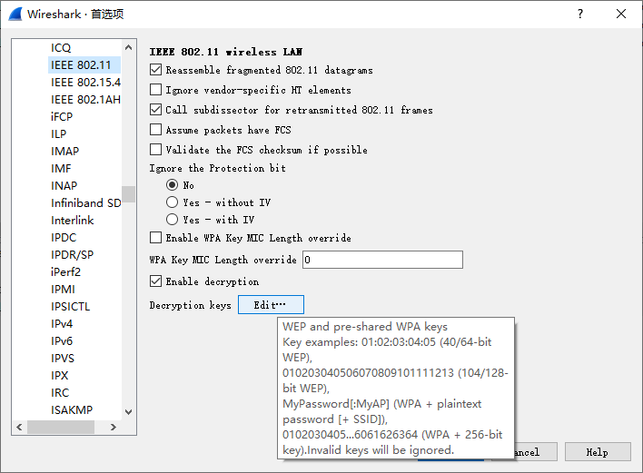
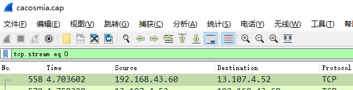
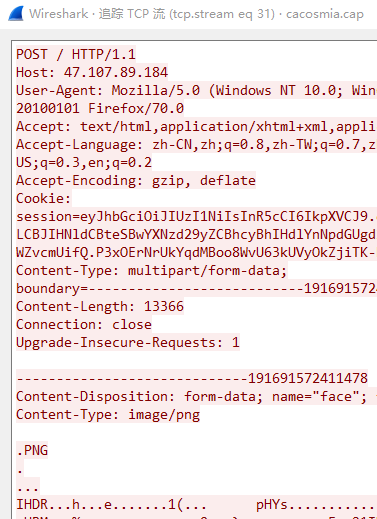
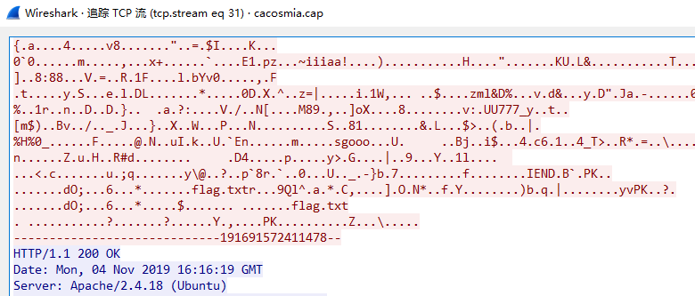
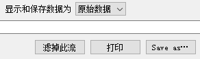
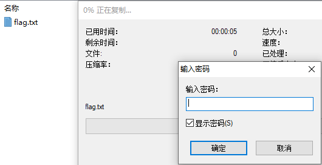
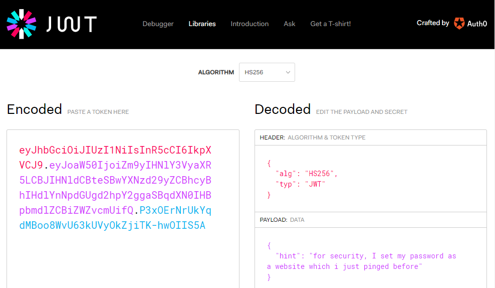
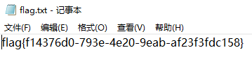

## 题目
野兽前辈想玩游戏，但是hacker妨碍了他连上无线网，前辈发出了无奈的吼声。

题目存档：[恶臭的数据包.7z](./problems/恶臭的数据包.7z)

## 解决方案
解压得到一个cap流量包，Wireshark打开看看统计信息：


一个无线流量包，信息都被加密了。来看看有没有握手包：



这个时候可以来尝试爆破了。Kali Linux，启动：

``` bash
aircrack-ng -w ./rockyou.txt ./cacosmia.cap
```

还是那个经典的字典。


很快就爆出来了，无线密码是`12345678`。这个时候可以来解密了：



Protocols -> IEEE 802.11 -> Decryption keys直达：




保存退出，此时应该能看到已经解密了。开始追踪流，先过滤一下再开始：




翻到后面就发现有些上传图片的流量。熟悉的PNG文件头：



还有让人激动的PK文件头和flag.txt:



先提取出来再说：



这样导出有HTTP头部信息，用010 Editor去掉即可得到一个图种，可以继续编辑把图和 ~~种~~ 压缩包拆开。也可以用binwalk或者foremost之类的工具分离出来。图用Stegsolve看了看似乎没有什么信息，压缩包被加密了：



不是个伪加密，回到流量包里找线索。发现Cookie有个JWT，尝试解开：



提示密码是被ping过的一个站点。回到流量包中尝试过滤：


没有发现。不过ping一个站点通常会先进行DNS解析：


发现最后一次解析有点可疑，返回了环回地址，尝试用`26rsfb.dnslog.cn`解压：



    flag{f14376d0-793e-4e20-9eab-af23f3fdc158}
