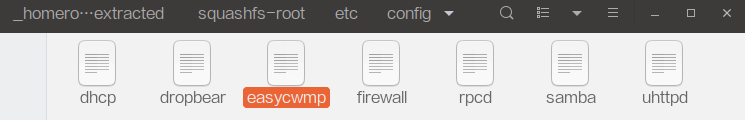

## 题目
ISP发给了白菜酱一台路由器，这是路由器官网上下载的固件。怎么配置这台路由器呢？你能帮白菜酱研究一下吗？ (特殊flag，以“flag-"开头)

> 2019-08-18 12:32:43
> 
> homerouter hint: power your router and login to admin page
> 
> 2019-08-18 16:23:18
> 
> [hint for homerouter] 虽然没luci 但是并不影响做题 ，flag 不在固件里
> 
> 2019-08-18 17:22:58
> 
> [hint for homerouter] 小伙子，办过电信宽带嘛？
> 
> 2019-08-18 20:26:44
> 
> [hint for homerouter] 深挖一下正常的openwrt固件里不存在的东西

## 解决方案
就在一个月黑风高的中午...


然后到了傍晚的时候...


...这下我彻底方了...虽然最后还是赛后才搞定的（捂脸.png）。

先试着用binwalk提取下发的路由器固件，能看到文件：


这个时候能看到有个那么不常见的东西：



能看到配置文件里有个不寻常的东西：


> EasyCwmp is a GPLv2 open source implementation of the TR069 cwmp standard.

这个时候就大概能猜想要去利用easycwmp来连接一下服务器看看会有什么。可以选择用qemu来跑固件，比较省事。还有个比较不那么靠谱的方法就是用Burp一类的工具模拟协议发包和服务器交互了。

有关更多信息，可以查看这里或者Google。

[TR069之CPE與ACS的Digest驗證](https://www.twblogs.net/a/5b7f63712b717767c6af5969)

[TR-069 协议完整的通信过程](https://blog.csdn.net/Lock_Love_/article/details/48713243)

由于这边不知道为啥qemu有点问题跑不起来，于是乎拿了一个路由器和一个软路由试了一下，下面都记录了。比赛的时候是用的一台平时折腾用的Phicomm K2，之前刷了PandoraBox，于是直接SSH上去。

### 使用PandoraBox
由于PandoraBox有预编译的包，所以可以直接：

``` bash
opkg update
opkg install easycwmp
```

然后编辑`/etc/config/easycwmp`里的acs相关的配置。串号随意改一个就好了。

这个时候如果尝试直接跑`easycwmp -f -b`的话可能会没有反应就退出了，好像是因为这里的easycwmp自己已经启动了。只好`ps`看一下进程，然后把它`kill`掉。

这个时候应该能正常用了，不过我这边没有输出，像卡住了一样，搜了一下发现应该去看syslog。于是先开着：

``` bash
logread -f
```

然后改了个串号再开`easycwmp -f -b`。如果发现日志里出现`Error reading ca cert file`的话，可以：

``` bash
opkg install ca-bundle
```

然后重试上面的步骤。如果`/usr/share/easycwmp/functions`下的文件里有`system_set_password root`的话（没有的话就去把固件里的`/usr/share/easycwmp/functions/system`复制一份过来），应该能在日志里读到：（就是下发配置修改root密码）


最后...接下来你可能会因为接下来登录不了SSH和LuCI而怀疑人生，不要慌，因为它帮你把密码设置成了flag...

### 使用OpenWRT软路由
这个只要搞个虚拟机就可以跑，比较简单。没有的话可以先下载一下镜像：[Index of /snapshots/targets/x86/64/](https://downloads.openwrt.org/snapshots/targets/x86/64/)。（其实也可以玩玩Koolshare的LEDE）

具体安装方法可以看这里：[Run OpenWrt as a VirtualBox virtual machine](https://openwrt.org/docs/guide-user/virtualization/virtualbox-vm)。

主要就是解压，然后转盘：

``` bash tab="Linux"
VBoxManage convertfromraw --format VDI openwrt-x86-64-combined-squashfs.img openwrt-x86-64-combined-squashfs.vdi
```

``` tab="Windows"
'C:\Program Files\Oracle\VirtualBox\VBoxManage.exe' convertfromraw --format VDI openwrt-x86-64-combined-squashfs.img openwrt-x86-64-combined-squashfs.vdi
```

然后VirtualBox新建虚拟机，使用已存在的虚拟硬盘文件即可。启动前需要保证网卡1是仅主机（Host-only）适配器，网卡2是NAT，不然可能上不了网。（Koolshare的好像不大一样，自己看文档吧）

要是启动后网络还是有问题就：

``` bash
uci show network
```

看一下。可以：

``` bash
uci set network.lan.ipaddr='192.168.56.2'
uci commit
reboot
```

把不对的改掉。

然后就可以来装easycwmp了。现在没有预编译的包了，只好自己编译。

[x86\_64/easycwmp_1.8.1](./files/homerouter/x86_64/easycwmp_1.8.1_x86_64.ipk)

[x86\_64/libmicroxml](./files/homerouter/x86_64/libmicroxml_2015_03_18_caa8d3e68.ipk)

[i386/easycwmp_1.8.1](./files/homerouter/i386/easycwmp_1.8.1_i386_pentium4.ipk)

[i386/libmicroxml](./files/homerouter/i386/libmicroxml_2015_03_18_caa8d3e68.ipk)

这里贴一下自己编译的，可以直接下载对应架构的，然后：

``` bash
opkg install xxx.ipk
```

非要自己编译的话就看着[这里（pivasoftware/easycwmp）](https://github.com/pivasoftware/easycwmp)的README编译吧。需要先`git clone https://github.com/openwrt/openwrt`，然后把[easycwmp-openwrt](http://easycwmp.org/download/easycwmp-openwrt-1.8.1.tar.gz)和[microxml](http://easycwmp.org/download/libmicroxml.tar.gz)的压缩包解压到`openwrt/package`下，这个时候在`openwrt`目录下执行：

``` bash
make menuconfig
```

应该就能在Utilities里找到easycwmp了。根据自己的需要进行`make`即可。要很长时间，构建过程中需要下载很多东西，建议事先搞好透明代理。（也可以用对应架构的SDK，具体看文档吧）

安装完成后的操作就和在PandoraBox下差不多了，就是改配置，然后读日志，再启动客户端就好了。


