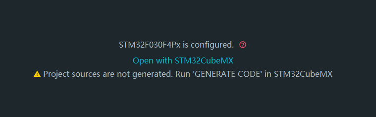
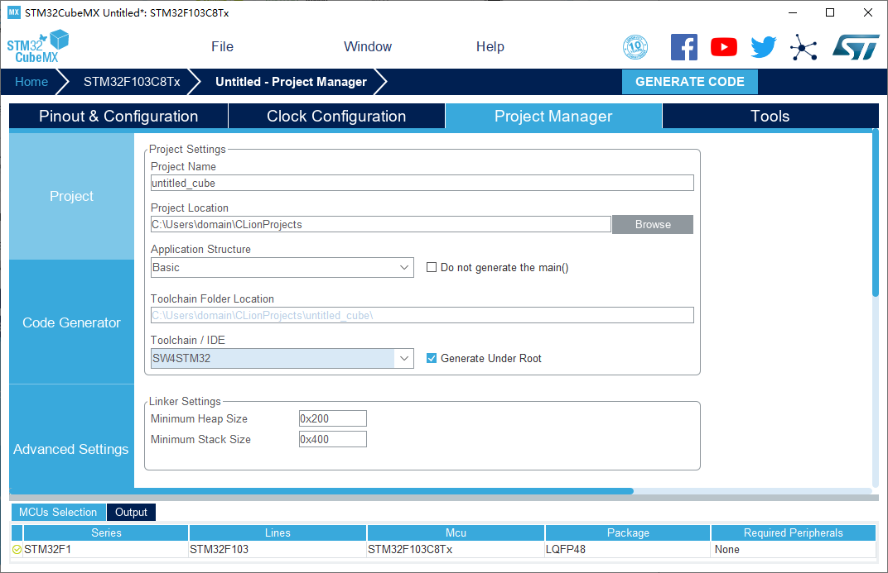
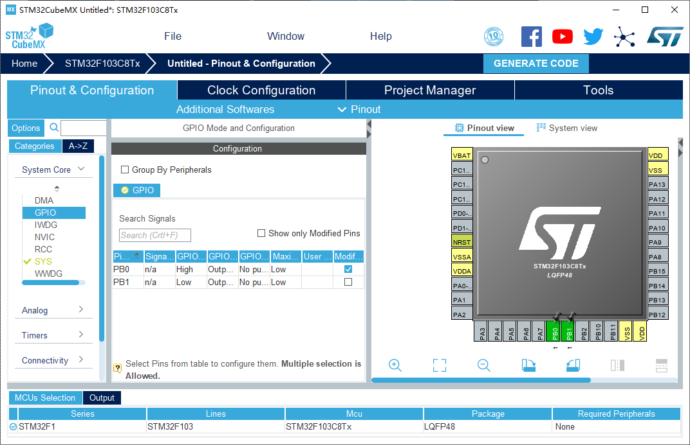
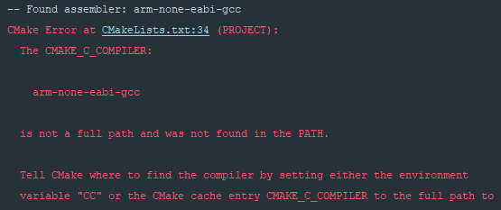

前方提示：这篇文章暂时是不能结尾了，因为自己的环境似乎跟开发板的驱动有冲突，插上就蓝屏，暂时没有解决办法，等下次找台电脑然后和Linux平台上的一起写了吧...

今天开机突然发现JetBrains Toolbox里正在升级CLion和IntelliJ IDEA，本来以为要4月份了还会在2018.3.5上继续更新，到官网上一瞧，有点惊喜：CLion 2019.1发布了。看看新特性，竟然是开始支持STM32CubeMX和OpenOCD，赶紧来体验一波。

## 先来说说我目前的环境
这不是一篇教程向的文章，所以当前列出的环境并非要求你和我一样。这只是说明情况（为下文踩坑埋下伏笔）而已。

操作系统：Windows 10 Education。如果你正在使用其它的Windows版本，某些可能不含WSL，你可能需要在Google上寻求解决办法。

本场主角：JetBrains CLion 2019.1。

工具链：WSL Ubuntu，当前只安装了开发C++控制台程序必要的包，后续会慢慢安装这次体验需要的东西。感觉使用其它工具链应该也是可行的。我不知道你是否已经知道了子系统，以及CLion如何使用它，如果答案是否定的，那么你可能需要[CLion的关于WSL的官方文档](https://www.jetbrains.com/help/clion/how-to-use-wsl-development-environment-in-clion.html)，另外[这里](https://blog.52szu.tech/szu_courses/cpp/clion_conf/#toolchain)有我对安装配置过程的一个大体描述。

其他软件：STM32CubeMX 5.1.0，之前安装过没怎么用。

还有个很重要的...开发板：洋桃1号开发板。

除此之外应该就没什么其它的影响因素了。

## 让我们开始吧
下面是体验的过程，如果你需要文档，可以访问[这里](https://www.jetbrains.com/help/clion/embedded-development.html)。也请注意，下文仅仅是一个非常简单的点灯实验，更多技术向的文章可能在未来发出。

我们来创建一个项目，选中**Embedded**，然后起个名字：

进入主界面后会发现默认配置的单片机型号不是自己需要的：

点击**Open with STM32CubeMX**，启动STM32CubeMX：

左上角有个型号，写着STM32F030F4Px，就是刚刚CLion默认配置的那个，点击它，把它换成我们需要的：

这里用的洋桃开发板，单片机是STM32F103C8T6，选好就可以点击右上的开始了：

更改单片机型号后，项目名称等属性会被改变，我们需要重新设置它们。另外，工具链别忘记选择**SW4STM32**。

这个时候已经可以点击右上角的生成代码然后回到CLion开始工作了。不过别急，我们先来开个灯：

这个板子上应该是对PB0、PB1输出高电平就可以点亮核心板上的LED1、LED2，随便设置一个，然后就点击生成代码吧。

回到CLion，这个时候应该已经检测到了代码更新，会有提示，并且会开始建索引：

可以看到单片机型号已经改变了：

其实这个时候，因为我没有OpenOCD，弹窗警告了一下，忘记截图了...这个等下再折腾。现在已经看到CMake这边的信息显示找不到arm-none-eabi-gcc：

不慌，打开子系统的控制台，安装一下：

    sudo apt install gcc-arm-none-eabi

某些原因，我一般会习惯性先：

    sudo apt update
    
如果你在这里遇到了网络问题，那么你可能需要代理，或者利用镜像站，比如[清华大学开源软件镜像站 | Tsinghua Open Source Mirror](https://mirrors.tuna.tsinghua.edu.cn/)或者[USTC Open Source Software Mirror](http://mirrors.ustc.edu.cn/)。

安装完成后，回到CLion，在CMake的错误信息左侧找到**Reload CMake Project**，应该不会有问题了。至于OpenOCD，浏览了一下官网，似乎没有提供Windows下的预编译的包。不过有非官方的预编译包的链接，下载一份解压好，然后编辑Run Configuration，指定好路径和Board config file，就可以Build了。完成后，可以在cmake-build-debug里找到hex文件。

对于这块开发板，应该使用FlyMCU的第三方ISP烧入即可。开头说好了，我还没有测试这一步，不知道会有什么问题，不过我尽快把这个坑填上...
