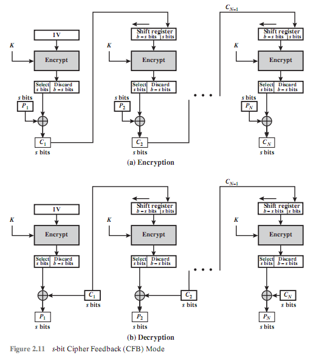

> 对称加密也称为常规加密、私钥或单钥加密。

## 2.1 对称加密原理
> 一个**对称加密**方案由5部分组成：**明文**、**加密算法**、**秘密密钥**、**密文**和**解密算法**。
>
> 对称加密的安全使用有如下两个要求：需要一个强加密算法；发送者和接收者必须通过一个安全的方式获得密钥并且保证密钥安全。
>
> 对称加密的安全取决于密钥的保密性而非算法的保密性。

### 2.1.1 密码体制
> 密码体制一般从以下3个不同的方面进行分类。
>
> 1. **明文转换成密文的操作类型**。替换-明文的每一个元素都映射到另外一个元素；换位-明文的元素都被再排列。大多数体制或称为乘积体制包括了多级替换和换位组合。
>
> 2. **使用的密钥数**。如果发送者和接收者都使用同一密钥，该体制就是对称、单钥、秘密密钥或者说传统加密。如果发送者和接收者使用不同的密钥，体制就是不对称、双钥或者说公钥加密。
>
> 3. **明文的处理方式**。**分组密码**一次处理一个输入元素分组，产生与该输入分组对应的一个输出分组。**流密码**在运行过程中连续地处理输入元素，每次产生一个输出元素。 
>

### 2.1.2 密码分析
| 攻击类型 | 密码破译者已知的信息 |
|:-----:|:-----|
| 唯密文 | 加密算法； 要解密的密文 |
| 已知明文 | 加密算法； 要解密的密文； 一个或多个用密钥产生的明文-密文对 |
| 选择明文 | 加密算法； 要解密的密文； 破译者选定的明文消息，以及使用密钥产生的对应密文 |
| 选择密文 | 加密算法； 要解密的密文； 破译者选定的密文，以及使用密钥产生对应的解密明文 |
| 选择文本 | 加密算法； 要解密的密文； 破译者选定的明文消息，以及使用密钥产生的对应密文； 破译者选定的密文，以及使用密钥产生对应的解密明文 |

> 当加密方案产生的密文满足下面条件之一或全部条件时，则称该加密方案是**计算安全的**：
>
> + 破解密文的代价超出被加密信息的价值。
>
> + 破解密文需要的时间超出信息的有用寿命。

无条件安全：一次性密码本。

### 2.1.3 Feistel密码结构
> 加密算法的输入是长度为$2w$比特的明文分组及密钥K。明文分组被分为两半：$L_0$和$R_0$。这两半数据通过n轮处理后组合成密文分组。
>
> 所有轮都具有相同的结构。左半边数据要做一个替换，具体过程是先对右半边数据使用**轮函数F**，然后将函数输出同原来的左半边数据做异或（XOR）。每个轮迭代的论函数都有相同的结构，但会以每轮对应的子密钥$K_i$为参数变化。在这个替换之后，再将这两半数据对换。
>
> 对称分组密码的具体操作取决于以下参数和设计属性：
>
> + **分组大小**：越大的分组意味着越高的安全性（所有其他条件都相同），但减小了加密/解密速率。
>
> + **密钥大小**：越长的密钥意味着越高的安全性，但也许会减小加密/解密速率。
>
> + **迭代轮数**：对称分组密码的本质是单轮处理不能提供充分的安全性，多轮处理能提供更高的安全性。
>
> + **子密钥产生算法**：此算法复杂度越高，密码破译难度就越高。
>
> + **轮函数**：同样，越高的复杂度意味着对破译越高的阻力。
>
> 在对称分组密码设计中还有两个其他的考虑因素：
>
> + **快速软件加密/解密**
>
> + **容易分析**：如果算法能被简明清楚地解释，则容易分析该算法的的弱点并因此给出对其强度更高级别的保障。

## 2.2 对称分组加密算法
### 2.2.1 数据加密标准
> 最广泛使用的加密方案是基于**数据加密标准（DES）**的，

#### 算法描述
> 明文长度为64比特，密钥长度为56比特；更长的明文被分为64比特的分组来处理。DES结构在图2.2所示的Feistel网络的基础上做了微小的变化。它采用16轮迭代，从原始56比特密钥产生16组子密钥，每一轮迭代使用一个子密钥。
>
> DES的解密过程在本质上和加密过程相同。规则如下：使用密文作为DES算法的输入，但是子密钥$K_i$的使用顺序与加密时相反。

初始置换；[轮函数](https://en.wikipedia.org/wiki/Data_Encryption_Standard#The_Feistel_(F)_function)；[子密钥产生算法](https://en.wikipedia.org/wiki/Data_Encryption_Standard#Key_schedule)；

### 2.2.2 三重DES
> 3DES使用3个密钥并执行3次DES算法，其组合过程依照加密-解密-加密（EDE）的顺序（见图2.3（a））进行。
>
> $$
> C = E(K_3, D(K_2, E(K_1, P)))
> $$
>
> 其中：
>
> $C =$ 密文；
>
> $P =$ 明文；
>
> $E[K, X] =$ 使用密钥$K$加密$X$；
>
> $D[K, Y] =$ 使用密钥$K$解密$Y$；
>
> 
>
> 解密仅仅是使用相反的密钥顺序进行相同的操作（见图2.3（b））：
>
> $$
> P = D(K_1, E(K_2, D(K_3, C)))
> $$
>
> 3DES加密过程中的第二步使用的解密没有密码方面的意义。它的唯一好处是让3DES的使用者能够解密原来单重DES使用者加密的数据：
>
> $$
> C = E(K_1, D(K_1, E(K_1, P))) = E[K, P]
> $$

## 2.3 随机数和伪随机数
### 2.3.1 随机数的应用
> 一些网络安全算法基于密码的随机数。例如：
>
> + RSA公开密钥算法和其他的公开密钥算法的密钥生成。
>
> + 对称流密码的密钥流生成。
>
> + 生成对称密钥用于临时会话时使用的密钥。
>
> + 在许多密钥分配方案中，例如Kerberos，随机数被用来建立同步交换以防止重放攻击。
>
> 这些应用为随机数列引起两种不同的且不必要兼容的需求：随机性和不可预测性。

随机性：均匀分布；独立。

### 2.3.2 真随机数发生器、伪随机数生成器和伪随机函数
> 密码应用程序通常利用了随机数生成的算法技术。这些算法具有确定性的特点，因此产生的数列不具有统计上的随机性。虽然如此，如果这个算法很好，那么产生出的数列将会通过很多合理的随机性测试，这种数字被称为**伪随机数字**。
>
> 图2.6将一个**真随机数发生器**[TRNG]和两个伪随机数发生器进行了对比。真随机数发生器将一个有效的随机源作为输入端；这个源被称为**熵源**。
>
> 
>
> 相比之下，伪随机数生成器采用一个不变值作为输入端，这个不变值称为**种子**，并且运用了确定的算法来产生一系列的输出比特。如图2.6所示，算法的结果通过回馈途径送到输入端。要特别指出的是，输出比特流仅仅被输入值所决定，并且种子能够再现全部的比特流。
>
> **伪随机数发生器**：一种用来生产一个开路型比特流的算法被称为PRNG。一个开路型比特流的常见应用是作为对称流密码的输入。
>
> **伪随机函数（PRF）**：PRF被用来产生一些固定长度的伪随机比特串。例如对称的加密密钥和随机数。
>
> 除了产生的比特数不同，PRNG和PRF之间没有区别。

### 2.3.3 算法设计
> **为特定目的构造的算法**：这些特定设计的算法仅仅用于产生伪随机比特流。一些算法被许多PRNG应用程序所使用。其他的算法被专门设计用在流密码中。后者最重要的设计是RC4。
>
> **基于现存密码算法的算法**：密码算法起了一个随机化输入的作用。以下三种密码算法经常被用来创造PRNG：
>
> + 对称的分组密码
>
> + 不对称的密码
>
> + 散列函数和消息认证码

## 2.4 流密码和RC4
> **分组密码**每次处理一个输入分组，并为每个输入分组产生一个输出分组。**流密码**连续处理输入元素，在运行过程中，一次产生一个输出元素。

### 2.4.1 流密码结构
> 
>
> [KUMA97]列出了下列设计流密码时需要重要考虑的因素：
>
> 1. 加密序列应该有一个长周期。
>
> 2. 密钥流应该尽可能地接近真随机数流的性质。
>
> 3. 图2.6指出了伪随机数生成器的输出受输入密钥值控制。
>
> 分组密码的优点是可以重复使用密钥。但是如果两个明文使用同一密钥进行流密码加密，密码破译常常会非常容易[DAWS96]。如果将这两个密文流进行异或，结果就是原始明文的异或值。如果明文是文本字符串、信用卡号或者其他已知其性质的字节流，密码破解可能会成功。
>
> 对于需要加密/解密数据流的应用，比如在数据通信信道或者浏览器/网络链路上，流密码也许是更好的选择。对于处理数据分组的应用，比如文件传递、电子邮件和数据库，分组密码可能更合适。但是，这两种密码都可以在几乎所有的应用中使用。

### 2.4.2 RC4算法

## 2.5 分组密码工作模式
> 分组密码一次处理一个数据分组。在DES和3DES中，分组长度是$b=64$比特。在AES中，分组长度是$b=128$比特。对于较长的明文，需要将明文分解成$b$比特的分组（需要时还要填充最后一个分组），针对不同应用使用一个分组密码时，NIST（在SP800-38A中）定义了五种**工作模式**。

### 2.5.1 电子密码本模式
> 最简单的一种使用方式是所谓的**电子密码本（ECB）**模式，在此模式下明文一次被处理$b$比特，而且明文的每一个分组都使用同一密钥加密。
>
> 在ECB中，如果同一个64比特的明文分组在消息中出现了不只一次，它总是产生相同的密文。
>
> 这也许能帮助破译，或者可能给替换或者重排数据分组提供了机会。

### 2.5.2 密码分组链接模式
> 在**密码分组链接（CBC）**模式（见图2.9）中，加密算法的输入是当前明文分组与前一密文分组的异或；每个分组使用同一密钥。
>
> 
>
> 为了产生第一个密文分组，将一个初始向量（IV）和第一个明文分组进行异或。解密时，将IV和解密算法的输出进行异或来恢复第一个明文分组。
>
> 发送者和接收者都必须知道IV。为了提高安全性，IV需要像密钥一样进行保护。这可以通过使用ECB加密传送IV来完成。

### 2.5.3 密码反馈模式
> 使用密码反馈（CFB）模式能将任意分组密码转化为流密码。
>
> 定义$S_S(X)$为$X$的最高有效$s$比特。那么，
>
> $$
> C_1 = P_1 \oplus S_s[E(K, IV)]
> $$
>
> 因此，
>
> $$
> P_1 = C_1 \oplus S_s[E(K, IV)]
> $$
>
> 

加一个输出反馈模式

### 2.5.4 计数器模式
> 典型的，计数器初始化为某一值，然后随着消息块的增加计数器增加1（以2的$b$次方为模，$b$为分组长度）。在加密时，计数器被加密然后与明文分组异或来产生密文分组，这里没有链接。当解密时，相同序列的计数器值与密文异或来恢复相对应的明文分组。
>
> 
