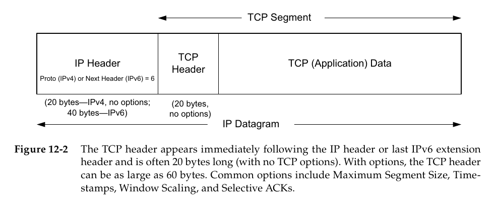
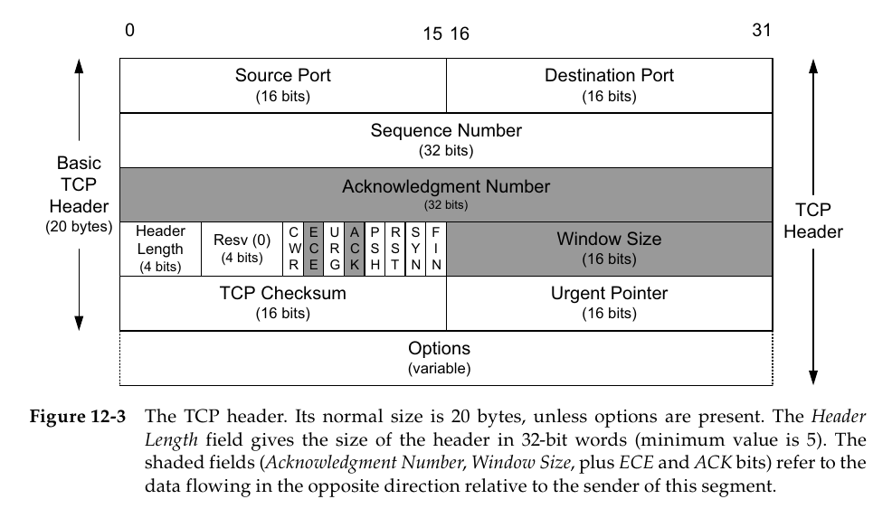

## 12.1 引言
> 到目前为止，我们一直在讨论那些自身不包含可靠传递数据机制的协议。它们可能会使用一种像校验和或CRC这样的数学函数来*检测*接收到的有差错的数据，但是它们不尝试去纠正差错。对于IP和UDP，根本没有实现差错纠正。对于以太网和基于其上的其他协议，协议提供一定次数的重试，如果还是不成功则放弃。
>
> 使用*差错校正码*（基本上是添加一些冗余的比特，使得即使某些比特被毁，真实的信息也可以被恢复过来）来纠正通信问题是处理差错的一种非常重要的方法。另一种方法是简单地“尝试重新发送”，直到信息最终被接收。这种方法，称为*自动重复请求*（Automatic Repeat Request，ARQ），构成了许多通信协议的基础，包括TCP在内。

### 12.1.2 分组窗口和滑动窗口
> 为了解决所有这些问题，我们以假设每个分组有一个序列号开始，正如前面所描述的。我们定义一个分组*窗口（window）*作为已被发送方注入但还没完成确认（如，发送方还没收到过它们的ACK）的分组（或者它们的序列号）的集合。我们把这个窗口中的分组数量成为*窗口大小（window size）*。术语*窗口*来自这样的想法：如果你把在一个通信对话中发送的所有分组排成长长的一行，但只能通过一个小孔来观察它们，你就只能看到它们的一个子集——像通过一个窗口观看一样。发送方的窗口（以及其他分组队列）可画图描述成图12-1那样。

> 这个图显示了当前三个分组的窗口，整个窗口大小是3。3号分组已经被发送和确认，所以由发送方保存的它的副本可以被释放。分组7在发送方已经准备好，但还没被发送，因为它还没“进入”窗口。现在如果我们想象数据开始从发送方流到接收方，ACK开始以相反的方向流动，发送方可能下一步就接收到一个分组4的ACK。当这发生时，窗口向右边“滑动”一个分组，意味着分组4的副本可以释放了，而分组7可以被发送了。窗口的这种滑动给这种类型的协议增加了一个名字，*滑动窗口（sliding window）*协议。

## 12.3 TCP头部和封装
> 图12-2显示了TCP在IP数据报中的封装。

> 头部本身明显要比在第10章我们见过的UDP的头部更复杂。这并不很令人惊讶，因为TCP是一个明显要更复杂的协议，它必须保持连接的每一端知道（同步）最新状态。如图12-3所示。

