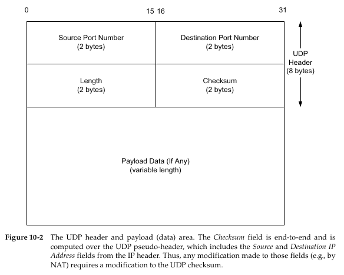

## 10.1 引言
> UDP是一种保留消息边界的简单的面向数据报的传输层协议。它不提供差错纠正、队列管理、重复消除、流量控制和拥塞控制。它提供差错检测，包含我们在传输层中碰到的第一个真实的*端到端*（end-to-end）校验和。
>
> 一般来说，每个被应用程序请求的UDP输出操作只产生一个UDP数据报，从而发送一个IP数据报。
>
> [RFC0768]是UDP的正式规范，它至今仍然是一个标准，30多年来没有做过重大的修改。如前所述，UDP不提供差错纠正：它把应用程序传给IP层的数据发送出去，但是并不保证它们能够到达目的地。另外，没有协议机制防止高速UDP流量对其他网络用户的消极影响。
>
> 因为它的无连接特征，它要比其他的传输协议使用更少的开销。另外，广播和组播操作（见第9章）更多直接使用像UDP这样的无连接传输。
>
> 图10-1显示了一个UDP数据报作为单个IPv4数据报的封装。IPv6的封装是类似的，但是一些细节有少许不同，我们在10.5节讨论它们。IPv4*协议*（Protocol）字段用值17来标识UDP。IPv6则在*下一个头部*（Next Header）字段使用相同的值。在本章稍后我们将探讨当UDP数据报大小超过MTU时会发生什么，数据包必须被分片成多于一个的IP层分组。

## 10.2 UDP头部
> 图10.2显示了一个包含负载和UDP头部（通常是8字节）的UDP数据报。
>
> 端口号相当于*邮箱*（mailbox），帮助协议辨认发送和接收进程（见第1章）。他们纯属*抽象的*（abstract）——它们不与主机上的任何物理实体相关。
>
> 源端口号是可选的；如果数据报的发送者不要求对方回复的话，它可被置成0。
>
> 因为IP层根据IPv4头部中的*协议*字段或IPv6头部中的*下一个头部*字段的值将进入的IP数据报分离到特定的传输协议，这意味着端口号在不同的传输协议之间是独立的。

有点拗口。不过书上也解释得很清楚：

> 这样的分离导致的一个直接结果是两个完全不同的服务器可以使用相同的端口号和IP地址，只要它们使用不同的传输协议。

> *校验和*（Checksum）字段是端到端的，是对包含了IP头部中的*源*（Source）和*目的IP地址*（Destination Address）字段的UDP伪头部计算得到的。因此，任何对这些字段的修改（如，由NAT）都需要对UDP校验和进行修改
>
> 参考图10-2，UDP*长度*（Length）字段是UDP头部和UDP数据的总长度，以字节为单位。这个字段的最小值是8，除非使用了带有IPv6超长数据包（jumbogram）的UDP（见10.5节）。
>
> 值得注意的是UDP*长度*字段是荣誉的；IPv4头部包含了数据包的总长度（见第5章），同时IPv6头部包含了负载长度。因此，一个UDP/IPv4数据报的长度等于IPv4数据报的总长度减去IPv4头部的长度。一个UDP/IPv6数据报的长度等于包含在IPv6头部中的*负载长度*（Payload Length）字段的值减去所有扩展头部（除非使用了超长数据报）的长度。在这两种情况下，UDP*长度*字段的值应该与从IP层提供的信息计算得到的长度是一致的。

## 10.3 UDP校验和
> UDP校验和是我们遇到的第一个端到端的传输层校验和（ICMP有一个端到端的校验和，但它不是一个真正的传输协议）。它覆盖了UDP头部、UDP数据和一个伪头部（在本节稍后有定义）。
>
> 回想一下IPv4头部中的校验和只覆盖整个头部（即它并不覆盖IP分组中的任何数据），它在每个IP跳都要被重新计算（因为IPv4 TTL字段的值在数据报转发时会被路由器减少）。传输协议（如TCP、UDP）使用校验和来覆盖它们的头部和数据。
>
> 虽然计算UDP校验和的基本方法与我们在第5章描述的普通互联网校验和（16位字的反码和的反码）类似，但是要注意两个小的细节。首先，UDP数据报长度可以是奇数个字节，而校验和算法只相加16位字（总是偶数个字节）。UDP的处理过程是在奇数长度的数据报尾部追加一个值为0的填充（虚）字节，这仅仅只是为了校验和的计算与验证。
>
> 第二个细节是UDP（也包括TCP）计算它的校验和时包含了（仅仅）衍生自IPv4头部的字段的一个12字节的*伪头部*或衍生自IPv6头部的字段的一个40字节的伪头部。这个伪头部也是虚的，它的目的只是用于校验和的计算（在发送方和接收方）。
>
> 
>
