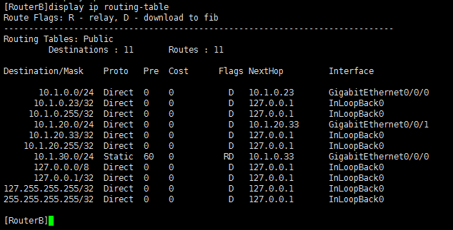
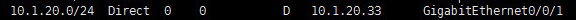

## 写在前面的废话

这个实验大概是在上一次VLAN实验基础上的一个拓展。在上一次实验里，配置好VLAN后，如果两台主机不在同一VLAN中，它们将不能互相通信。这次实验将讨论如何配置路由使得它们可以通信。

我知道你们应该不需要我写这篇了...不过还是顺便整理一下。啊，毕竟我比较菜对吧，我要是瞎扯错了什么麻烦告诉我...

这次将会用到：

+ 主机4台，其中一台通过串口用Xshell连上交换机/路由器进行管理。
+ Quidway S3700系列交换机1台。然后路由器是啥我不记得了，似乎是一台AR2800和一台AR2811？（不过这似乎不重要。）
+ 哦还有，额外的网线3根。

我们先来看看拓扑：

## 实验要求


> 使用tracert和ping命令分别跟踪和测试VLAN中主机之间通过路由器连接的网络连通性。

我首先把4台主机连接到交换机的相应接口上，并且根据要求设置好IP地址、子网掩码和网关。随后，将两台路由器连接到交换机上（这个顺序可能有点别扭），然后就是把两台路由器也连接起来。


## 开始踩坑
实验要求似乎是使用串口连接两台路由器，不过现在这两台好像并没有，于是就用网线连上了：


有关更多信息，可以查看：

[serial ports in router - 83105 - The Cisco Learning Network](https://learningnetwork.cisco.com/thread/83105)

还是跟上次一样，先在交换机上配置VLAN。我就不多说什么了，翻上一次的文章就可以了。主要就是划分使得PC1、PC2在VLAN3中，让PC3、PC4在VLAN2中：


（无视上面那个GigabitEthernet0/0/3还有那个奇怪的sysname G2）

随后就可以把串口线换到路由器上配置IP和路由表了。对于“RouterA”，设置好两个端口的IP，并配置好路由表就可以了：


有关`interface Cellular`，你或许可以查看[这里](https://support.huawei.com/enterprise/zh/doc/EDOC1000097154?section=k00f)。


对于这台路由器，它的静态路由配置命令是：

    ip route-static

和PPT上所提供的指导有出入，还是看看文档好了。对于“RouterB”同理：
    




这里似乎不存在什么难度问题，主要还是要查一下手册。这些都搞定了之后就可以来测试了。

## 路由追踪
对了，为了省事，并且这里也不连接互联网，就先把各台主机的防火墙先关闭了吧。

来看看PC2（10.1.30.2），我们试试到PC3（10.1.20.2）的路由追踪：


由于目的地址和PC2不在同一子网，数据包被发往网关（10.1.30.33）。网关根据规则匹配到：


于是将其转发到RouterB（10.1.0.23），随后根据规则：



即可到达目的主机。这与路由追踪的结果是一致的。

另外附上PC3（10.1.20.2）到PC2（10.1.30.3）和PC4（10.1.20.3）的路由追踪，道理是类似的：


## 控制台记录
放一些记录，希望对大家有所帮助。

``` bash
[G2]interface Ethernet0/0/2
[G2-Ethernet0/0/2]port default vlan 2          
[G2-Ethernet0/0/2]interface Ethernet0/0/4
[G2-Ethernet0/0/4]port default vlan 2    
[G2-Ethernet0/0/4]interface Ethernet0/0/6
[G2-Ethernet0/0/6]port default vlan 2
[G2-Ethernet0/0/6]display vlan 2
* : management-vlan
---------------------
VLAN ID Type         Status   MAC Learning Broadcast/Multicast/Unicast Property 
--------------------------------------------------------------------------------
2       common       enable   enable       forward   forward   forward default  
----------------
Untagged   Port: Ethernet0/0/2               Ethernet0/0/4               
                 Ethernet0/0/6               
----------------
Interface                   Physical 
Ethernet0/0/2               UP      
Ethernet0/0/4               UP      
Ethernet0/0/6               UP

[G2]interface Ethernet0/0/3
[G2-Ethernet0/0/3]port default vlan 3
[G2-Ethernet0/0/3]interface Ethernet0/0/5
[G2-Ethernet0/0/5]port default vlan 3    
[G2-Ethernet0/0/5]interface Ethernet0/0/7
[G2-Ethernet0/0/7]port default vlan 3
[G2]display vlan 3
* : management-vlan
---------------------
VLAN ID Type         Status   MAC Learning Broadcast/Multicast/Unicast Property 
--------------------------------------------------------------------------------
3       common       enable   enable       forward   forward   forward default  
----------------
Untagged   Port: Ethernet0/0/3               Ethernet0/0/5               
                 Ethernet0/0/7  
----------------
Interface                   Physical 
Ethernet0/0/3               UP      
Ethernet0/0/5               UP      
Ethernet0/0/7               UP
```

``` bash
<Huawei>system-view
[Huawei]sysname RouterA
[RouterA]interface GigabitEthernet0/0/1
[RouterA-GigabitEthernet0/0/1]ip address 10.1.30.33 24
[RouterA-GigabitEthernet0/0/1]interface GigabitEthernet0/0/0
[RouterA-GigabitEthernet0/0/0]ip address 10.1.0.33 24
[RouterA-GigabitEthernet0/0/0]display current-configuration 
[V200R001C01SPC500]
#
 sysname RouterA
#
 snmp-agent local-engineid 800007DB03101B5483B531
 snmp-agent 
#
voice
#
 drop illegal-mac alarm
#
aaa 
 authentication-scheme default
 authorization-scheme default
 accounting-scheme default
 domain default 
 domain default_admin 
 local-user admin password simple admin
 local-user admin service-type http
#
interface GigabitEthernet0/0/0
 ip address 10.1.0.33 255.255.255.0 
#
interface GigabitEthernet0/0/1
 ip address 10.1.30.33 255.255.255.0      
#                                         
interface GigabitEthernet0/0/2            
#                                         
interface Cellular0/0/0                   
 link-protocol ppp                        
#                                         
interface Cellular0/0/1                   
 link-protocol ppp                        
#                                         
interface NULL0                           
#                                         
user-interface con 0                      
user-interface vty 0 4                    
user-interface vty 16 20                  
#                                         
return
[RouterA]ip route-static 10.1.20.0 24 10.1.0.23
[RouterA]ip route-static 10.1.30.0 24 GigabitEthernet0/0/1
[RouterA]display ip routing-table 
Route Flags: R - relay, D - download to fib
------------------------------------------------------------------------------
Routing Tables: Public
         Destinations : 11       Routes : 11       

Destination/Mask    Proto   Pre  Cost      Flags NextHop         Interface

       10.1.0.0/24  Direct  0    0           D   10.1.0.33       GigabitEthernet0/0/0
      10.1.0.33/32  Direct  0    0           D   127.0.0.1       InLoopBack0
     10.1.0.255/32  Direct  0    0           D   127.0.0.1       InLoopBack0
      10.1.20.0/24  Static  60   0          RD   10.1.0.23       GigabitEthernet0/0/0
      10.1.30.0/24  Direct  0    0           D   10.1.30.33      GigabitEthernet0/0/1
     10.1.30.33/32  Direct  0    0           D   127.0.0.1       InLoopBack0
    10.1.30.255/32  Direct  0    0           D   127.0.0.1       InLoopBack0
      127.0.0.0/8   Direct  0    0           D   127.0.0.1       InLoopBack0
      127.0.0.1/32  Direct  0    0           D   127.0.0.1       InLoopBack0
127.255.255.255/32  Direct  0    0           D   127.0.0.1       InLoopBack0
255.255.255.255/32  Direct  0    0           D   127.0.0.1       InLoopBack0
```

``` bash
[RouterB]interface GigabitEthernet0/0/0
[RouterB-GigabitEthernet0/0/0]ip address 10.1.0.23 24
[RouterB-GigabitEthernet0/0/0]interface GigabitEthernet0/0/1
[RouterB-GigabitEthernet0/0/1]ip address 10.1.20.33 24
[RouterB]ip route-static 10.1.30.0 24 10.1.0.33
[RouterB]ip route-static 10.1.20.0 24 GigabitEthernet0/0/1
```
