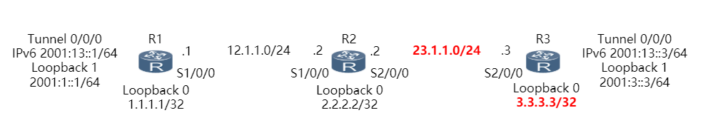

# IPv6 over IPv4 Tunnel Configuration
好的...我们来直入正题。这次的实验是在eNSP上进行的，如果你是在自己的PC上做这个实验的话，你需要到官网上下载最新版的[eNSP](https://support.huawei.com/enterprise/zh/tool/ensp-TL1000000015)。另外，它需要[Wireshark](https://www.wireshark.org/)、[WinPcap](https://nmap.org/npcap/windows-10.html)和[VirtualBox](https://www.virtualbox.org/)才能正常运行。

其中，

> **WinPcap isn't supported on Windows 10**
>
> For 14 years, WinPcap was the standard libpcap package for Windows. But when Windows 10 was released without NDIS 5 support, WinPcap failed to keep up, leaving users wondering what to do. Fortunately, the Nmap Project stepped up and converted the original WinPcap to the new NDIS 6 API, giving users a fast and completely compatible alternative to WinPcap for Windows 10.
>
> **Npcap is WinPcap for Windows 10**
>
> -- [Npcap: WinPcap for Windows 10](https://nmap.org/npcap/windows-10.html)

你能看到，如果你正在使用Windows 10，你需要安装Npcap而不是WinPcap。重要的是，{==安装过程中别忘了勾选WinPcap兼容模式==}，否则eNSP可能识别不到它。

还有，当前我能获取到的eNSP的版本仅支持VirtualBox 5.x。我尝试过VirtualBox 6.0，但是启动路由器的时候总是失败，后续版本或许会修正这一点。

## 实验要求
我继续摘抄一下...

> 安装和配置华为eNSP网络仿真软件
>
> 熟悉eNSP软件的使用，进行简单的网络命令练习
>
> 根据已给拓扑，实现IPv6-over-IPv4手工隧道的配置 ，达到IPv6数据包通过IPv4网络通信的目的

还有：

> IPv6 over IPv4隧道技术：通过隧道技术，使IPv6报文在IPv4网络中传输，实现IPv6网络之间的孤岛互连
>
> IPv6 over IPv4隧道分类：手动隧道包括手动隧道和GRE隧道
>
> 手动隧道：IPv6 over IPv4隧道手动隧道的一种，源地址和目的地址均需手工指定，用于边界路由器与边界路由器，或者主机与边界路由器之间。

这个重要的：

> 公司A网络拓扑如下所示，现根据需求完成如下配置：
>
> R1、R2和R3的IPv4地址如图所示，部署在OSPFv2的区域0中，该部分配置应首先完成；
>
> 所需的IPv6地址已经标出；
>
> 采用IPv6 over IPv4手动隧道的形式，实现R1与R3的Loopback1之间的互通。



## 来尝试一下
第一部分仅仅只是设置一下路由器、交换机和PC，差不多就是个熟悉软件的过程，这边就不多说什么了。

接下来有个很好的参考是：[IPv6 over IPv4 Tunnel Configuration](http://support.huawei.com/enterprise/pages/doc/subfile/docDetail1.jsp?contentId=DOC1000027468&partNo=10142)

第二部分需要先拖拽3台路由器到面板上，然后按照图中那样连接它们。完成后你就可以选中它们，然后启动。

### 一些准备
首先我们来设置IP地址和OSPF。对于AR1:

```
<Huawei>system-view
[Huawei]interface GigabitEthernet 0/0/0
[Huawei-GigabitEthernet0/0/0]ip addr 12.1.1.1 24
[Huawei-GigabitEthernet0/0/0]ospf
[Huawei-ospf-1]area 0
[Huawei-ospf-1-area-0.0.0.0]network 1.1.1.1 0.0.0.0
[Huawei-ospf-1-area-0.0.0.0]network 12.1.1.0 0.0.0.255
```

对于AR2：

```
<Huawei>system-view
[Huawei]interface GigabitEthernet 0/0/0
[Huawei-GigabitEthernet0/0/0]ip addr 12.1.1.2 24
[Huawei-GigabitEthernet0/0/0]interface GigabitEthernet 0/0/1
[Huawei-GigabitEthernet0/0/1]ip addr 23.1.1.2 24
[Huawei-GigabitEthernet0/0/1]ospf
[Huawei-ospf-1]area 0
[Huawei-ospf-1-area-0.0.0.0]network 12.1.1.0 0.0.0.255
[Huawei-ospf-1-area-0.0.0.0]network 23.1.1.0 0.0.0.255
```

还有AR3，其实跟AR1差不多：

```
<Huawei>system-view
[Huawei]interface GigabitEthernet 0/0/0
[Huawei-GigabitEthernet0/0/0]ip addr 23.1.1.3 24
[Huawei-GigabitEthernet0/0/0]ospf
[Huawei-ospf-1]area 0
[Huawei-ospf-1-area-0.0.0.0]network 3.3.3.3 0.0.0.0
[Huawei-ospf-1-area-0.0.0.0]network 23.1.1.0 0.0.0.255
```

每次设置OSPF时，你应该都能在控制台上观察到邻居变动等相关信息。

### 开始
接下来就是对路由器设置隧道和转发了。对于AR1，需要：

```
[Huawei-GigabitEthernet0/0/0]interface LoopBack 0
[Huawei-LoopBack0]ip addr 1.1.1.1 32
[Huawei-LoopBack0]interface LoopBack 1
[Huawei-LoopBack1]ipv6 addr 2001:1::1 64
```

诶？你收到一个错误没有？

!!! tip
    如果你没有通过`ipv6 enable`来使得某个端口启用IPv6，那么你在执行上述命令时就会得到一个看起来不是很相关的错误`Unrecognized command`。
    
    你只需要对这个端口执行`ipv6 enable`，再设置IPv6地址就可以了。

不对啊？为什么还是提示要在`system-view`下启用IPv6？

!!! tip
    需要在`system-view`中执行`ipv6`来启用IPv6，否则相关功能都不会启用。
    
    在没有启动前，你在设置IPv6相关的内容时都会出现一则提示（INFO）。

可以开始来折腾隧道了：

```
[Huawei-LoopBack1]interface tunnel 0/0/0
[Huawei-Tunnel0/0/0]ipv6 enable
[Huawei-Tunnel0/0/0]ipv6 address 2001:13::1 64
[Huawei-Tunnel0/0/0]tunnel-protocol ipv6-ipv4
[Huawei-Tunnel0/0/0]source LoopBack 0
[Huawei-Tunnel0/0/0]destination 3.3.3.3
```

别忘了转发：

```
[Huawei]ipv6 route-static 2001:3:: 64 Tunnel 0/0/0
```

同样的道理对AR3进行设置就可以了。在你设置好的时候应该就会在控制台上看到端口和协议`UP`的信息。

你也可以通过：

```
display ipv6 interface Tunnel 0/0/0
```

来查看它们是否都已经是`UP`状态。这个时候工作应该已经完成了，可以来测试了。

### 测试
你已经可以通过`ping ipv6`来测试网络是否正常工作了。

## 关键词
实验报告 IPv6隧道实验 计算机网络
