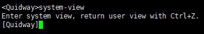
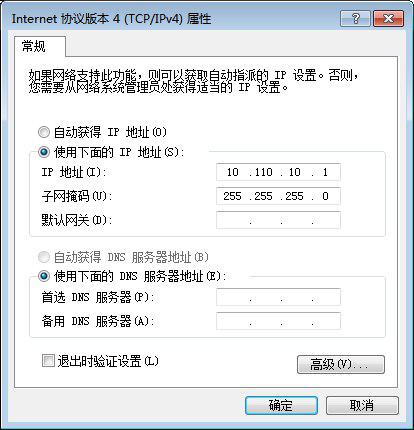
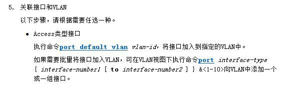
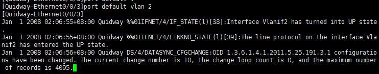
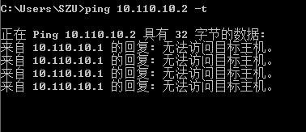
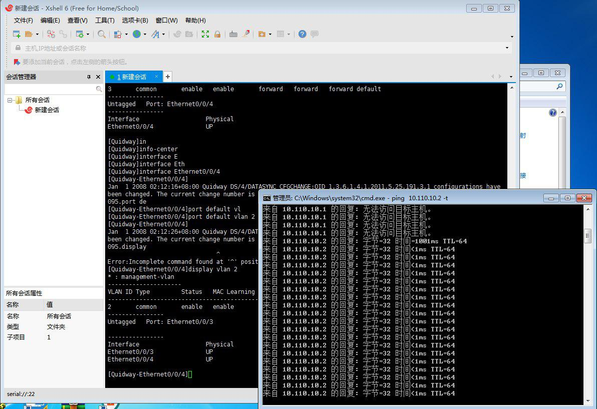
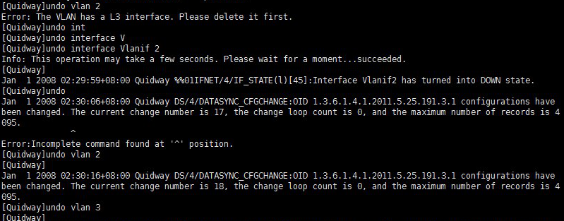
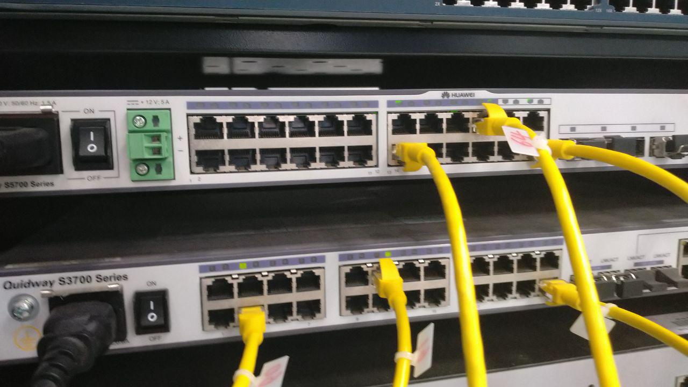
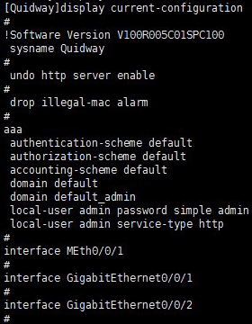
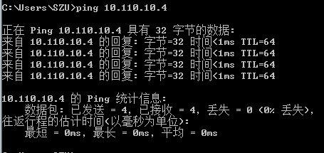

让队友和我一起折腾到了六点多，有点愧疚，感谢各位大佬支持。

记录一下踩坑的历史，希望对各位有所帮助，如果文中存在差错，还望各位指点。

这次的环境是：

+ 机房的电脑4台，全部是Windows 7系统。其中一台电脑使用Xshell，通过串口连接并配置交换机。
+ Quidway S5700系列交换机1台，Quidway S3700系列交换机1台。

...并不是我故意找了两台不一样的，而是我所在的位置上的柜子里就是这样的。这样的情况带来的问题就是有些命令不大一样，需要先翻手册才知道。当然你要是因为这个就黑说老师的PPT不对就有点过了，PPT上面的内容个人认为最多算是启发性质的、大方向上的教程，并且针对的交换机型号、硬件版本、固件版本不能总是和你所在的环境一样，更多的细节上的问题你总是需要自己想办法去解决和适应。

## CONSOLE方式登录
正常情况下，你应该可以看到交换机上面的CONSOLE口有一根线连到了某台电脑的RS-232（这个是我瞎说的）口上，这个时候就用这台电脑来配置交换机吧。

PPT里的示例使用的是超级终端，不过我使用的是Xshell，像这样子新建一个连接，然后选择**串口SERIAL**：

先别急着确定，我一般会习惯性地先看看端口号：

是**COM1**没错了，记住它，到左侧的**SERIAL**中确认一下各项参数是否正确，然后就可以连接了。

连接上之后，可以直接输入一个问号**?**来查看帮助，平时输入命令的时候，可以用**TAB**来提示相关词。

然后根据实验报告的要求，你可以到各种视图中转悠转悠熟悉一下操作：

什么？你说PPT上的端口不对？你看过文档或是**display**看过了吗？

这里就不再多说什么了，端口各种配置各位就自行看文档发掘吧。

## VLAN基本配置
题目要求大概是这样的：

> 按图连接好实验设备，PC1、PC2、交换机的IP地址分别为10.110.10.1、10.110.10.2、10.110.10.3，子网掩码均设置为255.255.255.0。建立VLAN2、VLAN3，通过配置将端口Ethernet 0/3包含到VLAN2中，将端口Ethernet 0/4包含到VLAN3中，并使用PING命令检查VLAN工作情况，测试PC1、PC2、交换机之间能否PING成功。
>
> 将端口Ethernet 0/4包含到VLAN2中，并使用PING命令检查VLAN工作情况，测试PC1、PC2 、交换机之间能否PING成功。

所以我们先把PC1、PC2分别连接到交换机的Ethernet 0/0/3、Ethernet 0/0/4上。正常情况下，连接正确的时候你能看到交换机上对应数字的灯在闪烁。连接完成后我们在PC上设置一下IP地址和子网掩码：

你应该能找到它在哪里吧...控制面板->网络和和共享中心->本地连接->属性->IPv4。

至于交换机的IP地址的设置...**你需要在vlanif上配置它**，有关详细信息，你可以参阅这里：

[vlanif和vlan的区别](https://forum.huawei.com/enterprise/zh/thread-159081-1-1.html)

[交换机要ip有什么用？](https://www.zhihu.com/question/51517961)

接下来我们该来配置一下VLAN了。根据要求，把Ethernet 0/0/3包含到VLAN2中，把Ethernet 0/0/4包含到VLAN3中：

在VLAN中添加端口也是可行的。

如果遇到问题需要更改端口类型：

如果你不明白，我想你应该去搜索一下有关trunk/access/hybrid的内容。

另一个接口同理，都配置好之后应该能看到是这样的：

这个时候就可以开始测试了：

由于两个PC被分配到了不同的VLAN中，并且没有可达路由，所以它们不能互相通信。这个时候，我们切换到Xshell中更改VLAN划分。由于刚刚的ping带有-t参数，它会不停地继续发送ping包。我们来把Ethernet 0/0/4改到VLAN2中看看：

我们刚把Ethernet 0/0/4添加到VLAN2后马上可以看到这边已经可以ping通了。

## Trunking
希望你在搞这个之前已经清楚地知道自己在做什么...如果不知道的话，我觉得你可以尝试着去搜一下相关的内容，也可以看看单线复用、单臂路由之类的应用，或许能有所帮助，而且说不定就能在日常生活中用起来了呢？

我们先把之前创建的VLAN先都删掉：

这个时候还是接线，按照PPT说明接好：

> 按图连接好实验设备，PC1、PC2、PC3、PC4的IP地址分别为10.110.10.1、10.110.10.2、10.110.10.3、10.110.10.4，子网掩码均设置为255.255.255.0。建立VLAN2、VLAN3，通过配置将PC1和PC3所连端口包含到VLAN3中，通过配置将PC2和PC4所连端口包含到VLAN2中，将两台交换机的Ethernet 0/23端口设置为Trunk端口，并允许所有VLAN通过。

由于这个交换机的22好像是坏的...于是换到了20上（真是尴尬）。所以我们接下来要干的事情是：

1. 将PC1连接到交换机1的Ethernet 0/0/3上，配置静态IP为10.110.10.1/24；
2. 将PC2连接到交换机1的Ethernet 0/0/12上，配置静态IP为10.110.10.2/24；
3. 将PC3连接到交换机2的Ethernet 0/0/13上，配置静态IP为10.110.10.3/24；
4. 将PC4连接到交换机2的Ethernet 0/0/20上，配置静态IP为10.110.10.4/24；
5. 找根网线把交换机1的Ethernet 0/0/23和交换机2的Ethernet 0/0/23连接起来。

大概会是这个样子：

接下来继续回到Xshell上开始配置交换机，我们先来折腾交换机1：

1. 将Ethernet 0/0/3添加到VLAN3中；
2. 将Ethernet 0/0/12添加到VLAN2中；
3. 将Ethernet 0/0/23配置为trunk并允许VLAN2/3的流量通过。

这台交换机的端口就不像想象中的那样了：

好吧...原来是`GigabitEthernet0/0/1`，原谅我这种只会用网件那种有配置程序的交换机的人TAB了半天...

这里添加各端口到VLAN中的命令大家应该都清楚了，不再挂图了...看看trunk：

别忘了还要允许流量通过：

是不是又想说和PPT里不一样？可是官方文档里可是清清楚楚地只有上面图里那种用法的哦。自己动手，丰衣足食吧。

检查过没有问题了就可以继续配置交换机2了：

1. 将Ethernet0/0/13添加到VLAN3中；
2. 将Ethernet0/0/20添加到VLAN2中；
3. 将Ethernet0/0/23配置为trunk并允许VLAN2/3的流量通过。

跟上面差不多，我就不累死累活上图了。如果两台都配置好了之后就可以来测试了！根据实验要求：

PC1和PC2之间能否ping成功：

由于PC1和PC2不在同一个VLAN，并且不存在可达路由，所以不能ping通。

PC1和PC3之间能否ping成功：

PC1和PC3在同一个VLAN中，并且配置好了trunk，可以ping通。

PC2和PC4之间能否ping成功：

同一VLAN，并且有正确的trunk，可以ping通。

附加一个PC2和PC3：

大概这样子就圆满完成了。不过走之前别忘了删掉VLAN，网线插回原位之类的扫尾工作哈。
