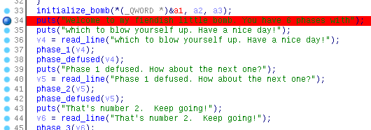

这回来整理一下这题逆向。我是个学艺不精的默默无闻的对二进制了解不多的普通学生，做这个还是有点难度的，感谢队里的大佬[@Apeng](https://apeng.fun/)带我。下面大概是我的解题过程，如果有问题或是错误，还望各位大佬指点。

题目存档：[bomb_64](./problems/bomb_64) [bomb_64.c](./problems/bomb_64.c)

环境：openSUSE Tumbleweed + wine + IDA + Remote Linux debugger

因为我是实机Linux，所以“Remote” Linux debugger其实是在本地调试。如果你正在Windows下使用IDA，那么可能需要Linux虚拟机来进行调试。不管怎样，有可以实现的可靠的方法就行。

!!! warning
    下文中由我手动还原的C代码并没有进行测试，可能存在问题，仅供参考。如果你发现了其中的问题，麻烦告诉我。

## main()
其实题目已经给出了`main()`函数的相关内容：

``` c
/* Do all sorts of secret stuff that makes the bomb harder to defuse. */
initialize_bomb();

printf("Welcome to my fiendish little bomb. You have 6 phases with\n");
printf("which to blow yourself up. Have a nice day!\n");

/* Hmm...  Six phases must be more secure than one phase! */
input = read_line();             /* Get input                   */
phase_1(input);                  /* Run the phase               */
phase_defused();                 /* Drat!  They figured it out!
                  * Let me know how they did it. */
printf("Phase 1 defused. How about the next one?\n");

/* The second phase is harder.  No one will ever figure out
 * how to defuse this... */
input = read_line();
phase_2(input);
phase_defused();
printf("That's number 2.  Keep going!\n");

/* I guess this is too easy so far.  Some more complex code will
 * confuse people. */
input = read_line();
phase_3(input);
phase_defused();
printf("Halfway there!\n");

/* Oh yeah?  Well, how good is your math?  Try on this saucy problem! */
input = read_line();
phase_4(input);
phase_defused();
printf("So you got that one.  Try this one.\n");

/* Round and 'round in memory we go, where we stop, the bomb blows! */
input = read_line();
phase_5(input);
phase_defused();
printf("Congratulations! You've (mostly) defused the bomb!\n");
printf("Hit Control-C to escape phase 6 (for free!), but if you want to\n");
printf("try phase 6 for extra credit, you can continue.  Just beware!\n");

/* Oh, so you want more danger? Let's make this one extra hard. */
input = read_line();
phase_6(input);
phase_defused();

/* Wow, they got it!  But isn't something... missing?  Perhaps
 * something they overlooked?  Mua ha ha ha ha! */

return 0;
```

看起来是有6个关卡，每次都需要有一段输入，合法则拆除炸弹，非法则炸弹爆炸。虽然已经知道是这样，但是我还是要F5一下：



先在初始化`initialize_bomb()`后面加个断点，然后启动动态调试。

## phase_1()
F8步进，在`phase_1()`函数前要求输入，我们先双击`phase_1`进去看看：

``` c tab="C, decompiled by IDA"
__int64 __fastcall phase_1(__int64 a1)
{
  __int64 result; // rax

  result = strings_not_equal((_BYTE *)a1, "Science isn't about why, it's about why not?");
  if ( (_DWORD)result )
    explode_bomb(a1, "Science isn't about why, it's about why not?");
  return result;
}
```

``` asm tab="ASM"
.text:0000000000400E70 ; =============== S U B R O U T I N E =======================================
.text:0000000000400E70
.text:0000000000400E70
.text:0000000000400E70 public phase_1
.text:0000000000400E70 phase_1 proc near                       ; CODE XREF: main+90↑p
.text:0000000000400E70 ; __unwind {
.text:0000000000400E70 sub     rsp, 8
.text:0000000000400E74 mov     esi, offset aScienceIsnTAbo     ; "Science isn't about why, it's about why"...
.text:0000000000400E79 call    strings_not_equal
.text:0000000000400E7E test    eax, eax
.text:0000000000400E80 jz      short loc_400E87
.text:0000000000400E82 call    explode_bomb
.text:0000000000400E87 ; ---------------------------------------------------------------------------
.text:0000000000400E87
.text:0000000000400E87 loc_400E87:                             ; CODE XREF: phase_1+10↑j
.text:0000000000400E87 add     rsp, 8
.text:0000000000400E8B retn
.text:0000000000400E8B ; } // starts at 400E70
.text:0000000000400E8B phase_1 endp
.text:0000000000400E8B
```

``` c tab="C, decompiled by me"
void phase_1(char str[]) {
    if (strings_not_equal(str, "Science isn't about why, it's about why not?")) {
        explode_bomb();
    }
}
```

非常明显，调用`strings_not_equal()`比较字符串，双击进入可看出要求输入的字符串和下述字符串

    Science isn't about why, it's about why not?

相等，如果不相等则调用`explode_bomb()`引爆炸弹。

其中，

``` asm
test    eax, eax
jz      short loc_400E87
```

将eax和eax与运算后，检查结果是否为0。所以效果应该是eax为0的时候跳转。也可以写成：

``` asm
cmp     eax, 0
```

[`testl` eax against eax?](https://stackoverflow.com/questions/147173/testl-eax-against-eax)

> The meaning of `test` is to AND the arguments together, and check the result for zero. So this code tests if EAX is zero or not. `je` will jump if zero.
>
> BTW, this generates a smaller instruction than `cmp eax, 0` which is the reason that compilers will generally do it this way.

对于`strings_not_equal()`来说：

``` c tab="C, decompiled by IDA"
__int64 __fastcall strings_not_equal(_BYTE *a1, _BYTE *a2)
{
  int v2; // er12
  int v3; // eax
  unsigned int flag; // edx
  __int64 v5; // rax
  char v6; // dl

  v2 = string_length(a1);
  v3 = string_length(a2);
  flag = 1;
  if ( v2 == v3 )
  {
    LOBYTE(flag) = 0;
    if ( *a1 )
    {
      LOBYTE(flag) = 1;
      if ( *a1 == *a2 )
      {
        v5 = 0LL;
        do
        {
          v6 = a1[v5 + 1];
          if ( !v6 )
            return 0;
          ++v5;
        }
        while ( v6 == a2[v5] );
        flag = 1;
      }
    }
  }
  return flag;
}
```

``` asm tab="ASM"
.text:000000000040123D ; =============== S U B R O U T I N E =======================================
.text:000000000040123D
.text:000000000040123D
.text:000000000040123D public strings_not_equal
.text:000000000040123D strings_not_equal proc near             ; CODE XREF: phase_1+9↑p
.text:000000000040123D                                         ; phase_defused+3A↓p
.text:000000000040123D
.text:000000000040123D var_18= qword ptr -18h
.text:000000000040123D var_10= qword ptr -10h
.text:000000000040123D var_8= qword ptr -8
.text:000000000040123D
.text:000000000040123D ; __unwind {
.text:000000000040123D mov     [rsp+var_18], rbx
.text:0000000000401242 mov     [rsp+var_10], rbp
.text:0000000000401247 mov     [rsp+var_8], r12
.text:000000000040124C sub     rsp, 18h
.text:0000000000401250 mov     rbx, rdi
.text:0000000000401253 mov     rbp, rsi
.text:0000000000401256 call    string_length
.text:000000000040125B mov     r12d, eax
.text:000000000040125E mov     rdi, rbp
.text:0000000000401261 call    string_length
.text:0000000000401266 mov     edx, 1
.text:000000000040126B cmp     r12d, eax
.text:000000000040126E jnz     short loc_4012A6
.text:0000000000401270 movzx   eax, byte ptr [rbx]
.text:0000000000401273 mov     dl, 0
.text:0000000000401275 test    al, al
.text:0000000000401277 jz      short loc_4012A6
.text:0000000000401279 mov     dl, 1
.text:000000000040127B cmp     al, [rbp+0]
.text:000000000040127E jnz     short loc_4012A6
.text:0000000000401280 mov     eax, 0
.text:0000000000401285 jmp     short loc_401291
.text:0000000000401287 ; ---------------------------------------------------------------------------
.text:0000000000401287
.text:0000000000401287 loc_401287:                             ; CODE XREF: strings_not_equal+5B↓j
.text:0000000000401287 add     rax, 1
.text:000000000040128B cmp     dl, [rbp+rax+0]
.text:000000000040128F jnz     short loc_4012A1
.text:0000000000401291
.text:0000000000401291 loc_401291:                             ; CODE XREF: strings_not_equal+48↑j
.text:0000000000401291 movzx   edx, byte ptr [rbx+rax+1]
.text:0000000000401296 test    dl, dl
.text:0000000000401298 jnz     short loc_401287
.text:000000000040129A mov     edx, 0
.text:000000000040129F jmp     short loc_4012A6
.text:00000000004012A1 ; ---------------------------------------------------------------------------
.text:00000000004012A1
.text:00000000004012A1 loc_4012A1:                             ; CODE XREF: strings_not_equal+52↑j
.text:00000000004012A1 mov     edx, 1
.text:00000000004012A6
.text:00000000004012A6 loc_4012A6:                             ; CODE XREF: strings_not_equal+31↑j
.text:00000000004012A6                                         ; strings_not_equal+3A↑j ...
.text:00000000004012A6 mov     eax, edx
.text:00000000004012A8 mov     rbx, [rsp+18h+var_18]
.text:00000000004012AC mov     rbp, [rsp+18h+var_10]
.text:00000000004012B1 mov     r12, [rsp+18h+var_8]
.text:00000000004012B6 add     rsp, 18h
.text:00000000004012BA retn
.text:00000000004012BA ; } // starts at 40123D
.text:00000000004012BA strings_not_equal endp
.text:00000000004012BA
```

``` c tab="C, decompiled by me"
int strings_not_equal(char str1[], char str2[]) {
    int str1_length = string_length(str1);
    int str2_length = string_length(str2);
    int flag = 1;
    if (str1_length == str2_length) {
        flag = 0;
        if (str1[0] != '\0') {
            flag = 1;
            if (str1[0] != str2[0]) {
                int index = 0;
                while (str1[index + 1] != '\0') {
                    if (str1[index + 1] != str2[index + 1]) {
                        return flag;
                    }
                }
                flag = 0;
            }
        }
    }
    return flag;
}
```

对于`string_length()`来说：

``` c tab="C, decompiled by IDA"
__int64 __fastcall string_length(_BYTE *a1)
{
  __int64 result; // rax
  _BYTE *v2; // rdx

  result = 0LL;
  if ( *a1 )
  {
    v2 = a1;
    do
      result = (unsigned int)((_DWORD)++v2 - (_DWORD)a1);
    while ( *v2 );
  }
  return result;
}
```

``` asm tab="ASM"
.text:0000000000401221 ; =============== S U B R O U T I N E =======================================
.text:0000000000401221
.text:0000000000401221
.text:0000000000401221 public string_length
.text:0000000000401221 string_length proc near                 ; CODE XREF: strings_not_equal+19↓p
.text:0000000000401221                                         ; strings_not_equal+24↓p
.text:0000000000401221 ; __unwind {
.text:0000000000401221 mov     eax, 0
.text:0000000000401226 cmp     byte ptr [rdi], 0
.text:0000000000401229 jz      short locret_40123B
.text:000000000040122B mov     rdx, rdi
.text:000000000040122E
.text:000000000040122E loc_40122E:                             ; CODE XREF: string_length+18↓j
.text:000000000040122E add     rdx, 1
.text:0000000000401232 mov     eax, edx
.text:0000000000401234 sub     eax, edi
.text:0000000000401236 cmp     byte ptr [rdx], 0
.text:0000000000401239 jnz     short loc_40122E
.text:000000000040123B
.text:000000000040123B locret_40123B:                          ; CODE XREF: string_length+8↑j
.text:000000000040123B rep retn
.text:000000000040123B ; } // starts at 401221
.text:000000000040123B string_length endp
.text:000000000040123B
```

``` c tab="C, decompiled by me"
int string_length(char str[]) {
    int length = 0;
    if (str[0] != '\0') {
        char *ptr = str;
        while (*ptr != '\0') {
            ptr += 1;
            length = ptr - str;
        }
    }
    return length;
}
```

所以，我们只需要输入：

    Science isn't about why, it's about why not?

就可以通过第一个check。

## phase_2()
先双击进来看看，看了个大概，然后随便输6个数开始慢慢调：

!!! tip
    嗯，没错，就是先随便给6个数。即使这6个数本身不能通过check也无所谓，我们的主要目的是调试的时候看它如何进行比较等运算的。如果它要炸了，你只需要改变相应的跳转flag让它回归正轨就可以了，但是别忘记了要记下它的算法，你需要记下来才能在没有调试器的时候通过check。

``` c tab="C, decompiled by IDA"
__int64 __fastcall phase_2(__int64 a1)
{
  char *v1; // rbp
  int v2; // er12
  __int64 result; // rax
  __int64 v4; // [rsp+0h] [rbp-48h]
  char v5; // [rsp+Ch] [rbp-3Ch]

  read_six_numbers(a1, (__int64)&v4);
  v1 = (char *)&v4;
  v2 = 0;
  do
  {
    result = *((unsigned int *)v1 + 3);
    if ( *(_DWORD *)v1 != (_DWORD)result )
      explode_bomb(a1, &v4);
    v2 += *(_DWORD *)v1;
    v1 += 4;
  }
  while ( v1 != &v5 );
  if ( !v2 )
    explode_bomb(a1, &v4);
  return result;
}
```

``` asm tab="ASM"
.text:0000000000400E8C ; =============== S U B R O U T I N E =======================================
.text:0000000000400E8C
.text:0000000000400E8C
.text:0000000000400E8C public phase_2
.text:0000000000400E8C phase_2 proc near                       ; CODE XREF: main+AC↑p
.text:0000000000400E8C
.text:0000000000400E8C var_3C= byte ptr -3Ch
.text:0000000000400E8C var_20= qword ptr -20h
.text:0000000000400E8C var_18= qword ptr -18h
.text:0000000000400E8C var_10= qword ptr -10h
.text:0000000000400E8C var_8= qword ptr -8
.text:0000000000400E8C
.text:0000000000400E8C ; __unwind {
.text:0000000000400E8C mov     [rsp+var_20], rbx
.text:0000000000400E91 mov     [rsp+var_18], rbp
.text:0000000000400E96 mov     [rsp+var_10], r12
.text:0000000000400E9B mov     [rsp+var_8], r13
.text:0000000000400EA0 sub     rsp, 48h
.text:0000000000400EA4 mov     rsi, rsp
.text:0000000000400EA7 call    read_six_numbers
.text:0000000000400EAC mov     rbp, rsp
.text:0000000000400EAF lea     r13, [rsp+48h+var_3C]
.text:0000000000400EB4 mov     r12d, 0
.text:0000000000400EBA
.text:0000000000400EBA loc_400EBA:                             ; CODE XREF: phase_2+48↓j
.text:0000000000400EBA mov     rbx, rbp
.text:0000000000400EBD mov     eax, [rbp+0Ch]
.text:0000000000400EC0 cmp     [rbp+0], eax
.text:0000000000400EC3 jz      short loc_400ECA
.text:0000000000400EC5 call    explode_bomb
.text:0000000000400ECA ; ---------------------------------------------------------------------------
.text:0000000000400ECA
.text:0000000000400ECA loc_400ECA:                             ; CODE XREF: phase_2+37↑j
.text:0000000000400ECA add     r12d, [rbx]
.text:0000000000400ECD add     rbp, 4
.text:0000000000400ED1 cmp     rbp, r13
.text:0000000000400ED4 jnz     short loc_400EBA
.text:0000000000400ED6 test    r12d, r12d
.text:0000000000400ED9 jnz     short loc_400EE0
.text:0000000000400EDB call    explode_bomb
.text:0000000000400EE0 ; ---------------------------------------------------------------------------
.text:0000000000400EE0
.text:0000000000400EE0 loc_400EE0:                             ; CODE XREF: phase_2+4D↑j
.text:0000000000400EE0 mov     rbx, [rsp+48h+var_20]
.text:0000000000400EE5 mov     rbp, [rsp+48h+var_18]
.text:0000000000400EEA mov     r12, [rsp+48h+var_10]
.text:0000000000400EEF mov     r13, [rsp+48h+var_8]
.text:0000000000400EF4 add     rsp, 48h
.text:0000000000400EF8 retn
.text:0000000000400EF8 ; } // starts at 400E8C
.text:0000000000400EF8 phase_2 endp
.text:0000000000400EF8
```

``` c tab="C, decompiled by me"
void phase_2() {
    int array[6];
    read_six_numbers(arg1, array);
    int sum = 0;
    int *ptr = arrray;
    while (ptr != (array + 3)) {
        if (ptr[0] != ptr[3]) {
            explode_bomb();
        }
        sum += *ptr;
        ptr += 1;
    }
    if (sum == 0) {
        explode_bomb();
    }
}
```

对了，希望你已经知道了`a[i]`是`*(a+i)`的语法糖。

看起来像是输入6个数字，前三个和后三个需要分别相等，{--并且不能全为0--}更新：6个数累加和不能为0（感谢提醒）。

另外，再看看`read_six_numbers()`：

``` c tab="C, decompiled by IDA"
__int64 __fastcall read_six_numbers(__int64 a1, __int64 a2)
{
  __int64 result; // rax

  result = __isoc99_sscanf(a1, &unk_401EB2, a2, a2 + 4, a2 + 8, a2 + 12);
  if ( (signed int)result <= 5 )
    explode_bomb(a1, &unk_401EB2);
  return result;
}
```

``` asm tab="ASM"
.text:0000000000401743 ; =============== S U B R O U T I N E =======================================
.text:0000000000401743
.text:0000000000401743
.text:0000000000401743 public read_six_numbers
.text:0000000000401743 read_six_numbers proc near              ; CODE XREF: phase_2+1B↑p
.text:0000000000401743
.text:0000000000401743 var_18= qword ptr -18h
.text:0000000000401743 var_10= qword ptr -10h
.text:0000000000401743
.text:0000000000401743 ; __unwind {
.text:0000000000401743 sub     rsp, 18h
.text:0000000000401747 mov     rdx, rsi
.text:000000000040174A lea     rcx, [rsi+4]
.text:000000000040174E lea     rax, [rsi+14h]
.text:0000000000401752 mov     [rsp+18h+var_10], rax
.text:0000000000401757 lea     rax, [rsi+10h]
.text:000000000040175B mov     [rsp+18h+var_18], rax
.text:000000000040175F lea     r9, [rsi+0Ch]
.text:0000000000401763 lea     r8, [rsi+8]
.text:0000000000401767 mov     esi, offset unk_401EB2
.text:000000000040176C mov     eax, 0
.text:0000000000401771 call    ___isoc99_sscanf
.text:0000000000401776 cmp     eax, 5
.text:0000000000401779 jg      short loc_401780
.text:000000000040177B call    explode_bomb
.text:0000000000401780 ; ---------------------------------------------------------------------------
.text:0000000000401780
.text:0000000000401780 loc_401780:                             ; CODE XREF: read_six_numbers+36↑j
.text:0000000000401780 add     rsp, 18h
.text:0000000000401784 retn
.text:0000000000401784 ; } // starts at 401743
.text:0000000000401784 read_six_numbers endp
.text:0000000000401784
```

``` c tab="C, decompiled by me"
// （省略了部分内容）
void read_six_numbers(char arg1[], int array[]) {
    if (scanf("%d %d %d %d %d %d", array, array + 1, array + 2, array + 3, array + 4, array + 5) <= 5) {
        explode_bomb();
    }
}
```

综上，随意构造前三个和后三个数字分别相等且{--不全为0--}累加和不为0的六个数字即可，例如：

    1 2 3 1 2 3

应该能通过第二个check。

## phase_3()
这关主要是`switch`和跳转表。

``` c tab="C, decompiled by IDA"
signed __int64 __fastcall phase_3(__int64 a1, __int64 a2, __int64 a3, __int64 a4, __int64 a5, __int64 a6)
{
  signed __int64 result; // rax
  int v7; // [rsp+8h] [rbp-10h]
  int v8; // [rsp+Ch] [rbp-Ch]

  if ( (signed int)__isoc99_sscanf(a1, "%d %d", &v8, &v7, a5, a6) <= 1 )
    explode_bomb(a1, "%d %d");
  switch ( v8 )
  {
    case 0:
      result = 535LL;
      break;
    case 1:
      result = 926LL;
      break;
    case 2:
      result = 214LL;
      break;
    case 3:
      result = 339LL;
      break;
    case 4:
      result = 119LL;
      break;
    case 5:
      result = 352LL;
      break;
    case 6:
      result = 919LL;
      break;
    case 7:
      result = 412LL;
      break;
    default:
      explode_bomb(a1, "%d %d");
      return result;
  }
  if ( (_DWORD)result != v7 )
    explode_bomb(a1, "%d %d");
  return result;
}
```

``` asm tab="ASM"
.text:0000000000400EF9 ; =============== S U B R O U T I N E =======================================
.text:0000000000400EF9
.text:0000000000400EF9
.text:0000000000400EF9 public phase_3
.text:0000000000400EF9 phase_3 proc near                       ; CODE XREF: main+C8↑p
.text:0000000000400EF9
.text:0000000000400EF9 var_10= dword ptr -10h
.text:0000000000400EF9 var_C= dword ptr -0Ch
.text:0000000000400EF9
.text:0000000000400EF9 ; __unwind {
.text:0000000000400EF9 sub     rsp, 18h
.text:0000000000400EFD lea     rcx, [rsp+18h+var_10]
.text:0000000000400F02 lea     rdx, [rsp+18h+var_C]
.text:0000000000400F07 mov     esi, offset aDD                 ; "%d %d"
.text:0000000000400F0C mov     eax, 0
.text:0000000000400F11 call    ___isoc99_sscanf
.text:0000000000400F16 cmp     eax, 1
.text:0000000000400F19 jg      short loc_400F20
.text:0000000000400F1B call    explode_bomb
.text:0000000000400F20 ; ---------------------------------------------------------------------------
.text:0000000000400F20
.text:0000000000400F20 loc_400F20:                             ; CODE XREF: phase_3+20↑j
.text:0000000000400F20 cmp     [rsp+18h+var_C], 7              ; switch 8 cases
.text:0000000000400F25 ja      short loc_400F63                ; jumptable 0000000000400F2B default case
.text:0000000000400F27 mov     eax, [rsp+18h+var_C]
.text:0000000000400F2B jmp     ds:off_401B60[rax*8]            ; switch jump
.text:0000000000400F32 ; ---------------------------------------------------------------------------
.text:0000000000400F32
.text:0000000000400F32 loc_400F32:                             ; CODE XREF: phase_3+32↑j
.text:0000000000400F32                                         ; DATA XREF: .rodata:off_401B60↓o
.text:0000000000400F32 mov     eax, 217h                       ; jumptable 0000000000400F2B case 0
.text:0000000000400F37 jmp     short loc_400F74
.text:0000000000400F39 ; ---------------------------------------------------------------------------
.text:0000000000400F39
.text:0000000000400F39 loc_400F39:                             ; CODE XREF: phase_3+32↑j
.text:0000000000400F39                                         ; DATA XREF: .rodata:off_401B60↓o
.text:0000000000400F39 mov     eax, 0D6h                       ; jumptable 0000000000400F2B case 2
.text:0000000000400F3E jmp     short loc_400F74
.text:0000000000400F40 ; ---------------------------------------------------------------------------
.text:0000000000400F40
.text:0000000000400F40 loc_400F40:                             ; CODE XREF: phase_3+32↑j
.text:0000000000400F40                                         ; DATA XREF: .rodata:off_401B60↓o
.text:0000000000400F40 mov     eax, 153h                       ; jumptable 0000000000400F2B case 3
.text:0000000000400F45 jmp     short loc_400F74
.text:0000000000400F47 ; ---------------------------------------------------------------------------
.text:0000000000400F47
.text:0000000000400F47 loc_400F47:                             ; CODE XREF: phase_3+32↑j
.text:0000000000400F47                                         ; DATA XREF: .rodata:off_401B60↓o
.text:0000000000400F47 mov     eax, 77h                        ; jumptable 0000000000400F2B case 4
.text:0000000000400F4C jmp     short loc_400F74
.text:0000000000400F4E ; ---------------------------------------------------------------------------
.text:0000000000400F4E
.text:0000000000400F4E loc_400F4E:                             ; CODE XREF: phase_3+32↑j
.text:0000000000400F4E                                         ; DATA XREF: .rodata:off_401B60↓o
.text:0000000000400F4E mov     eax, 160h                       ; jumptable 0000000000400F2B case 5
.text:0000000000400F53 jmp     short loc_400F74
.text:0000000000400F55 ; ---------------------------------------------------------------------------
.text:0000000000400F55
.text:0000000000400F55 loc_400F55:                             ; CODE XREF: phase_3+32↑j
.text:0000000000400F55                                         ; DATA XREF: .rodata:off_401B60↓o
.text:0000000000400F55 mov     eax, 397h                       ; jumptable 0000000000400F2B case 6
.text:0000000000400F5A jmp     short loc_400F74
.text:0000000000400F5C ; ---------------------------------------------------------------------------
.text:0000000000400F5C
.text:0000000000400F5C loc_400F5C:                             ; CODE XREF: phase_3+32↑j
.text:0000000000400F5C                                         ; DATA XREF: .rodata:off_401B60↓o
.text:0000000000400F5C mov     eax, 19Ch                       ; jumptable 0000000000400F2B case 7
.text:0000000000400F61 jmp     short loc_400F74
.text:0000000000400F63 ; ---------------------------------------------------------------------------
.text:0000000000400F63
.text:0000000000400F63 loc_400F63:                             ; CODE XREF: phase_3+2C↑j
.text:0000000000400F63 call    explode_bomb                    ; jumptable 0000000000400F2B default case
.text:0000000000400F68 ; ---------------------------------------------------------------------------
.text:0000000000400F68 mov     eax, 0
.text:0000000000400F6D jmp     short loc_400F74
.text:0000000000400F6F ; ---------------------------------------------------------------------------
.text:0000000000400F6F
.text:0000000000400F6F loc_400F6F:                             ; CODE XREF: phase_3+32↑j
.text:0000000000400F6F                                         ; DATA XREF: .rodata:off_401B60↓o
.text:0000000000400F6F mov     eax, 39Eh                       ; jumptable 0000000000400F2B case 1
.text:0000000000400F74
.text:0000000000400F74 loc_400F74:                             ; CODE XREF: phase_3+3E↑j
.text:0000000000400F74                                         ; phase_3+45↑j ...
.text:0000000000400F74 cmp     eax, [rsp+18h+var_10]
.text:0000000000400F78 jz      short loc_400F7F
.text:0000000000400F7A call    explode_bomb
.text:0000000000400F7F ; ---------------------------------------------------------------------------
.text:0000000000400F7F
.text:0000000000400F7F loc_400F7F:                             ; CODE XREF: phase_3+7F↑j
.text:0000000000400F7F add     rsp, 18h
.text:0000000000400F83 retn
.text:0000000000400F83 ; } // starts at 400EF9
.text:0000000000400F83 phase_3 endp
.text:0000000000400F83
```

!!! warning
    跳转表内的地址的“顺序”不总是和你想象的一样。:-)

附上跳转表，各位自行对照着上面看吧。

```
.rodata:0000000000401B60 off_401B60      dq offset loc_400F32    ; DATA XREF: phase_3+32↑r
.rodata:0000000000401B60                 dq offset loc_400F6F    ; jump table for switch statement
.rodata:0000000000401B60                 dq offset loc_400F39
.rodata:0000000000401B60                 dq offset loc_400F40
.rodata:0000000000401B60                 dq offset loc_400F47
.rodata:0000000000401B60                 dq offset loc_400F4E
.rodata:0000000000401B60                 dq offset loc_400F55
.rodata:0000000000401B60                 dq offset loc_400F5C
```

综上，当前关卡需要输入两个整数，这两个整数需要为：

    0 535
    1 926
    2 214
    3 339
    4 119
    5 352
    6 919
    7 412

中的一对，否则将会调用`explode_bomb()`引爆炸弹。

所以，给出上述整数对中的任意一对即可通过第三个check。

## phase_4()
继续步进：

``` c tab="C, decompiled by IDA"
__int64 __fastcall phase_4(__int64 a1, __int64 a2, __int64 a3, __int64 a4, __int64 a5, __int64 a6)
{
  __int64 v6; // rdi
  __int64 result; // rax
  int v8; // [rsp+Ch] [rbp-Ch]

  if ( (unsigned int)__isoc99_sscanf(a1, 4202177LL, &v8, a4, a5, a6) != 1 || v8 <= 0 )
    explode_bomb(a1, 4202177LL);
  v6 = (unsigned int)v8;
  result = func4(v8, 4202177LL);
  if ( (_DWORD)result != 55 )
    explode_bomb(v6, 4202177LL);
  return result;
}
```

``` asm tab="ASM"
.text:0000000000400FC1 ; =============== S U B R O U T I N E =======================================
.text:0000000000400FC1
.text:0000000000400FC1
.text:0000000000400FC1 public phase_4
.text:0000000000400FC1 phase_4 proc near                       ; CODE XREF: main+E4↑p
.text:0000000000400FC1
.text:0000000000400FC1 var_C= dword ptr -0Ch
.text:0000000000400FC1
.text:0000000000400FC1 ; __unwind {
.text:0000000000400FC1 sub     rsp, 18h
.text:0000000000400FC5 lea     rdx, [rsp+18h+var_C]
.text:0000000000400FCA mov     esi, 401EC1h
.text:0000000000400FCF mov     eax, 0
.text:0000000000400FD4 call    ___isoc99_sscanf
.text:0000000000400FD9 cmp     eax, 1
.text:0000000000400FDC jnz     short loc_400FE5
.text:0000000000400FDE cmp     [rsp+18h+var_C], 0
.text:0000000000400FE3 jg      short loc_400FEA
.text:0000000000400FE5
.text:0000000000400FE5 loc_400FE5:                             ; CODE XREF: phase_4+1B↑j
.text:0000000000400FE5 call    explode_bomb
.text:0000000000400FEA ; ---------------------------------------------------------------------------
.text:0000000000400FEA
.text:0000000000400FEA loc_400FEA:                             ; CODE XREF: phase_4+22↑j
.text:0000000000400FEA mov     edi, [rsp+18h+var_C]
.text:0000000000400FEE call    func4
.text:0000000000400FF3 cmp     eax, 37h
.text:0000000000400FF6 jz      short loc_400FFD
.text:0000000000400FF8 call    explode_bomb
.text:0000000000400FFD ; ---------------------------------------------------------------------------
.text:0000000000400FFD
.text:0000000000400FFD loc_400FFD:                             ; CODE XREF: phase_4+35↑j
.text:0000000000400FFD add     rsp, 18h
.text:0000000000401001 retn
.text:0000000000401001 ; } // starts at 400FC1
.text:0000000000401001 phase_4 endp
.text:0000000000401001
```

``` c tab="C, decompiled by me"
void phase_4() {
    int number;
    if (scanf("%d", &number) != 1 || number <= 0) {
        explode_bomb();
    }
    if (func4(number) != 55) {
        explode_bomb();
    }
}
```

这看起来像是需要输入一个非负整数，让它经过`func4()`计算后得到`55`，否则就会触发`explode_bomb()`引爆炸弹。所以我们来看看`func4()`里面有什么：

``` c tab="C, decompiled by IDA"
signed __int64 __fastcall func4(signed int a1, __int64 a2)
{
  signed __int64 result; // rax
  int v3; // ebp

  result = 1LL;
  if ( a1 > 1 )
  {
    v3 = func4((unsigned int)(a1 - 1), a2);
    result = v3 + (unsigned int)func4((unsigned int)(a1 - 2), a2);
  }
  return result;
}
```

``` asm tab="ASM"
.text:0000000000400F84 ; =============== S U B R O U T I N E =======================================
.text:0000000000400F84
.text:0000000000400F84
.text:0000000000400F84 public func4
.text:0000000000400F84 func4 proc near                         ; CODE XREF: func4+1D↓p
.text:0000000000400F84                                         ; func4+27↓p ...
.text:0000000000400F84
.text:0000000000400F84 var_10= qword ptr -10h
.text:0000000000400F84 var_8= qword ptr -8
.text:0000000000400F84
.text:0000000000400F84 ; __unwind {
.text:0000000000400F84 mov     [rsp+var_10], rbx
.text:0000000000400F89 mov     [rsp+var_8], rbp
.text:0000000000400F8E sub     rsp, 18h
.text:0000000000400F92 mov     ebx, edi
.text:0000000000400F94 mov     eax, 1
.text:0000000000400F99 cmp     edi, 1
.text:0000000000400F9C jle     short loc_400FB2
.text:0000000000400F9E lea     edi, [rbx-1]
.text:0000000000400FA1 call    func4
.text:0000000000400FA6 mov     ebp, eax
.text:0000000000400FA8 lea     edi, [rbx-2]
.text:0000000000400FAB call    func4
.text:0000000000400FB0 add     eax, ebp
.text:0000000000400FB2
.text:0000000000400FB2 loc_400FB2:                             ; CODE XREF: func4+18↑j
.text:0000000000400FB2 mov     rbx, [rsp+18h+var_10]
.text:0000000000400FB7 mov     rbp, [rsp+18h+var_8]
.text:0000000000400FBC add     rsp, 18h
.text:0000000000400FC0 retn
.text:0000000000400FC0 ; } // starts at 400F84
.text:0000000000400FC0 func4 endp
.text:0000000000400FC0
```

``` c tab="C, decompiled by me"
int func4(int number) {
    if (number <= 1) {
        return 1;
    }
    return func4(number - 1) + func4(number - 2);
}
```

更新：代码更正了一下，感谢提醒。但我还是建议看IDA逆的而不是我的。另外，配合着调试效果更佳，有关如何调试的文章已经发布。

相当明显了，这应该是一个递归计算斐波纳契数列的函数。

综上，由于斐波那契数列是：

> 1 2 3 5 8 13 21 34 55

所以，只要给定：

    9

，即第9个数字，就可通过第四个check。

## phase_5()
继续前进：

``` c tab="C, decompiled by IDA"
__int64 __fastcall phase_5(__int64 a1, __int64 a2, __int64 a3, __int64 a4, __int64 a5, __int64 a6)
{
  __int64 result; // rax
  int v7; // ecx
  int v8; // edx
  int v9; // [rsp+8h] [rbp-10h]
  int v10; // [rsp+Ch] [rbp-Ch]

  if ( (signed int)__isoc99_sscanf(a1, "%d %d", &v10, &v9, a5, a6) <= 1 )
    explode_bomb(a1, "%d %d");
  LODWORD(result) = v10 & 0xF;
  v10 = result;
  if ( (_DWORD)result == 15 )
    goto LABEL_11;
  v7 = 0;
  v8 = 0;
  do
  {
    ++v8;
    result = (unsigned int)array_3014[(signed int)result];
    v7 += result;
  }
  while ( (_DWORD)result != 15 );
  v10 = 15;
  if ( v8 != 12 || v7 != v9 )
LABEL_11:
    explode_bomb(a1, "%d %d");
  return result;
}
```

``` asm tab="ASM"
.text:0000000000401002 ; =============== S U B R O U T I N E =======================================
.text:0000000000401002
.text:0000000000401002
.text:0000000000401002 public phase_5
.text:0000000000401002 phase_5 proc near                       ; CODE XREF: main+100↑p
.text:0000000000401002
.text:0000000000401002 var_10= dword ptr -10h
.text:0000000000401002 var_C= dword ptr -0Ch
.text:0000000000401002
.text:0000000000401002 ; __unwind {
.text:0000000000401002 sub     rsp, 18h
.text:0000000000401006 lea     rcx, [rsp+18h+var_10]
.text:000000000040100B lea     rdx, [rsp+18h+var_C]
.text:0000000000401010 mov     esi, offset aDD                 ; "%d %d"
.text:0000000000401015 mov     eax, 0
.text:000000000040101A call    ___isoc99_sscanf
.text:000000000040101F cmp     eax, 1
.text:0000000000401022 jg      short loc_401029
.text:0000000000401024 call    explode_bomb
.text:0000000000401029 ; ---------------------------------------------------------------------------
.text:0000000000401029
.text:0000000000401029 loc_401029:                             ; CODE XREF: phase_5+20↑j
.text:0000000000401029 mov     eax, [rsp+18h+var_C]
.text:000000000040102D and     eax, 0Fh
.text:0000000000401030 mov     [rsp+18h+var_C], eax
.text:0000000000401034 cmp     eax, 0Fh
.text:0000000000401037 jz      short loc_401065
.text:0000000000401039 mov     ecx, 0
.text:000000000040103E mov     edx, 0
.text:0000000000401043
.text:0000000000401043 loc_401043:                             ; CODE XREF: phase_5+52↓j
.text:0000000000401043 add     edx, 1
.text:0000000000401046 cdqe
.text:0000000000401048 mov     eax, ds:array_3014[rax*4]
.text:000000000040104F add     ecx, eax
.text:0000000000401051 cmp     eax, 0Fh
.text:0000000000401054 jnz     short loc_401043
.text:0000000000401056 mov     [rsp+18h+var_C], eax
.text:000000000040105A cmp     edx, 0Ch
.text:000000000040105D jnz     short loc_401065
.text:000000000040105F cmp     ecx, [rsp+18h+var_10]
.text:0000000000401063 jz      short loc_40106A
.text:0000000000401065
.text:0000000000401065 loc_401065:                             ; CODE XREF: phase_5+35↑j
.text:0000000000401065                                         ; phase_5+5B↑j
.text:0000000000401065 call    explode_bomb
.text:000000000040106A ; ---------------------------------------------------------------------------
.text:000000000040106A
.text:000000000040106A loc_40106A:                             ; CODE XREF: phase_5+61↑j
.text:000000000040106A add     rsp, 18h
.text:000000000040106E retn
.text:000000000040106E ; } // starts at 401002
.text:000000000040106E phase_5 endp
.text:000000000040106E
```

``` c tab="C, decompiled by me"
int array[] = {0xA, 0x2, 0xE, 0x7, 
               0x8, 0xC, 0xF, 0xB, 
               0x0, 0x4, 0x1, 0xD, 
               0x3, 0x9, 0x6, 0x5, };

void phase_5() {
    int number1, number2;
    if (scanf("%d %d", &number1, &number2) <= 1) {
        explode_bomb();
    }
    number1 = number1 & 0xF;
    if (number1 == 0xF) {
        explode_bomb();
    }
    int i = 0, sum = 0;
    do {
        i += 1;
        number1 = array[number1];
        sum += number1;
    } while (number1 != 0xF)
    if (i != 0xC && sum != number2) {
        explode_bomb();
    }
}
```

``` asm tab="array, raw"
.rodata:0000000000401BA0 ; int array_3014[16]
.rodata:0000000000401BA0 array_3014 dd 0Ah                       ; DATA XREF: phase_5+46↑r
.rodata:0000000000401BA4 db    2
.rodata:0000000000401BA5 db    0
.rodata:0000000000401BA6 db    0
.rodata:0000000000401BA7 db    0
.rodata:0000000000401BA8 db  0Eh
.rodata:0000000000401BA9 db    0
.rodata:0000000000401BAA db    0
.rodata:0000000000401BAB db    0
.rodata:0000000000401BAC db    7
.rodata:0000000000401BAD db    0
.rodata:0000000000401BAE db    0
.rodata:0000000000401BAF db    0
.rodata:0000000000401BB0 db    8
.rodata:0000000000401BB1 db    0
.rodata:0000000000401BB2 db    0
.rodata:0000000000401BB3 db    0
.rodata:0000000000401BB4 db  0Ch
.rodata:0000000000401BB5 db    0
.rodata:0000000000401BB6 db    0
.rodata:0000000000401BB7 db    0
.rodata:0000000000401BB8 db  0Fh
.rodata:0000000000401BB9 db    0
.rodata:0000000000401BBA db    0
.rodata:0000000000401BBB db    0
.rodata:0000000000401BBC db  0Bh
.rodata:0000000000401BBD db    0
.rodata:0000000000401BBE db    0
.rodata:0000000000401BBF db    0
.rodata:0000000000401BC0 db    0
.rodata:0000000000401BC1 db    0
.rodata:0000000000401BC2 db    0
.rodata:0000000000401BC3 db    0
.rodata:0000000000401BC4 db    4
.rodata:0000000000401BC5 db    0
.rodata:0000000000401BC6 db    0
.rodata:0000000000401BC7 db    0
.rodata:0000000000401BC8 db    1
.rodata:0000000000401BC9 db    0
.rodata:0000000000401BCA db    0
.rodata:0000000000401BCB db    0
.rodata:0000000000401BCC db  0Dh
.rodata:0000000000401BCD db    0
.rodata:0000000000401BCE db    0
.rodata:0000000000401BCF db    0
.rodata:0000000000401BD0 db    3
.rodata:0000000000401BD1 db    0
.rodata:0000000000401BD2 db    0
.rodata:0000000000401BD3 db    0
.rodata:0000000000401BD4 db    9
.rodata:0000000000401BD5 db    0
.rodata:0000000000401BD6 db    0
.rodata:0000000000401BD7 db    0
.rodata:0000000000401BD8 db    6
.rodata:0000000000401BD9 db    0
.rodata:0000000000401BDA db    0
.rodata:0000000000401BDB db    0
.rodata:0000000000401BDC db    5
.rodata:0000000000401BDD db    0
.rodata:0000000000401BDE db    0
.rodata:0000000000401BDF db    0
```

然后就发现自己逆的跟IDA的好像差不多...现在看起来已经很明确了，题目预置了一个16个整数的数组，要求输入两个整数。

其中，会先取第一个整数的二进制的后4位，也就是被截断后最大值是15，这个数值会被当作数组下标去查找数组中存储的值，随后累加查找到的值。并且，会用查找到的值继续当作数组下标去找到新的值，如此循环，直到取到`0xF`时停止。

注意到，停止的时候要求查找了12次，并且每次查找到的值的累加和应当与输入的第二个数相等。

所以我们可以从数组的第6个（从0开始），也就是`0xF`开始，逆向查找回去，于是可以得到正确的顺序应该是：

    array[7] ==> 0xB ==> 11
    array[11] ==> 0xD ==> 13
    array[13] ==> 0x9 ==> 9
    
    array[9] ==> 0x4 ==> 4
    array[4] ==> 0x8 ==> 8
    array[8] ==> 0x0 ==> 0
    
    array[0] ==> 0xA ==> 10
    array[10] ==> 0x1 ==> 1
    array[1] ==> 0x2 ==> 2
    
    array[2] ==> 0xE ==> 14
    array[14] ==> 0x6 ==> 6
    array[6] ==> 0xF ==> 15

也就是说，第一个数字应当是`7`，并且，累加和应当是`93`（我偷偷加好了）。所以第五部分的flag是：

    7 93

## phase_6()
> Congratulations! You've (mostly) defused the bomb!
>
> Hit Control-C to escape phase 6 (for free!), but if you want to
>
> try phase 6 for extra credit, you can continue.  Just beware!

看起来题目说第六关是附加题？还是来看看：

``` c tab="C, decompiled by IDA"
_DWORD *__fastcall phase_6(const char *a1)
{
  _DWORD *result; // rax

  node0 = strtol(a1, 0LL, 10);
  result = *(_DWORD **)(*(_QWORD *)(*(_QWORD *)(fun6(&node0, 0LL) + 8) + 8LL) + 8LL);
  if ( *result != node0 )
    explode_bomb(&node0, 0LL);
  return result;
}
```

``` asm tab="ASM"
.text:00000000004010D9 ; =============== S U B R O U T I N E =======================================
.text:00000000004010D9
.text:00000000004010D9
.text:00000000004010D9 public phase_6
.text:00000000004010D9 phase_6 proc near                       ; CODE XREF: main+130↑p
.text:00000000004010D9 ; __unwind {
.text:00000000004010D9 sub     rsp, 8
.text:00000000004010DD mov     edx, 0Ah                        ; base
.text:00000000004010E2 mov     esi, 0                          ; endptr
.text:00000000004010E7 call    _strtol
.text:00000000004010EC mov     cs:node0, eax
.text:00000000004010F2 mov     edi, offset node0
.text:00000000004010F7 call    fun6
.text:00000000004010FC mov     rax, [rax+8]
.text:0000000000401100 mov     rax, [rax+8]
.text:0000000000401104 mov     rax, [rax+8]
.text:0000000000401108 mov     edx, cs:node0
.text:000000000040110E cmp     [rax], edx
.text:0000000000401110 jz      short loc_401117
.text:0000000000401112 call    explode_bomb
.text:0000000000401117 ; ---------------------------------------------------------------------------
.text:0000000000401117
.text:0000000000401117 loc_401117:                             ; CODE XREF: phase_6+37↑j
.text:0000000000401117 add     rsp, 8
.text:000000000040111B retn
.text:000000000040111B ; } // starts at 4010D9
.text:000000000040111B phase_6 endp
.text:000000000040111B
```

``` asm tab="node, raw"
.data:0000000000602780 public node0
.data:0000000000602780 node0 dd 0                              ; DATA XREF: phase_6+13↑w
.data:0000000000602780                                         ; phase_6+19↑o ...
.data:0000000000602784 align 8
.data:0000000000602788 dq offset node1
.data:0000000000602790 public node1
.data:0000000000602790 node1 db  76h ; v                       ; DATA XREF: .data:0000000000602788↑o
.data:0000000000602791 db    1
.data:0000000000602792 db    0
.data:0000000000602793 db    0
.data:0000000000602794 db    1
.data:0000000000602795 db    0
.data:0000000000602796 db    0
.data:0000000000602797 db    0
.data:0000000000602798 db 0A0h
.data:0000000000602799 db  27h ; '
.data:000000000060279A db  60h ; `
.data:000000000060279B db    0
.data:000000000060279C db    0
.data:000000000060279D db    0
.data:000000000060279E db    0
.data:000000000060279F db    0
.data:00000000006027A0 public node2
.data:00000000006027A0 node2 db  3Ah ; :
.data:00000000006027A1 db    3
.data:00000000006027A2 db    0
.data:00000000006027A3 db    0
.data:00000000006027A4 db    2
.data:00000000006027A5 db    0
.data:00000000006027A6 db    0
.data:00000000006027A7 db    0
.data:00000000006027A8 db 0B0h
.data:00000000006027A9 db  27h ; '
.data:00000000006027AA db  60h ; `
.data:00000000006027AB db    0
.data:00000000006027AC db    0
.data:00000000006027AD db    0
.data:00000000006027AE db    0
.data:00000000006027AF db    0
.data:00000000006027B0 public node3
.data:00000000006027B0 node3 db  72h ; r
.data:00000000006027B1 db    1
.data:00000000006027B2 db    0
.data:00000000006027B3 db    0
.data:00000000006027B4 db    3
.data:00000000006027B5 db    0
.data:00000000006027B6 db    0
.data:00000000006027B7 db    0
.data:00000000006027B8 db 0C0h
.data:00000000006027B9 db  27h ; '
.data:00000000006027BA db  60h ; `
.data:00000000006027BB db    0
.data:00000000006027BC db    0
.data:00000000006027BD db    0
.data:00000000006027BE db    0
.data:00000000006027BF db    0
.data:00000000006027C0 public node4
.data:00000000006027C0 node4 db  0Eh
.data:00000000006027C1 db    3
.data:00000000006027C2 db    0
.data:00000000006027C3 db    0
.data:00000000006027C4 db    4
.data:00000000006027C5 db    0
.data:00000000006027C6 db    0
.data:00000000006027C7 db    0
.data:00000000006027C8 db 0D0h
.data:00000000006027C9 db  27h ; '
.data:00000000006027CA db  60h ; `
.data:00000000006027CB db    0
.data:00000000006027CC db    0
.data:00000000006027CD db    0
.data:00000000006027CE db    0
.data:00000000006027CF db    0
.data:00000000006027D0 public node5
.data:00000000006027D0 node5 db 0E8h
.data:00000000006027D1 db    1
.data:00000000006027D2 db    0
.data:00000000006027D3 db    0
.data:00000000006027D4 db    5
.data:00000000006027D5 db    0
.data:00000000006027D6 db    0
.data:00000000006027D7 db    0
.data:00000000006027D8 db 0E0h
.data:00000000006027D9 db  27h ; '
.data:00000000006027DA db  60h ; `
.data:00000000006027DB db    0
.data:00000000006027DC db    0
.data:00000000006027DD db    0
.data:00000000006027DE db    0
.data:00000000006027DF db    0
.data:00000000006027E0 public node6
.data:00000000006027E0 node6 db 0A1h
.data:00000000006027E1 db    2
.data:00000000006027E2 db    0
.data:00000000006027E3 db    0
.data:00000000006027E4 db    6
.data:00000000006027E5 db    0
.data:00000000006027E6 db    0
.data:00000000006027E7 db    0
.data:00000000006027E8 db 0F0h
.data:00000000006027E9 db  27h ; '
.data:00000000006027EA db  60h ; `
.data:00000000006027EB db    0
.data:00000000006027EC db    0
.data:00000000006027ED db    0
.data:00000000006027EE db    0
.data:00000000006027EF db    0
.data:00000000006027F0 public node7
.data:00000000006027F0 node7 db  1Eh
.data:00000000006027F1 db    1
.data:00000000006027F2 db    0
.data:00000000006027F3 db    0
.data:00000000006027F4 db    7
.data:00000000006027F5 db    0
.data:00000000006027F6 db    0
.data:00000000006027F7 db    0
.data:00000000006027F8 db    0
.data:00000000006027F9 db  28h ; (
.data:00000000006027FA db  60h ; `
.data:00000000006027FB db    0
.data:00000000006027FC db    0
.data:00000000006027FD db    0
.data:00000000006027FE db    0
.data:00000000006027FF db    0
.data:0000000000602800 public node8
.data:0000000000602800 node8 db  58h ; X
.data:0000000000602801 db    2
.data:0000000000602802 db    0
.data:0000000000602803 db    0
.data:0000000000602804 db    8
.data:0000000000602805 db    0
.data:0000000000602806 db    0
.data:0000000000602807 db    0
.data:0000000000602808 db  10h
.data:0000000000602809 db  28h ; (
.data:000000000060280A db  60h ; `
.data:000000000060280B db    0
.data:000000000060280C db    0
.data:000000000060280D db    0
.data:000000000060280E db    0
.data:000000000060280F db    0
.data:0000000000602810 public node9
.data:0000000000602810 node9 db  11h
.data:0000000000602811 db    2
.data:0000000000602812 db    0
.data:0000000000602813 db    0
.data:0000000000602814 db    9
.data:0000000000602815 db    0
.data:0000000000602816 db    0
.data:0000000000602817 db    0
.data:0000000000602818 db    0
.data:0000000000602819 db    0
.data:000000000060281A db    0
.data:000000000060281B db    0
.data:000000000060281C db    0
.data:000000000060281D db    0
.data:000000000060281E db    0
.data:000000000060281F db    0
```

``` asm tab="node"
.data:0000000000602780                 public node0
.data:0000000000602780 node0           dd 0                    ; DATA XREF: phase_6+13↑w
.data:0000000000602780                                         ; phase_6+19↑o ...
.data:0000000000602784                 align 8
.data:0000000000602788                 dq offset node1
.data:0000000000602790                 public node1
.data:0000000000602790 node1           dd 176h                 ; DATA XREF: .data:0000000000602788↑o
.data:0000000000602794                 dd 1
.data:0000000000602798                 dq offset node2
.data:00000000006027A0                 public node2
.data:00000000006027A0 node2           dd 33Ah                 ; DATA XREF: .data:0000000000602798↑o
.data:00000000006027A4                 dd 2
.data:00000000006027A8                 dq offset node3
.data:00000000006027B0                 public node3
```

注意到`node, raw`标签内，这段数据区的每个node的后8个字节似乎正好是下一个node的地址，按D转换成上面的`node`标签里那样：

基本上可以看出来，一个节点里有一个数据和序号，还有一个指向下一个节点的指针。于是到`Structures`里添加一个结构体`Node`，就像这个样子：

``` asm
00000000 Node            struc ; (sizeof=0x10, mappedto_13)
00000000                                         ; XREF: .data:node1/r
00000000                                         ; .data:node2/r
00000000 data            dd ?
00000004 index           dd ?
00000008 next            dq ?                    ; offset
00000010 Node            ends
00000010
```

回到汇编代码段，对着每个node按Y，指定它的类型，就会变成这样：

``` asm
.data:0000000000602780                 public node0
.data:0000000000602780 ; Node node0
.data:0000000000602780 node0           Node <0, 0, offset node1>
.data:0000000000602780                                         ; DATA XREF: phase_6+13↑w
.data:0000000000602780                                         ; phase_6+19↑o ...
.data:0000000000602790                 public node1
.data:0000000000602790 ; Node node1
.data:0000000000602790 node1           Node <176h, 1, offset node2.data>
.data:0000000000602790                                         ; DATA XREF: .data:node0↑o
.data:00000000006027A0                 public node2
.data:00000000006027A0 ; Node node2
.data:00000000006027A0 node2           Node <33Ah, 2, offset node3>
.data:00000000006027A0                                         ; DATA XREF: .data:node1↑o
.data:00000000006027B0                 public node3
.data:00000000006027B0 ; Node node3
.data:00000000006027B0 node3           Node <172h, 3, offset node4>
.data:00000000006027B0                                         ; DATA XREF: .data:node2↑o
.data:00000000006027C0                 public node4
.data:00000000006027C0 ; Node node4
.data:00000000006027C0 node4           Node <30Eh, 4, offset node5>
.data:00000000006027C0                                         ; DATA XREF: .data:node3↑o
.data:00000000006027D0                 public node5
.data:00000000006027D0 ; Node node5
.data:00000000006027D0 node5           Node <1E8h, 5, offset node6>
.data:00000000006027D0                                         ; DATA XREF: .data:node4↑o
.data:00000000006027E0                 public node6
.data:00000000006027E0 ; Node node6
.data:00000000006027E0 node6           Node <2A1h, 6, offset node7>
.data:00000000006027E0                                         ; DATA XREF: .data:node5↑o
.data:00000000006027F0                 public node7
.data:00000000006027F0 ; Node node7
.data:00000000006027F0 node7           Node <11Eh, 7, offset node8>
.data:00000000006027F0                                         ; DATA XREF: .data:node6↑o
.data:0000000000602800                 public node8
.data:0000000000602800 ; Node node8
.data:0000000000602800 node8           Node <258h, 8, offset node9>
.data:0000000000602800                                         ; DATA XREF: .data:node7↑o
.data:0000000000602810                 public node9
.data:0000000000602810 ; Node node9
.data:0000000000602810 node9           Node <211h, 9, 0>       ; DATA XREF: .data:node8↑o
```

好了，每个数据都相当清楚了。来看看`phase_6()`吧，由于我们已经知道了参数是一个`Node *`，所以还是对着参数按Y把类型改成`Node *`。这个时候只要再按一下F5（似乎只是为了刷新一下），就会发现已经...：

``` c
Node *__fastcall phase_6(const char *a1)
{
  Node *result; // rax

  node0.data = strtol(a1, 0LL, 10);
  result = fun6(&node0)->next->next->next;
  if ( result->data != node0.data )
    explode_bomb(&node0, 0LL);
  return result;
}
```

还有这个：

``` c
Node *__fastcall fun6(Node *a1)
{
  Node *v1; // r8
  Node *result; // rax
  Node *v3; // rcx
  Node *v4; // rdx
  Node *v5; // rcx

  v1 = a1->next;
  a1->next = 0LL;
  result = a1;
  v3 = a1;
  if ( !v1 )
    return a1;
  while ( 1 )
  {
    v4 = v3;
    if ( v3 && v3->data > v1->data )
    {
      while ( 1 )
      {
        v4 = v3->next;
        if ( !v4 )
          break;
        if ( v4->data <= v1->data )
        {
          a1 = v3;
          goto LABEL_8;
        }
        v3 = v3->next;
      }
      a1 = v3;
    }
LABEL_8:
    if ( a1 == v4 )
      result = v1;
    else
      a1->next = v1;
    v5 = v1->next;
    v1->next = v4;
    if ( !v5 )
      return result;
    v1 = v5;
    v3 = result;
    a1 = result;
  }
}
```

这个时候我已经累了，不想再写了...经过尝试输入链表中的数据动态调试可以发现，函数对链表进行了排序，应该输入第四大的数据`258h`就可以了。所以：

    600

## secret_phase()
其实在IDA左侧栏能看到一个隐藏关`secret_phase()`，双击它，然后按X查找引用。可以看到，在每关`phase_defused()`时都会检查是否触发隐藏关：

``` asm
void __fastcall phase_defused(__int64 a1, __int64 a2, __int64 a3, __int64 a4, __int64 a5, __int64 a6)
{
  char v6; // [rsp+Ch] [rbp-5Ch]
  char v7; // [rsp+10h] [rbp-58h]

  if ( num_input_strings == 6 )
  {
    if ( (unsigned int)__isoc99_sscanf(&unk_603030, "%d %s", &v6, &v7, a5, a6) == 2
      && !(unsigned int)strings_not_equal(&v7, "austinpowers") )
    {
      puts("Curses, you've found the secret phase!");
      puts("But finding it and solving it are quite different...");
      secret_phase((__int64)"But finding it and solving it are quite different...", (__int64)"austinpowers");
    }
    puts("Congratulations! You've defused the bomb! Again!");
  }
}
```

动态调试的时候能发现{==第四关==}时需要输入：

    9 austinpowers
    
就可以触发隐藏关。隐藏关是个二叉树，先加入以下结构体：

``` asm
00000000 BiTree          struc ; (sizeof=0x20, mappedto_14)
00000000                                         ; XREF: .data:n1/r
00000000                                         ; .data:n21/r ...
00000000 data            dq ?
00000008 lchild          dq ?                    ; offset
00000010 rchild          dq ?                    ; offset
00000018 unknown         dq ?
00000020 BiTree          ends
00000020
```

还是F5：

``` c
__int64 __fastcall secret_phase(__int64 a1)
{
  const char *v1; // rdi
  unsigned int v2; // ebx

  v1 = (const char *)read_line(a1);
  v2 = strtol(v1, 0LL, 10);
  if ( v2 - 1 > 0x3E8 )
    explode_bomb(v1, 0LL);
  if ( (unsigned int)fun7((BiTree *)&n1, v2) != 3 )
    explode_bomb(&n1, v2);
  puts("Wow! You've defused the secret stage!");
  return phase_defused("Wow! You've defused the secret stage!");
}
```

还有：

``` c
signed __int64 __fastcall fun7(BiTree *a1, int a2)
{
  signed __int64 result; // rax

  if ( !a1 )
    return 0xFFFFFFFFLL;
  if ( SLODWORD(a1->data) > a2 )
    return 2 * (unsigned int)fun7(a1->lchild, a2);
  result = 0LL;
  if ( LODWORD(a1->data) != a2 )
    result = 2 * (unsigned int)fun7(a1->rchild, a2) + 1;
  return result;
}
```

还有二叉树：

``` asm
.data:00000000006025A0                 public n1
.data:00000000006025A0 ; BiTree n1
.data:00000000006025A0 n1              BiTree <24h, offset n21, offset n22, 0>
.data:00000000006025A0                                         ; DATA XREF: secret_phase+2B↑o
.data:00000000006025C0                 public n21
.data:00000000006025C0 ; BiTree n21
.data:00000000006025C0 n21             BiTree <8, offset n31, offset n32, 0>
.data:00000000006025C0                                         ; DATA XREF: .data:n1↑o
.data:00000000006025E0                 public n22
.data:00000000006025E0 ; BiTree n22
.data:00000000006025E0 n22             BiTree <32h, offset n33, offset n34, 0>
.data:00000000006025E0                                         ; DATA XREF: .data:n1↑o
.data:0000000000602600                 public n32
.data:0000000000602600 ; BiTree n32
.data:0000000000602600 n32             BiTree <16h, offset n43, offset n44, 0>
.data:0000000000602600                                         ; DATA XREF: .data:n21↑o
.data:0000000000602620                 public n33
.data:0000000000602620 ; BiTree n33
.data:0000000000602620 n33             BiTree <2Dh, offset n45, offset n46, 0>
.data:0000000000602620                                         ; DATA XREF: .data:n22↑o
.data:0000000000602640                 public n31
.data:0000000000602640 ; BiTree n31
.data:0000000000602640 n31             BiTree <6, offset n41, offset n42, 0>
.data:0000000000602640                                         ; DATA XREF: .data:n21↑o
.data:0000000000602660                 public n34
.data:0000000000602660 ; BiTree n34
.data:0000000000602660 n34             BiTree <6Bh, offset n47, offset n48, 0>
.data:0000000000602660                                         ; DATA XREF: .data:n22↑o
.data:0000000000602680                 public n45
.data:0000000000602680 ; BiTree n45
.data:0000000000602680 n45             BiTree <28h, 0, 0, 0>   ; DATA XREF: .data:n33↑o
.data:00000000006026A0                 public n41
.data:00000000006026A0 ; BiTree n41
.data:00000000006026A0 n41             BiTree <1, 0, 0, 0>     ; DATA XREF: .data:n31↑o
.data:00000000006026C0                 public n47
.data:00000000006026C0 ; BiTree n47
.data:00000000006026C0 n47             BiTree <63h, 0, 0, 0>   ; DATA XREF: .data:n34↑o
.data:00000000006026E0                 public n44
.data:00000000006026E0 ; BiTree n44
.data:00000000006026E0 n44             BiTree <23h, 0, 0, 0>   ; DATA XREF: .data:n32↑o
.data:0000000000602700                 public n42
.data:0000000000602700 ; BiTree n42
.data:0000000000602700 n42             BiTree <7, 0, 0, 0>     ; DATA XREF: .data:n31↑o
.data:0000000000602720                 public n43
.data:0000000000602720 ; BiTree n43
.data:0000000000602720 n43             BiTree <14h, 0, 0, 0>   ; DATA XREF: .data:n32↑o
.data:0000000000602740                 public n46
.data:0000000000602740 ; BiTree n46
.data:0000000000602740 n46             BiTree <2Fh, 0, 0, 0>   ; DATA XREF: .data:n33↑o
.data:0000000000602760                 public n48
.data:0000000000602760 ; BiTree n48
.data:0000000000602760 n48             BiTree <3E9h, 0, 0, 0>  ; DATA XREF: .data:n34↑o
```

是个二叉排序树的样子。

> 用[VisuAlgo - 二叉搜索树，高度平衡树](https://visualgo.net/zh/bst)画的图


看函数的递归调用可以知道：输入的数据比节点大则访问左孩子，小于则访问右孩子，相等会返回0。由于结果需要为`3`，结合上面递归调用的算法，所以应该是`2 × (2 × 0 + 1) + 1`，访问顺序应该是（输入的数据通过影响遍历的路径来影响结果）：

> 24h 32h 6Bh

也就是说，可以输入`6Bh`通过check：

    107

应该就可以结束了！

## flag
```
Science isn't about why, it's about why not?
1 2 3 1 2 3
1 926
9 austinpowers
7 93
600
107

```


完结撒花...

> 图片来源：[不觉晓晓-蜜桃猫](https://www.weibo.com/u/3540182725)


有问题可以评论区或是邮箱告诉我。感恩。

## 常见问题
> 为什么是在第四关后面加上字符串触发隐藏关？我看到了上面有个6，不应该是第六关的时候输入吗？

额这个...你仔细看一下就会发现它的含义应该是第六关的时候才开始检查是否进入隐藏关。而输入数据的地址正好是第四关的地方，你在静态看的时候不是那么容易看出来，但是调试的时候就会容易得多。

> 为什么第三关的跳转表那么奇怪？


有关文章：[Does the order of case in Switch statement can vary the performance?](https://stackoverflow.com/questions/2815983/does-the-order-of-case-in-switch-statement-can-vary-the-performance)
