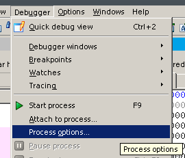

...我还是不得不要写一下这个...其实这个真的很重要，但是大部分课上不怎么讲，然后就能看到很多学生在出现了问题后无从下手。下面来讨论一下动态调试，不过由于相关文章网上已经有很多，我就不废话太多了。

## Windows + IDA + Remote Linux Debugger
这应该是大部分人会使用的环境。你需要一台运行着Windows操作系统的主机，以及一份IDA Pro。你看到了Remote Linux Debugger，没错，你还需要一个运行着Linux操作系统的主机。不过这个可以是你本地的Linux虚拟机，也可以是你边上的例如局域网里的一台运行着Linux系统的主机，甚至可以是云主机（这个比较危险）或者是一个Docker容器（应该可以，不过我还没试过）。下面以Linux虚拟机为例来瞎扯一下。

### 来搞定一下虚拟机
我就假设你已经拥有了一个Linux虚拟机，是啥发行版应该不重要。不过你正使用的虚拟化软件可能会稍微影响到后续的操作。

你需要先启动你的Linux虚拟机，如果你已经可以自由地在宿主机和虚拟机之间共享文件的话，就可以跳过下面这一小节。

#### 利用VMware Tools
当然，你得正在使用VMware进行虚拟化。通过在菜单栏中选中安装VMware Tools，你应该能发现有一个光驱被加载到了虚拟机中。这个时候只需要运行虚拟光驱内的安装程序即可。应该在重启后，你就可以自由地在宿主机和虚拟机之间拖拽文件和共享剪贴板了。

有关更多信息，你可以参考[这里](https://www.vmware.com/support/ws5/doc/new_guest_tools_ws.html)。

另外，对于VirtualBox，你可以使用[VBoxGuestAdditions](https://www.virtualbox.org/manual/ch04.html)。总之道理是差不多的。

#### 利用SFTP
利用你的包管理工具安装`openssh-server`。

对于Ubuntu，你可以：

``` bash
sudo apt update
sudo apt install openssh-server
```

对于CentOS，你可以：

``` bash
sudo yum update
sudo yum install openssh-server
```

在安装成功后，你需要启动服务：

``` bash
sudo service sshd start
```

或是：

``` bash
sudo systemctl start sshd
```

某些时候，可能是`ssh`而非`sshd`。

这个时候你就可以通过SFTP来传输文件了。我推荐你使用Xshell来连接并控制，使用Xftp来传输文件。

##### 关于怎么连接
你应该要知道你的虚拟化软件提供多种供虚拟机联网的方式。

###### 如果你正在使用NAT方式
对于VMware，你可能不需要端口转发。只需要先通过

``` bash
ifconfig
```

获取到虚拟机的IP地址，然后在你的SSH客户端（例如Xshell）中连接该IP地址的22端口即可。

对于VirtualBox，你可能需要在虚拟机设置中的网络里选择端口转发，使得宿主机可以访问虚拟机的22端口。另外，后续调试时，你还需要设置好端口转发使得虚拟机的23946端口可被访问。

###### 如果你正在使用桥接方式
你只需要先获取IP地址，然后就可以连接了。

!!! danger
    强烈建议不要在没有自己的一层路由器NAT保护的情况下使用这种方式！当你调试的时候将会开放23946端口，一旦有人利用端口扫描获取到了信息，他将可以向你的虚拟机传输危险文件并运行它！
    
    另外，这也同时会使得22端口暴露。弱的口令将使得攻击者可以控制你的虚拟机。

!!! warning
    这个方式事实上像是虚拟机也有个网卡获取到了IP地址，和你的主机处于同一局域网中，像两台电脑一样。
    
    你得保证你所连接的网络不会隔离同一局域网中的主机，否则你将无法通信。例如你连接了教学区开放式的无线网络，在没有拨号过认证前将不能和内网的其它主机通信。但是前面提到桥接像是有两台电脑一样，然而你同时应该只能过一个设备的认证，所以你可能没有办法在这种网络环境中使得主机和虚拟机能互相通信。

反正你可以有无数种方法可以来共享文件。我就不继续废话下去了。

### 开始调试吧
首先如果你的虚拟机上还没有`linux_server`和`linux_server64`的话，你需要先把它们传输到虚拟机上。另外，你要调试的程序也要传输到虚拟机上。记得要记下它们的路径。

什么？你说你不知道这两个程序在哪里？你可以在IDA目录下的dbgsrv文件夹中找到它们。

你需要先启动`linux_server`或是`linux_server64`。运行哪个取决于你要调试32位还是64位的程序了。如果提示没有执行权限，你可以：

``` bash
chmod +x ./linux_server
```

然后就可以启动了。这个时候你应该能在控制台上看到服务器正在监听的信息。

回到IDA中，在菜单栏中选择**Debugger->Select debugger**：


不用说，选择*Remote Linux Debugger*：


然后还是：



填入你的要调试的程序在服务器（虚拟机）上的位置以及目录，还有虚拟机的IP地址：


确定后就可以点击菜单栏中的**Start process**开始调试了。打断点，然后单步执行，看寄存器和栈这些应该就不用我说了吧。

### 还有Attach to process...
比如你在使用pwntools启动了一个进程，这个时候你仍然可以使用IDA来调试它。

首先你需要在你的exp.py里合适的地方加上一句：

``` python
pause()
```

然后还是跑起exp。回到IDA中选择**Attach to process...**，然后选择你要调试的进程，就可以开始你的表演了。

!!! tip
    你的`linux_server`还是要开着。

其实有很多工具、很多方法调试很多平台的程序的，时间关系我只好先列举其中常用的一种可以来调试实验的方法了，后续有空而且有必要的话我会慢慢补上。
