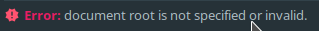

还是来讨论一下开发环境的配置。这门课程应该会推荐你使用HBuilder作为编辑代码的工具，我没有过多了解，基本上是帮同学debug的时候才有所接触。另外可能还会推荐你使用XAMPP来提供各种服务。

我在修这门课期间完全没有使用上述软件，在下面我会讲述我的方法。我不会去比较两种方式优劣与否，我始终认为适合自己的、能提高生产力的方法才是优秀的。啊？你说我是JetBrains家的死忠，又来推销他家的IDE？呵呵，要不是JetBrains给学生免费的教育授权...我早就...掏钱买他家正版全家桶了...（诶诶我擦...别扔砖头...）

开个玩笑，言归正传，我们来看看怎么愉快地玩耍：

## IntelliJ IDEA Ultimate / PhpStorm

你知道吗？IDEA装上相应的插件之后，就可以愉快地开发PHP、Python等项目而不再需要安装PhpStorm、PyCharm等工具了。虽然有些功能不在它原来的位置上，或者其它一些小问题可能造成一些困扰。

如果你未来并不打算使用IDEA或者你觉得你暂时无法驾驭，那么你可以先考虑使用PhpStorm。

> PhpStorm = WebStorm + PHP + DB/SQL
>
> All the features in WebStorm are included into PhpStorm, with full-fledged support for PHP and Databases/SQL support added on top.
>
> [PhpStorm: The Lightning-Smart IDE for PHP Programming by JetBrains](https://www.jetbrains.com/phpstorm/)

申请学生授权、下载和安装的过程我就不多说了，如果你在使用其他工具时已经申请教育授权则不必重复申请（废话）；如果你正在使用JetBrains Toolbox的话，那么你的下载安装将会变得特别简单，仅需一键即可完成（好像也是废话）。

### 外观和编辑器
初次启动即可选择主题，即使你错过了它，仍然可以在Settings->Appearance中找到。至于代码的颜色，你可以在Settings->Editor->Color Scheme中选择一种你喜欢的。更多选项你可以查阅官方文档。另外，我正在使用插件Material Theme UI，如果你感兴趣的话不妨安装尝试。

### LiveEdit插件
当你刚开始写网页时，你可能厌倦了不停地保存并切换到浏览器刷新来查看实际的效果。你可以安装LiveEdit插件来帮助你，它将会自动刷新你的网页而不需要你手动操作。安装的时候请注意还需要在Chrome浏览器上安装JetBrains IDE Support插件。

#### 常见问题
> 我已经安装好插件了，如何启动？

当你还没有Run/Debug Configurations的时候，一个比较简单的方法是右击标签，然后选择Debug，这将自动生成Configuration，并开启一个浏览器窗口显示你的网页。

> 选择Debug后生成了一个空白的浏览器页面？

请确认Chrome浏览器上的JetBrains IDE Support插件是否已经点亮，如果没有，请重启IDE和浏览器；如果已经点亮，请将鼠标移至插件图标上检查其连接目标是否为当前使用的IDE。此外，目前有接到案例，IDE更新至最新版，但LiveEdit插件并未更新而无法调试，更新插件后即恢复正常。如还有其它问题，可在下方评论或自行搜索或前往社区寻求帮助。

### 一些快捷键
你可以在官方文档中找到，也可通过**Tip of the Day**零散地学习。刚在CLion那篇里写过了一些快捷键，而且大部分应该是一样的，实在不想再重复一遍了，来讨论几个常用的就好。

- **Ctrl+D** 直接复制一行
- Clone Caret Above/Below 你不能有很多只手来帮你更快地编辑代码，但是拥有多个光标同时编辑却很容易。这个快捷键在我当前的环境下似乎并不是那么容易描述（Keymap: Default for KDE, IDEA 2018.3.4），你可以**Double Ctrl**，请注意，第二次按下Ctrl时请不要放开，否则将启动Run Anything，同时你需要按上/下方向键来产生多个光标。印象中，某些版本的PhpStorm可以按住**Alt**然后使用方向键来产生多个光标，或者在按住**Alt**的时候在希望产生光标的位置点按鼠标。不过事实上你也可以自由地改变这一切，可以在Settings->Keymap中找到它，然后设置一个顺手的不冲突的快捷键。
- **Shift+F6** 重命名
- **Ctrl+Shift+T** 使代码块被围绕

我觉得这真的是我最后一次废话这些东西了...

### 版本控制
图形化的版本控制，要不要？

在开发一个项目的时候，通常会需要利用版本控制系统来管理诸多版本，具体用途和优点我就不在这里瞎扯了，我建议你去Google一下Git之类的...我不在这里废话并不代表着不重要啊，这个还是比较重要的。

我这里就假设你基本上已经知道了Git或者其他版本控制系统的最基础的使用方法。

新建一个项目时，你可以选择在云端（例如GitHub、BitBucket、Azure DevOps等托管网站）新建一个repository，然后在本地`clone`并打开它，这可以通过File->New->Project from Version Control...来实现。当然，如果你想基于本地已经存在的项目，你可以在VCS->Git->Remotes...中将云端repo的地址填入。

当你完成了一些修改的时候，你可以通过右上角的Commit或是快捷键**Ctrl+K**来`commit`提交，然后在弹出的窗口中点击右下方的Commit and Push...即可准备将修改`push`推送到云端。

其它的我就不多废话了，各位自行发掘吧。

### 数据库
你可能已经注意到了IDE里的**Database**，没错，它可以管理数据库。点击加号来添加一个Data Source，选择你所使用的对应的数据库服务器，然后填入相关信息就可以测试连接了。

一旦成功连接，你就可以通过它可视化地操作数据库了，并且它可以帮助你写SQL语句，更好的地方在于它还可以在你写后台程序的时候提示你数据库相关的信息。

## 关于服务
你应该很快会发现这种直接在浏览器打开你的网页的方式不能满足你了，你会希望有后端来处理各种事务，有数据库来保存各类数据...关于服务器的方案，你可能听说了很多，比如老师可能会推荐你使用XAMPP，又如你可能听说过WAMP，但接下来我会介绍一些完全不同的方案。

!!! danger
    不管你使用何种方式，包括但不限于安装并启动上面的服务全家桶（XAMPP）、还是按照下面的过程逐一安装服务，都是把你的电脑当成服务器来使用。
    
    在开发过程中如果你的电脑处于校园网中并且没有一层路由器NAT保护，并且也没有合理地配置防火墙，你所开放的服务可能被他人访问。如果配置不当或是程序存在漏洞，这将会带来严重的问题，例如信息泄漏或甚至是主机被控制。

### Docker
**强烈推荐使用这种方式，特别是部署你的应用的时候。我会特别地在另一篇文章中描述这种方法。**

### PHP Built-in Web Server
> As of PHP 5.4.0, the CLI SAPI provides a built-in web server.
> 
> -- Built-in Web Server, php.net

有关内置Web Server的更多信息，请访问[这里](http://php.net/manual/en/features.commandline.webserver.php)。

个人认为这是一个相对简单得多的方案，特别是你可以直接通过IDE来启动服务器。

!!! warning
    官方文档已经指出，它只应该用于开发，而不应在实际生产环境中使用。

首先你应先有一个PHP解释器，如果还没有安装，请前往[官网](http://www.php.net/)下载。这里就假设你已经部署好了你的PHP解释器，你只需要在Run/Debug Configurations里添加一个**PHP Built-in Web Server**，请注意指定根目录和解释器，

请根据实际情况设定根目录：

同理，如果下方出现警告指出未指定PHP解释器，你可以点击FIX后在新窗口中设置好。另外，也请留意一下监听地址。

保存后点击Run即可启动Web服务器，在浏览器中访问刚才记住的地址即可。

你应该可以看到你写好的index，如果不是index，请记得在地址栏输入你所希望请求的文件名。

!!! tip
    这个时候的服务器是只监听本机请求的，也就是说不会受到来自其他主机的攻击。不过，其他人也就无法在他们的电脑上直接访问并查看你的成果了。

如果你问我数据库的话...其实这个不是特别重要，你可以选择MySQL、MariaDB、PostgreSQL等等众多数据库的Windows版本，或者在子系统上安装。随后你只要启动了服务器，你就可以通过客户端或是PHP来访问了。

这里本来是打算写在子系统上安装服务的，但是考虑到安全性之类的还是删掉了。还是建议搞个云主机来跑Docker，下一篇慢慢讲。
