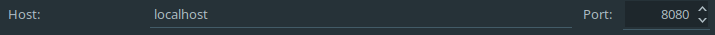

还是来讨论一下开发环境的配置。这门课程应该会推荐你使用HBuilder作为编辑代码的工具，我没有过多了解，基本上是帮同学debug的时候才有所接触。另外可能还会推荐你使用XAMPP来提供各种服务。

我在修这门课期间完全没有使用上述软件，在下面我会讲述我的方法。我不会去比较两种方式优劣与否，我始终认为适合自己的、能提高生产力的方法才是优秀的。啊？你说我是JetBrains家的死忠，又来推销他家的IDE？呵呵，要不是JetBrains给学生免费的教育授权...我早就...掏钱买他家正版全家桶了...（诶诶我擦...别扔砖头...）

开个玩笑，言归正传，我们来看看怎么愉快地玩（zhuang）耍（bi）：

## IntelliJ IDEA Ultimate / PhpStorm

你知道吗？IDEA装上相应的插件之后，就可以愉快地开发PHP、Python等项目而不再需要安装PhpStorm、PyCharm等工具了。虽然有些功能不在它原来的位置上，或者其它一些小问题可能造成一些困扰。如果你未来并不打算使用IDEA或者你觉得你暂时无法驾驭，那么你可以先考虑使用PhpStorm。申请学生授权、下载和安装的过程我就不多说了，如果你在使用其他工具时已经申请教育授权则不必重复申请（废话）；如果你正在使用JetBrains Toolbox的话，那么你的下载安装将会变得特别简单，仅需一键即可完成（好像也是废话）。

### 外观和编辑器
初次启动即可选择主题，即使你错过了它，仍然可以在Settings->Appearance中找到。至于代码的颜色，你可以在Settings->Editor->Color Scheme中选择一种你喜欢的。更多选项你可以查阅官方文档。另外，我正在使用插件Material Theme UI，如果你感兴趣的话不妨安装尝试。

### LiveEdit插件
当你刚开始写网页时，你可能厌倦了不停地保存并切换到浏览器刷新来查看实际的效果。你可以安装LiveEdit插件来帮助你，它将会实时（几乎）刷新你的网页而不需要你手动操作。安装的时候请注意还需要在Chrome浏览器上安装JetBrains IDE Support插件。

#### 常见问题
> 我已经安装好插件了，如何启动？

当你还没有Run/Debug Configurations的时候，一个比较简单的方法是右击标签，然后选择Debug，这将自动生成Configuration（如果没有），并开启一个浏览器窗口显示你的网页。

> 选择Debug后生成了一个空白的浏览器页面？

请确认Chrome浏览器上的JetBrains IDE Support插件是否已经点亮，如果没有，请重启IDE和浏览器；如果已经点亮，请将鼠标移至插件图标上检查其连接目标是否为当前使用的IDE。此外，目前有接到案例，IDE更新至最新版，但LiveEdit插件并未更新而无法调试，更新插件后即恢复正常。如还有其它问题，可在下方评论或自行搜索或前往社区寻求帮助。

### 一些快捷键
你可以在官方文档中找到，也可通过**Tip of the Day**零散地学习。刚在CLion那篇里写过了一些快捷键，而且大部分应该是一样的，实在不想再重复一遍了，来讨论几个常用的就好。

- **Ctrl+D** 直接复制一行
- Clone Caret Above/Below 你不能有很多只手来帮你更快地编辑代码，但是拥有多个光标同时编辑却很容易。这个快捷键在我当前的环境下似乎并不是那么容易描述（Keymap: Default for KDE, IDEA 2018.3.4），你可以**Double Ctrl**，请注意，第二次按下Ctrl时请不要放开，否则将启动Run Anything，同时你需要按上/下方向键来产生多个光标。印象中，某些版本的PhpStorm可以按住**Alt**然后使用方向键来产生多个光标，或者在按住**Alt**的时候在希望产生光标的位置点按鼠标。不过事实上你也可以自由地改变这一切，可以在Settings->Keymap中找到它，然后设置一个顺手的不冲突的快捷键。
- **Shift+F6** 重命名
- **Ctrl+Shift+T** 使代码块被围绕

我觉得这真的是我最后一次废话这些东西了...

### 版本控制
在考虑要不要分开写

### 数据库
你可能已经注意到了IDE里的**Database**，没错，它可以管理数据库，相关内容后续补上。

## 关于服务
你应该很快会发现这种直接在浏览器打开你的网页的方式不能满足你了，你会希望有后端来处理各种事务，有数据库来保存各类数据...关于服务器的方案，你可能听说了很多，比如老师可能会推荐你使用XAMPP，又如你可能听说过WAMP，但接下来我会介绍一些完全不同的方案。

### PHP Built-in Web Server
> As of PHP 5.4.0, the CLI SAPI provides a built-in web server.
> 
> -- Built-in Web Server, php.net

有关内置Web Server的更多信息，请访问[这里](http://php.net/manual/en/features.commandline.webserver.php)。

个人认为这是一个相对简单得多的方案，特别是你可以直接通过IDE来启动服务器。首先你应先有一个PHP解释器，如果还没有安装，请前往[官网](http://www.php.net/)下载。这里就假设你已经部署好了你的PHP解释器，你只需要在Run/Debug Configurations里添加一个**PHP Built-in Web Server**，请注意指定根目录和解释器，

请根据实际情况设定根目录：

同理，如果下方出现警告指出未指定PHP解释器，你可以点击FIX后在新窗口中设置好。另外，也请留意一下监听地址。

保存后点击Run即可启动Web服务器，在浏览器中访问刚才记住的地址即可。

你应该可以看到你写好的index，如果不是index，请记得在地址栏输入你所希望请求的文件名。

如果你问我数据库的话...其实这个不是特别重要，你可以选择MySQL、MariaDB、PostgreSQL等等众多数据库的Windows版本，或者在子系统上安装。

### Windows Subsystem for Linux (WSL) on Windows 10 适用于Linux的Windows子系统
WSL真香，真的。

安装各种服务也同样简单，下面以搭建Nginx+MariaDB+PHP为例。

好吧拖延症又犯了 晚点继续更新
