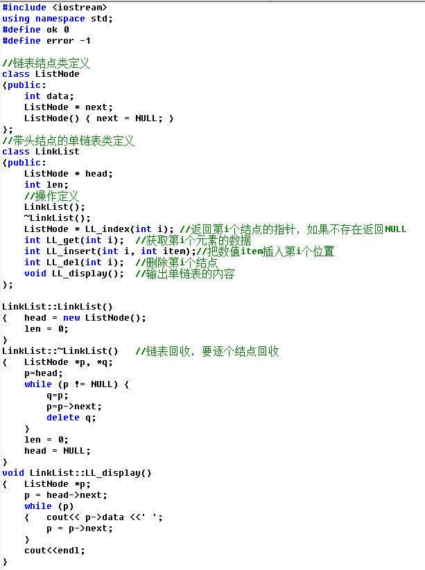

# DS单链表--类实现
时间限制: 1 Sec  内存限制: 128 MB

## 题目描述
用C++语言和类实现单链表，含头结点

属性包括：data数据域、next指针域

操作包括：插入、删除、查找

注意：单链表不是数组，所以位置从1开始对应首结点，头结点不放数据

类定义参考



## 输入
第1行先输入n表示有n个数据，接着输入n个数据

第2行输入要插入的位置和新数据

第3行输入要插入的位置和新数据

第4行输入要删除的位置

第5行输入要删除的位置

第6行输入要查找的位置

第7行输入要查找的位置

## 输出
数据之间用空格隔开，

第1行输出创建后的单链表的数据

每成功执行一次操作（插入或删除），输出执行后的单链表数据

每成功执行一次查找，输出查找到的数据

如果执行操作失败（包括插入、删除、查找等失败），输出字符串error，不必输出单链表

## 样例输入
    6 11 22 33 44 55 66
    3 777
    1 888
    1
    11
    0
    5

## 样例输出
    11 22 33 44 55 66 
    11 22 777 33 44 55 66 
    888 11 22 777 33 44 55 66 
    11 22 777 33 44 55 66 
    error
    error
    44

## 提示

## 解决方案
``` cpp
#include <iostream>
#include <vector>
#include <stdexcept>

class List {
public:
    List(std::vector<int> &vector) : root_(new Node) {
        Node *node = root_;
        for (int i = 0; i < vector.size(); ++i, node = node->next) {
            node->next = new Node(vector[i]);
        }
    }
    ~List() {
        Node *node = root_, *next;
        while (node != NULL) {
            next = node->next;
            delete node;
            node = next;
        }
    }
    int at(int index) {
        int count = 0;
        Node *node = root_;
        while (node->next != NULL) {
            count += 1;
            node = node->next;
            if (count == index) {
                return node->data;
            }
        }
        throw std::out_of_range("UPPER_LIMIT");
    }
    void insert(int index, int data) {
        int count = 0;
        Node *node = root_;
        while (node->next != NULL || (count + 1) == index) {
            count += 1;
            if (count == index) {
                Node *tmp = node->next;
                node->next = new Node(data, tmp);
                return;
            }
            node = node->next;
        }
        throw std::out_of_range("UPPER_LIMIT");
    }
    void erase(int index) {
        int count = 0;
        Node *node = root_;
        while (node->next != NULL) {
            count += 1;
            if (count == index) {
                Node *tmp = node->next;
                node->next = node->next->next;
                delete tmp;
                return;
            }
            node = node->next;
        }
        throw std::out_of_range("UPPER_LIMIT");
    }
    int length() {
        int count = 0;
        Node *node = root_;
        while (node->next != NULL) {
            node = node->next;
            count += 1;
        }
        return count;
    }
    void print() {
        Node *node = root_;
        while (node->next != NULL) {
            node = node->next;
            std::cout << node->data << ' ';
        }
        std::cout << std::endl;
    }

private:
    struct Node {
        int data;
        Node *next;
        Node() : data(0), next(NULL) {}
        Node(int data) : data(data) {}
        Node(int data, Node *next) : data(data), next(next) {}
    };
    Node *root_;
};

int main() {
    int size;
    std::cin >> size;
    std::vector<int> vector(static_cast<size_t >(size));
    for (int i = 0; i < size; ++i) {
        std::cin >> vector[i];
    }
    List list(vector);
    list.print();

    for (int i = 0; i < 2; ++i) {
        int index, number;
        std::cin >> index >> number;
        try {
            list.insert(index, number);
            list.print();
        } catch (std::out_of_range &out_of_range) {
            std::cout << "error" << std::endl;
        }
    }

    for (int i = 0; i < 2; ++i) {
        int index;
        std::cin >> index;
        try {
            list.erase(index);
            list.print();
        } catch (std::out_of_range &out_of_range) {
            std::cout << "error" << std::endl;
        }
    }

    for (int i = 0; i < 2; ++i) {
        int index;
        std::cin >> index;
        try {
            std::cout << list.at(index) << std::endl;
        } catch (std::out_of_range &out_of_range) {
            std::cout << "error" << std::endl;
        }
    }

    return 0;
}

```
