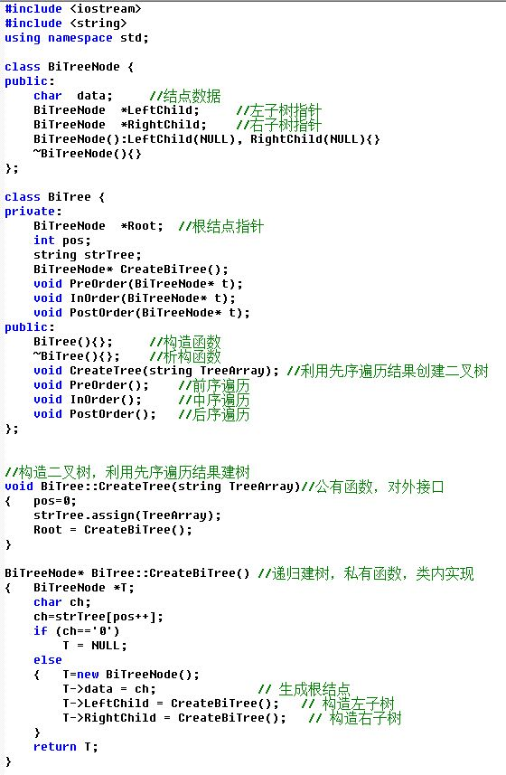

# DS二叉树--二叉树构建与遍历
时间限制: 1 Sec  内存限制: 128 MB

## 题目描述
给定一颗二叉树的逻辑结构如下图，（先序遍历的结果，空树用字符‘0’表示，例如AB0C00D00），建立该二叉树的二叉链式存储结构，并输出该二叉树的先序遍历、中序遍历和后序遍历结果


本题目的代码框架参考如下



三种遍历的代码框架


## 输入
第一行输入一个整数t，表示有t个二叉树

第二行起输入每个二叉树的先序遍历结果，空树用字符‘0’表示，连续输入t行

## 输出
输出每个二叉树的先序遍历、中序遍历和后序遍历结果

## 样例输入
    2
    AB0C00D00
    AB00C00

## 样例输出
    ABCD
    BCAD
    CBDA
    ABC
    BAC
    BCA

## 提示

## 解决方案
``` cpp
#include <iostream>
#include <string>

class BiTree {
public:
    BiTree() : root(NULL) {}
    void assign(const std::string &string) {
        int index = 0;
        assign(string, index, root);
    }
    void preOrderTraverse() {
        preOrderTraverse(root);
        std::cout << std::endl;
    }
    void inOrderTraverse() {
        inOrderTraverse(root);
        std::cout << std::endl;
    }
    void postOrderTraverse() {
        postOrderTraverse(root);
        std::cout << std::endl;
    }
private:
    struct Node {
        char data;
        Node *left;
        Node *right;
        Node() : data(0), left(NULL), right(NULL) {}
        explicit Node(char data) : data(data), left(NULL), right(NULL) {}
    };
    Node *root;
    void assign(const std::string &string, int &index, Node *&node) {
        char data = string[index++];
        if (data != '0') {
            node = new Node(data);
            assign(string, index, node->left);
            assign(string, index, node->right);
        } else {
            node = NULL;
        }
    }
    void preOrderTraverse(Node *node) {
        if (node) {
            std::cout.put(node->data);
            preOrderTraverse(node->left);
            preOrderTraverse(node->right);
        }
    }
    void inOrderTraverse(Node *node) {
        if (node) {
            inOrderTraverse(node->left);
            std::cout.put(node->data);
            inOrderTraverse(node->right);
        }
    }
    void postOrderTraverse(Node *node) {
        if (node) {
            postOrderTraverse(node->left);
            postOrderTraverse(node->right);
            std::cout.put(node->data);
        }
    }
};

int main() {
    int ctrl;
    std::cin >> ctrl;

    while (ctrl--) {
        std::string string;
        std::cin >> string;
        class BiTree biTree;
        biTree.assign(string);
        biTree.preOrderTraverse();
        biTree.inOrderTraverse();
        biTree.postOrderTraverse();
    }

    return 0;
}

```
