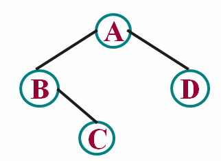

# DS二叉树--叶子数量
时间限制: 1 Sec  内存限制: 128 MB

## 题目描述
计算一颗二叉树包含的叶子结点数量。

提示：叶子是指它的左右孩子为空。

建树方法采用“先序遍历+空树用0表示”的方法，即给定一颗二叉树的先序遍历的结果为AB0C00D00，其中空节点用字符‘0’表示。则该树的逻辑结构如下图。



## 输入
第一行输入一个整数t，表示有t个测试数据

第二行起输入二叉树先序遍历的结果，空树用字符‘0’表示，输入t行

## 输出
逐行输出每个二叉树的包含的叶子数量

## 样例输入
    3
    AB0C00D00
    AB00C00
    ABC00D00E00

## 样例输出
    2
    2
    3

## 提示

## 解决方案
``` cpp
#include <iostream>
#include <string>

class BiTree {
public:
    BiTree() : root(NULL) {}
    void assign(const std::string &string) {
        int index = 0;
        assign(string, index, root);
    }
    int leaves() {
        int count = 0;
        leaves(root, count);
        return count;
    }
private:
    struct Node {
        char data;
        Node *left, *right;
        Node() : data(0), left(NULL), right(NULL) {}
        explicit Node(char data) : data(data), left(NULL), right(NULL) {}
    };
    Node *root;
    void assign(const std::string &string, int &index, Node *&node) {
        char data = string[index++];
        if (data != '0') {
            node = new Node(data);
            assign(string, index, node->left);
            assign(string, index, node->right);
        } else {
            node = NULL;
        }
    }
    void leaves(Node *node, int &count) {
        if (node) {
            if (node->left == NULL && node->right == NULL) {
                count += 1;
            }
            leaves(node->left, count);
            leaves(node->right, count);
        }
    }
};

int main() {
    int ctrl;
    std::cin >> ctrl;

    while (ctrl--) {
        std::string string;
        std::cin >> string;
        class BiTree biTree;
        biTree.assign(string);
        std::cout << biTree.leaves() << std::endl;
    }

    return 0;
}

```
