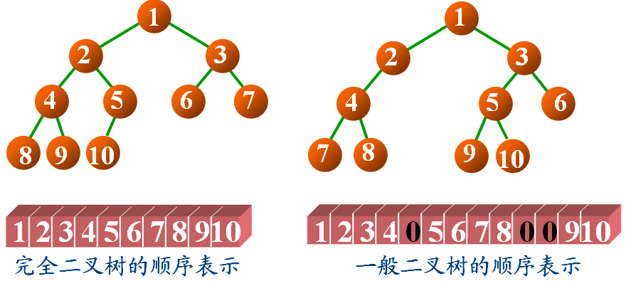

# DS二叉树——二叉树之数组存储
时间限制: 1 Sec  内存限制: 128 MB

## 题目描述
二叉树可以采用数组的方法进行存储，把数组中的数据依次自上而下,自左至右存储到二叉树结点中，一般二叉树与完全二叉树对比，比完全二叉树缺少的结点就在数组中用0来表示。，如下图所示



从上图可以看出，右边的是一颗普通的二叉树，当它与左边的完全二叉树对比，发现它比完全二叉树少了第5号结点，所以在数组中用0表示，同样它还少了完全二叉树中的第10、11号结点，所以在数组中也用0表示。

结点存储的数据均为非负整数

## 输入
第一行输入一个整数t，表示有t个二叉树

第二行起，每行输入一个数组，先输入数组长度，再输入数组内数据，每个数据之间用空格隔开，输入的数据都是非负整数

连续输入t行

## 输出
每行输出一个示例的先序遍历结果，每个结点之间用空格隔开

## 样例输入
    3
    3 1 2 3
    5 1 2 3 0 4
    13 1 2 3 4 0 5 6 7 8 0 0 9 10

## 样例输出
    1 2 3 
    1 2 4 3 
    1 2 4 7 8 3 5 9 10 6 

## 提示
注意从数组位置和二叉树深度、结点位置进行关联，或者父子结点在数组中的位置存在某种管理，例如i, i+1, i/2,  i+1/2........或者2i, 2i+1.......仔细观察哦

## 解决方案
``` cpp
#include <iostream>
#include <vector>

class BiTree {
public:
    explicit BiTree(size_t size) : arr_(size, 0) {}
    void setFromCin() {
        for (int i = 0; i < arr_.size(); ++i) {
            std::cin >> arr_[i];
        }
    }
    void preOrderTraverse() {
        preOrderTraverse(0);
        std::cout << std::endl;
    }
private:
    std::vector<int> arr_;
    void preOrderTraverse(int index) {
        if (index < arr_.size() && arr_[index] != 0) {
            std::cout << arr_[index] << ' ';
            preOrderTraverse(2 * index + 1);
            preOrderTraverse(2 * index + 2);
        }
    }
};

int main() {
    int ctrl;
    std::cin >> ctrl;

    while (ctrl--) {
        size_t size;
        std::cin >> size;
        class BiTree biTree(size);
        biTree.setFromCin();
        biTree.preOrderTraverse();
    }

    return 0;
}

```
