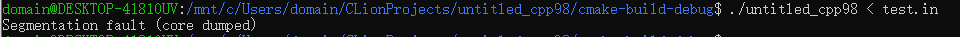

其实这篇文章最早的时候是想讨论一下，为什么有的同学把代码里的变量移动了一下位置，在OJ里就不会再出现运行错误的问题。但是我能找到的这个例子却不太好...因为它...在我写文章的时候，不能复现当时的情况了...当时大概是这样的：

某天下午我正在机房角落撸代码，那个时候也下课同学都走得差不多了。突然听到有人说：

> 你看我把这个变量放上面过不了，放到下面就AC了！

至于这位同学有没有说OJ有问题我是不记得了，不过我当时就去PY了一份这个同学的代码还有后台的数据来看看：

题目是这样的：
> 编写函数void find(int *num,int n,int &minIndex,int &maxIndex)，求数组num(元素为num[0]，num[1]，...，num[n-1]）中取最小值、最大值的元素下标minIndex,maxIndex（若有相同最值，取第一个出现的下标。）
>
> 输入n，动态分配n个整数空间，输入n个整数，调用该函数求数组的最小值、最大值下标。最后按样例格式输出结果。

来看看这位同学的代码，我有把代码放到CLion里格式化了一下下：

``` cpp
#include <iostream>

using namespace std;

void find(int *num, int n, int &minIndex, int &maxIndex);

int main() {
    int t, n;
    cin >> t;
    while (t--) {
        int max, min;
        cin >> n;
        int *a = new int[n];
        for (int i = 0; i < n; i++)
            cin >> a[i];
        find(a, n, min, max);
        cout << "min=" << a[min] << " " << "minindex=" << min << endl;
        cout << "max=" << a[max] << " " << "maxindex=" << max << endl << endl;
    }
}

void find(int *num, int n, int &minIndex, int &maxIndex) {
    int i, max = num[0], min = num[0];
    for (i = 0; i < n; i++) {
        if (num[i] < min) {
            min = num[i];
            minIndex = i;
        }
        if (num[i] > max) {
            max = num[i];
            maxIndex = i;
        }
    }
}

```

这个题目比较简单，就是找一下一个数组里面的最大值和最小值的索引而已。测试样例输入是没有问题的，不过到了后台数据的时候...

靠...写到这里的时候才发现PY来的后台数据不知道被我归档到哪里了...还好有Everything...

看起来都是很简单的数据，但是事实上对于这个程序来说却隐藏着巨大的威胁：



遇到这种情况我一般会debug来看看这个时候的翻车现场是怎么样的：


这个时候已经能很明显地发现问题所在了，变量min的数值远远地超过了数组可索引的范围。这是为何？从头开始单步调试就可以发现：局部变量max、min未被初始化，这个时候变量的值是不确定的。但更糟糕的是，在某些情况下，例如数组单调递增或递减，程序不会试图更新maxIndex或minIndex，这将导致程序在输出阶段使用未初始化的变量，所以就出现了Runtime Error。

至于你可能想讨论某些时候这个程序可以正常通过OJ的检验的原因，很简单，一种可能性比较大的原因就是上述自动变量的初值在那个时候恰好为0，这样即使find函数中没有更新它的值，也不会出现问题。改变自动变量声明的位置可能会让它们在栈中的相对位置发生改变，这将可能让程序碰巧通过一些检查点。但是——

请看好你的自动变量，记得初始化它们。

[What happens to a declared, uninitialized variable in C? Does it have a value?](https://stackoverflow.com/questions/1597405/what-happens-to-a-declared-uninitialized-variable-in-c-does-it-have-a-value)
